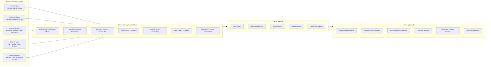
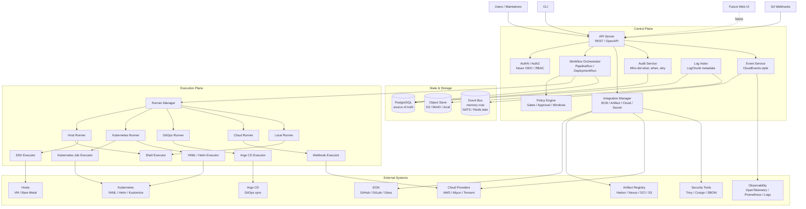
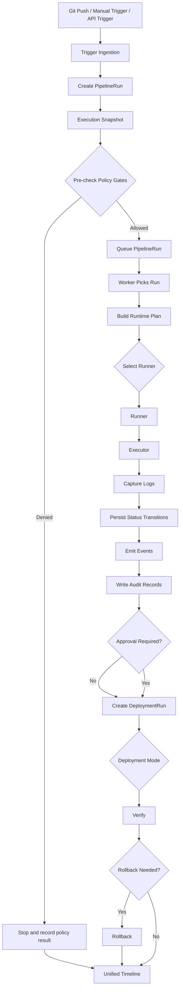
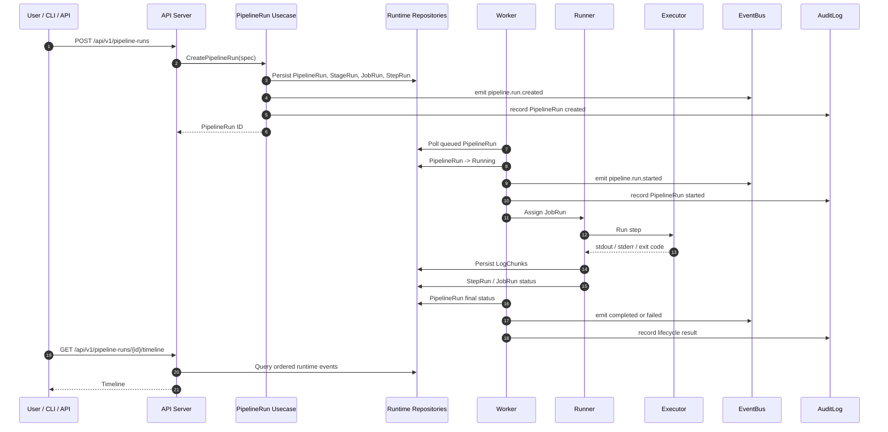
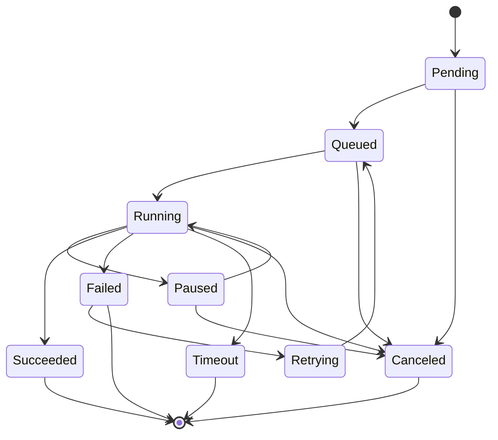
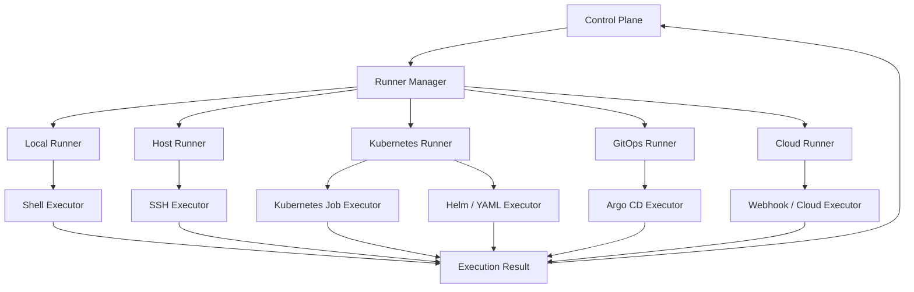
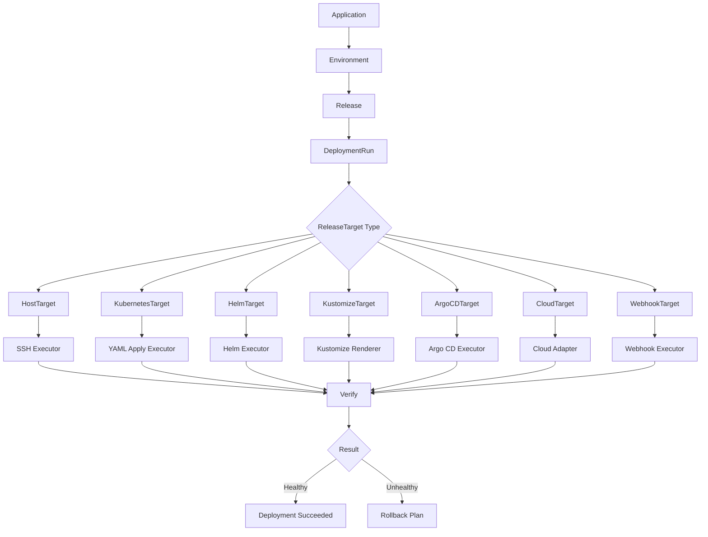
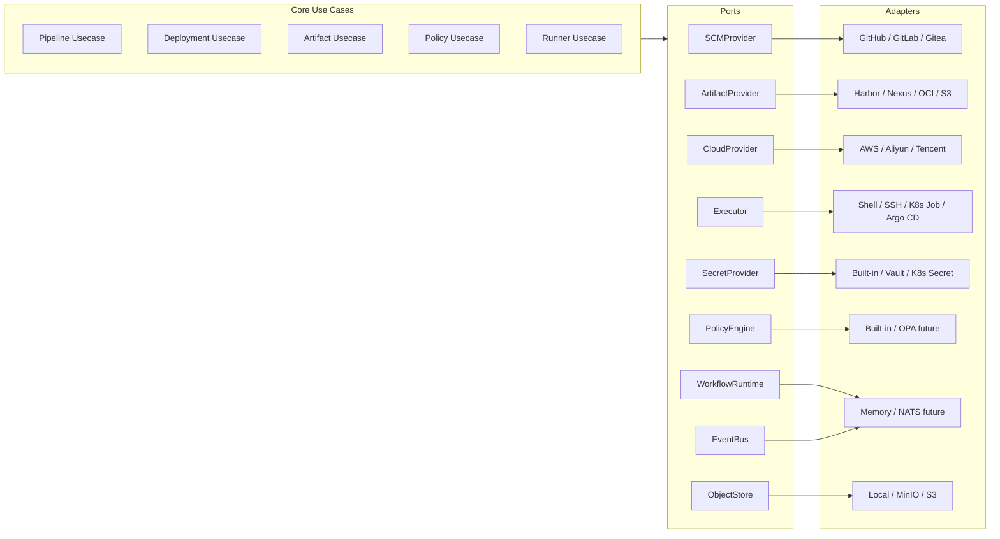
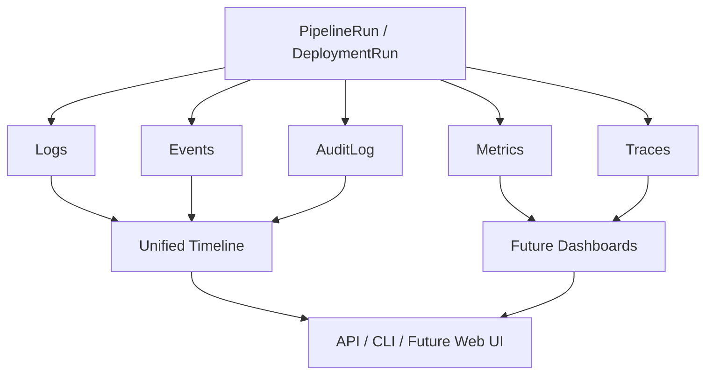

# Nivora

> Plano de control de entrega backend-first para pipelines, lanzamientos, despliegues, runners, puertas de política, aprobaciones y registros de auditoría.

**Nivora** es un plano de control de entrega DevOps de código abierto bajo la organización `sevoniva`.

El proyecto registra la intención y el estado de entrega a través de pipelines, lanzamientos, artefactos, despliegues, runners, decisiones de política, aprobaciones, registros, eventos y registros de auditoría. Está diseñado para rodear las herramientas existentes, no para reemplazarlas.

Nivora **no es** Jenkins, Argo CD, Kubernetes, Harbor, un plano de control en la nube ni un escáner. Esos sistemas permanecen separados; Nivora modela y audita cómo el trabajo de entrega se mueve a través de ellos.

Madurez actual: **fundación candidata a beta endurecida**. Nivora **no está listo para producción**. El repositorio tiene fundaciones backend funcionales, almacenes respaldados por PostgreSQL para áreas centrales de tiempo de ejecución y metadatos del catálogo del plano de control, operaciones de despliegue protegidas, pruebas RBAC, activos de empaquetado y scripts de verificación. El uso en producción aún necesita más validación alrededor del aislamiento de runners, simulacros de instalación/restauración en vivo, integraciones externas y operaciones a escala de producción.

Los documentos futuros de `v1.0.0` son listas de verificación de planificación, no prueba de que se haya alcanzado la GA. La fuente de verdad actual es [Capability Status](docs/status/CAPABILITY_STATUS.md), con contexto de auditoría histórica en [Implementation Audit](docs/status/IMPLEMENTATION_AUDIT.md).

El seguimiento de preparación empresarial vive en [Enterprise Production Baseline](docs/status/ENTERPRISE_PRODUCTION_BASELINE.md), [Enterprise Readiness Matrix](docs/status/ENTERPRISE_READINESS_MATRIX.md), [Enterprise Production Readiness Review](docs/status/ENTERPRISE_PRODUCTION_READINESS_REVIEW.md) y [Enterprise Risk Register](docs/status/ENTERPRISE_RISK_REGISTER.md). Estos documentos son evidencia de endurecimiento de lanzamiento, no aprobación de producción.

## Estado Actual

| Área | Estado |
|---|---|
| PipelineRun runtime | Implementado para ejecución local de shell con registros/eventos/auditoría más lecturas de metadatos de artefacto/caché/anotación/resumen; no es un motor de flujo de trabajo completo |
| DeploymentRun runtime | Parcial; existen fundaciones de ejecución en seco YAML, aplicación protegida, inventario, salud, diff, auditoría y persistencia PostgreSQL |
| Release y ReleaseExecution | Parcial; existen fundaciones de orquestación secuencial y persistencia PostgreSQL |
| Catálogo de objetivos de lanzamiento | Fundación; `/api/v1/release-targets` y `nivora target` gestionan metadatos de objetivo con persistencia PostgreSQL en modo servidor configurado y operaciones inseguras deshabilitadas por defecto |
| Catálogo / inteligencia de repositorio | Fundación; existen catálogo de metadatos de repositorio, `nivora repository create --file` basado en archivo, instantáneas de solo lectura local/genéricas, detección estática de lenguaje/construcción/prueba/paquete, resúmenes DevOps solo de planificación, almacenamiento de instantáneas/inteligencia respaldado por PostgreSQL en modo servidor/MCP configurado, `nivora repository inspect/snapshot/analyze/devops-plan` y herramientas de lectura/planificación MCP de repositorio; las escrituras SCM externas permanecen como trabajo futuro |
| Nivora Workflow | Fundación; existen analizador, validador, planificador DAG/matriz, pistas de artefacto/caché, intención de seguridad/lanzamiento/despliegue solo de planificación, conversión de definición de Pipeline, registros de plan almacenados, metadatos de WorkflowRun protegidos, `nivora workflow validate/plan/run/cancel/reconcile/retry` y superficies API/MCP solo de planificación; WorkflowRun puede encolar/cancelar/reintentar registros de PipelineRun vinculados, reconciliar estado desde el estado de PipelineRun vinculado y registrar metadatos de artefacto/caché, pero no es un motor de flujo de trabajo completo |
| Protocolo de runner | Parcial; existen tokens, latido, reclamación, registros, estado y perfiles de aislamiento; el aislamiento a nivel de SO sigue siendo trabajo del operador |
| YAML de Kubernetes | Fundación experimental de aplicación/reversión protegida; sin comportamiento destructivo por defecto |
| GitOps / Argo CD | Fundación experimental de planificación/estado/sincronización protegida; sin automatización Argo de producción |
| Artefacto / OCI | Parcial; análisis OCI, fundación de digest y catálogo de registro respaldado por PostgreSQL; sin integración completa de producto de registro |
| DevSecOps / política | Fundación; rutas de escáner noop/fake, reglas integradas y catálogo de política respaldado por PostgreSQL; sin integración de producción Trivy/Cosign/SBOM |
| Secretos / credenciales | Parcial; metadatos, redacción, esqueletos de proveedor; el ciclo de vida del proveedor de producción permanece como trabajo futuro |
| Auth / RBAC | Parcial; fundación local/token/OIDC y pruebas de ruta; el SSO empresarial completo permanece como trabajo futuro |
| Aprobaciones / ventanas de cambio / notificaciones | Fundación; solo backend, sin flujo de trabajo ITSM |
| Multi-cloud | Solo inventario marcador/fundación; sin despliegue en la nube |
| Despliegue en host | Plan/ejecución en seco/noop experimental y superficie SSH protegida |
| Consola web | Interfaz mínima experimental que consume APIs backend |
| Plano de control MCP | Fundación; acceso de IA de solo lectura stdio local y solo de planificación más JSON-RPC remoto de solo lectura experimental opt-in, herramientas de planificación de repositorio/flujo de trabajo, lecturas agregadas de eventos/registros, herramientas de acción denegada, rechazo de token de runner, auditoría respaldada por cumplimiento y 31 escenarios de operador validados con respuestas doradas; MCP remoto no está ampliamente expuesto ni listo para producción |
| Índice de capacidad de integración | Fundación; `/api/v1/integrations` de solo lectura etiqueta capacidades integradas, esqueleto, noop, fundación y adaptadores experimentales |
| Empaquetado | Parcial; existen Docker Compose, Helm, valores tipo producción y comprobaciones de humo |
| Observabilidad / auditoría | Parcial; existen fundaciones de diagnóstico, métricas, centro de recuperación de tiempo de ejecución, doctor de producción, índice de API de visualización de solo lectura, libros de jugadas y exportación de auditoría/evidencia; la retención/exportación de producción aún necesita endurecimiento |

Enfoque actual:

```text
keep public status accurate
keep examples and docs aligned with implemented behavior
stabilize CI, packaging, and local demo paths
continue runtime, install, restore, runner, and audit hardening
turn operator-facing checks into repeatable product workflows
```

Referencias de estado:

- [Alpha Capability Matrix](docs/ALPHA_CAPABILITY_MATRIX.md)
- [Beta Capability Matrix](docs/BETA_CAPABILITY_MATRIX.md)
- [API Inventory](docs/API_INVENTORY.md)
- [Alpha Demo Guide](docs/demo/alpha-demo.md)
- [v0.1.0-alpha.1 Checklist](docs/releases/v0.1.0-alpha.1-checklist.md)
- [v0.5.0-beta Checklist](docs/releases/v0.5.0-beta-checklist.md)
- [v0.5.0-beta Release Notes Draft](docs/releases/v0.5.0-beta-release-notes-draft.md)
- [v1.0.0-rc.1 Checklist](docs/releases/v1.0.0-rc.1-checklist.md)
- [Future v1.0.0 GA Readiness Capability Matrix](docs/releases/v1.0.0-ga-capability-matrix.md)
- [Future v1.0.0 GA Readiness Checklist](docs/releases/v1.0.0-ga-checklist.md)
- [Future v1.0.0 Release Notes Draft](docs/releases/v1.0.0-release-notes.md)
- [Implementation Audit](docs/status/IMPLEMENTATION_AUDIT.md)
- [Capability Status](docs/status/CAPABILITY_STATUS.md)
- [AI Control Plane Product Review](docs/status/AI_CONTROL_PLANE_PRODUCT_REVIEW.md)
- [AI Control Plane Beta Readiness](docs/status/AI_CONTROL_PLANE_BETA_READINESS.md)
- [AI Control Plane Deep Audit](docs/status/AI_CONTROL_PLANE_DEEP_AUDIT.md)
- [AI Operator Journeys](docs/status/AI_OPERATOR_JOURNEYS.md)
- [AI Control Plane Go / No-Go](docs/status/AI_CONTROL_PLANE_GO_NO_GO.md)
- [Remote MCP Readiness Audit](docs/status/REMOTE_MCP_READINESS_AUDIT.md)
- [MCP Enterprise Opening Decision](docs/status/MCP_ENTERPRISE_OPENING_DECISION.md)
- [Enterprise Production Readiness Review](docs/status/ENTERPRISE_PRODUCTION_READINESS_REVIEW.md)
- [Enterprise Next Goals](docs/status/ENTERPRISE_NEXT_GOALS.md)
- [Security Threat Model](docs/security/threat-model.md)
- [MCP Threat Model](docs/security/mcp-threat-model.md)
- [Security Review Checklist](docs/security/security-review-checklist.md)
- [User Guide](docs/user/README.md)
- [Operator Guide](docs/operator/README.md)
- [Developer Guide](docs/developer/README.md)
- [Tutorials](docs/tutorials/README.md)
- [Release Playbook](docs/releases/release-playbook.md)
- [Production-Direction Install](docs/operations/production-install.md)
- [Production Doctor](docs/operations/production-doctor.md)
- [Upgrade Guide](docs/operations/upgrade.md)
- [Release Automation](docs/operations/release-automation.md)
- [Changelog](CHANGELOG.md)

## Por qué existe Nivora

El estado de entrega a menudo se divide entre varios sistemas.

| Área | Herramientas comunes |
|---|---|
| Control de fuentes | GitHub, GitLab, Gitea |
| Ejecución CI | Jenkins, GitLab CI, GitHub Actions, Tekton |
| Almacenamiento de artefactos | Harbor, Nexus, JFrog, registros OCI, S3 |
| Entrega Kubernetes | kubectl, Helm, Kustomize |
| GitOps | Argo CD |
| Despliegue en host | SSH, systemd, scripts |
| Objetivos en la nube | AWS, Aliyun, Tencent Cloud |
| Seguridad | Trivy, Cosign, herramientas SBOM, motores de política |
| Observabilidad | OpenTelemetry, Prometheus, registros |
| Proceso humano | aprobaciones, ventanas de cambio, auditoría de lanzamiento |

El problema no son las herramientas individuales. El problema es que la intención de entrega, el estado de ejecución, la auditoría, la política, la trazabilidad de artefactos y el contexto de reversión a menudo se almacenan por separado.

Nivora proporciona un modelo de plano de control backend para ese estado.

## Posicionamiento del producto

Nivora es un **plano de control de entrega**. No es solo una herramienta CI, y no es solo una herramienta CD.

Coordina:

```text
source code
-> pipeline execution
-> artifact selection
-> policy evaluation
-> approval
-> deployment
-> verification
-> rollback
-> audit
-> timeline
```

Nivora busca responder preguntas operativas como:

- ¿Qué commit produjo este lanzamiento?
- ¿Qué artefacto se desplegó?
- ¿Quién aprobó el despliegue en producción?
- ¿Qué runner ejecutó el trabajo?
- ¿Qué puertas de política pasaron o fallaron?
- ¿Qué entorno recibió el lanzamiento?
- ¿Qué cambió entre dos despliegues?
- ¿Qué registros, eventos y registros de auditoría pertenecen a esta entrega?
- ¿Se puede revertir este despliegue de forma segura?
- ¿Qué sistemas externos participaron en la entrega?

## Mapa de valor de Nivora

Este diagrama muestra los límites previstos entre sistemas externos, el plano de control de Nivora, los mecanismos de ejecución y los registros de entrega.



## Qué es Nivora

Nivora es un plano de control de entrega. Coordina:

- Ejecución de pipeline
- Planificación de lanzamiento
- Ejecución de despliegue
- Asignación de runner
- Selección de executor
- Trazabilidad de artefactos
- Evaluación de política
- Flujo de aprobación
- Registros de auditoría
- Eventos de tiempo de ejecución
- Línea temporal de entrega
- Modelos de lectura de API de visualización

Nivora comienza como un **monolito modular** con múltiples binarios:

```text
nivora-server
nivora-worker
nivora-runner
nivora CLI
```

Esto mantiene el proyecto comprensible mientras preserva un camino hacia la extracción futura de servicios.

## Qué no es Nivora

Nivora no es:

- un clon de Jenkins
- un reemplazo de Argo CD
- una plataforma solo Kubernetes
- un sistema específico de proveedor en la nube
- un proyecto frontend-first
- una herramienta de automatización de caja negra
- una declaración de que cada integración modelada ha completado la validación de producción

Nivora debe integrarse con sistemas existentes a través de puertos y adaptadores explícitos.

## Arquitectura objetivo

La arquitectura objetivo separa el **Plano de Control** del **Plano de Ejecución**.

El plano de control posee el estado, la orquestación, las políticas, la auditoría, las APIs y la configuración de integración. El plano de ejecución posee la ejecución de trabajos, registros, latidos y resultados de tiempo de ejecución.



## Principios de arquitectura

### El plano de control y el plano de ejecución son separados

El plano de control posee la API, el estado, la orquestación, la política, la auditoría, la configuración de integración y la línea temporal de eventos. El plano de ejecución posee la ejecución de trabajos, registros, latido e informe de resultados de tiempo de ejecución.

El servidor API no debería ejecutar trabajos de despliegue directamente.

### Runner y Executor son diferentes

```text
Runner = who executes
Executor = how execution happens
```

| Runner | Executor |
|---|---|
| Local Runner | Shell Executor |
| Host Runner | SSH Executor |
| Kubernetes Runner | Kubernetes Job Executor |
| GitOps Runner | Argo CD Executor |
| Cloud Runner | Webhook / Cloud Adapter |

Esta separación permite a Nivora soportar muchos entornos de ejecución sin reescribir la lógica central de orquestación.

### GitOps es un modo de despliegue

Nivora soporta GitOps, pero GitOps no es todo el producto.

Los modos de despliegue futuros incluyen despliegue en host, YAML Kubernetes crudo, Helm, Kustomize, GitOps Argo CD, entrega basada en webhook y entrega específica de proveedor en la nube.

### Puertos y adaptadores primero

Los sistemas externos deben integrarse a través de interfaces estables:

```text
SCMProvider
ArtifactProvider
CloudProvider
Executor
WorkflowRuntime
SecretProvider
NotificationProvider
PolicyEngine
EventBus
ObjectStore
```

Los casos de uso centrales deben depender de capacidades, no de proveedores concretos.

### Los artefactos deben ser inmutables

Un lanzamiento debe apuntar a artefactos inmutables siempre que sea posible: digest de imagen, versión inmutable, artefacto firmado y referencia SBOM. Evita etiquetas `latest`, reconstrucciones implícitas durante el despliegue y mutación de artefactos no rastreada.

### La auditoría no es opcional

Las acciones importantes de entrega deben ser auditables: pipeline iniciado, trabajo asignado, artefacto seleccionado, aprobación concedida o rechazada, despliegue iniciado, reversión ejecutada, violación de política detectada, runner registrado y credencial usada.

Los registros de auditoría no deben contener valores secretos.

### Sin preparación de producción falsa

Nivora debe ser explícito sobre lo que existe hoy y lo que es arquitectura objetivo. Las fases tempranas no deben afirmar preparación de producción, integraciones completas, programación duradera o garantías de seguridad que no hayan sido implementadas y verificadas.

## Flujo de entrega de extremo a extremo

Este es el flujo a largo plazo alrededor del cual Nivora está diseñado. Las fases tempranas implementan solo el subconjunto de PipelineRun basado en shell: análisis de definición, creación de ejecución en cola, ejecución de runner local, registros, eventos, registros de auditoría, reintento, tiempo de espera, cancelación y consultas de línea temporal.



## Modelo de tiempo de ejecución de PipelineRun

Esta es la primera fundación de ejecución que Nivora está construyendo. La implementación actual está limitada a ejecución mínima de PipelineRun basada en shell.



## Modelo de estado de PipelineRun



## Modelo de runner y executor



## Modelo de despliegue

La ejecución de despliegue es arquitectura objetivo. No está implementada como un motor de despliegue de producción completo en la fase actual.



## Modelo de integración

Todos los sistemas externos deben conectarse a través de puertos y adaptadores. Los nombres de adaptador a continuación son direcciones de integración objetivo a menos que se documenten explícitamente como implementados.

El endpoint de solo lectura `/api/v1/integrations` expone el índice actual de capacidades de adaptador/plugin. Es solo metadatos: no configura proveedores, llama a servicios externos ni devuelve credenciales. Los adaptadores esqueleto, noop, solo fundación y experimentales están etiquetados como tales.

```bash
go run ./cmd/nivora integrations list --local
go run ./cmd/nivora integrations list --server http://localhost:8080
```



## Modelo de observabilidad y auditoría



## Conceptos centrales

| Concepto | Significado |
|---|---|
| Application | Un producto o servicio gestionado por Nivora |
| Environment | Un contexto de entrega como dev, staging, prod o un grupo de objetivo personalizado |
| ReleaseTarget | Un objetivo de despliegue concreto como grupo de host, clúster Kubernetes, aplicación Argo CD, objetivo en la nube o objetivo webhook |
| Pipeline | Una definición reutilizable de etapas, trabajos y pasos |
| PipelineRun | Una ejecución de un Pipeline |
| StageRun | Registro de ejecución para una etapa |
| JobRun | Registro de ejecución para un trabajo |
| StepRun | Registro de ejecución para un paso |
| Release | Una intención de entrega versionada, usualmente vinculada a artefactos inmutables |
| DeploymentRun | Una ejecución de un lanzamiento o plan de despliegue contra un objetivo |
| Runner | Un componente que recibe y ejecuta trabajos |
| Executor | Un mecanismo usado por un Runner para ejecutar trabajo |
| Artifact | Una salida de construcción como imagen, jar, binario, chart o paquete |
| Artifact Registry | Un sistema que almacena artefactos |
| Policy | Una puerta que puede permitir, denegar o requerir aprobación |
| AuditLog | Registro duradero de acciones importantes |
| Event | Señal de tiempo de ejecución emitida durante el ciclo de vida de entrega |
| LogChunk | Segmento ordenado de stdout, stderr o registro del sistema |

## Estructura del repositorio

```text
nivora/
  cmd/
    nivora-server/
    nivora-worker/
    nivora-runner/
    nivora/

  internal/
    app/
    domain/
    usecase/
    ports/
    adapters/
    infra/
    api/

  api/
    openapi/
    asyncapi/
    proto/

  configs/
  deployments/
  examples/
  docs/
  scripts/
  test/

  AGENTS.md
  PROJECT_CHARTER.md
  README.md
  ROADMAP.md
  CONTRIBUTING.md
```

| Directorio | Propósito |
|---|---|
| `cmd/` | Solo puntos de entrada de binarios |
| `internal/domain/` | Conceptos y estados de dominio puro |
| `internal/usecase/` | Orquestación de negocio |
| `internal/ports/` | Interfaces de capacidad externa |
| `internal/adapters/` | Implementaciones de puertos |
| `internal/infra/` | Infraestructura técnica |
| `internal/api/` | Transporte HTTP / gRPC |
| `api/` | Definiciones OpenAPI, AsyncAPI, proto |
| `docs/` | Arquitectura, hoja de ruta, conceptos, documentación comunitaria |
| `examples/` | Pipelines y especificaciones de despliegue de ejemplo |

## Inicio rápido

### Prerrequisitos

- Go
- Make
- Docker, opcional para compose local
- PostgreSQL, opcional dependiendo del modo de tiempo de ejecución

### Construir

```bash
make build
```

### Probar

```bash
make test
```

### Verificar

```bash
make verify
```

### Empaquetar

```bash
make docker-build
make helm-template
make helm-lint
```

Documentación de empaquetado:

- [Docker Compose install](docs/operations/install-docker-compose.md)
- [Kubernetes install](docs/operations/install-kubernetes.md)
- [Configuration](docs/operations/configuration.md)
- [Performance and load testing](docs/operations/performance.md)
- [Backup and restore](docs/operations/backup-restore.md)
- [HA and disaster recovery](docs/operations/ha-disaster-recovery.md)

### Pruebas de humo

```bash
make smoke-local
make smoke-api
```

### Ejecutar servidor

```bash
make run-server
```

### Ejecutar interfaz web

```bash
make run-web
```

La consola web vive bajo `web/` y consume APIs existentes de metadatos de tiempo de ejecución, visualización, artefacto, política, evidencia, plugin y integración. Es una fundación mínima de Phase 6.4, no un producto frontend completo.

Si el backend no es accesible, la consola ahora se detiene en una sola página de diagnóstico de conexión en lugar de renderizar cada tarjeta del panel como un fallo de obtención. Iníciela a través de `make run-web` o ejecute Vite desde `web/` para que las dependencias se resuelvan desde el paquete web registrado.

### Comprobación de salud

```bash
curl http://localhost:8080/healthz
curl http://localhost:8080/readyz
curl http://localhost:8080/api/v1/version
curl http://localhost:8080/api/v1/system/runtime
curl http://localhost:8080/api/v1/system/diagnostics
curl http://localhost:8080/metrics
```

`/readyz` y `/api/v1/system/diagnostics` incluyen comprobaciones ligeras de dependencias para base de datos, almacén de objetos, bus de eventos, recuperación de outbox y postura de reconexión de runner.

### Ejecutar worker

```bash
make run-worker
```

### Ejecutar runner

```bash
make run-runner
```

### CLI

```bash
go run ./cmd/nivora version
go run ./cmd/nivora pipeline run --local examples/pipelines/simple-shell.yaml
go run ./cmd/nivora pipeline get <pipeline-run-id> --server http://localhost:8080 --token-env NIVORA_AUTH_TOKEN
go run ./cmd/nivora pipeline logs <pipeline-run-id> --server http://localhost:8080 --token-env NIVORA_AUTH_TOKEN
go run ./cmd/nivora pipeline timeline <pipeline-run-id> --server http://localhost:8080
go run ./cmd/nivora deployment plan --local examples/deployments/yaml-dry-run.yaml
go run ./cmd/nivora deployment dry-run --local examples/deployments/yaml-dry-run.yaml
go run ./cmd/nivora deployment apply --local examples/deployments/yaml-apply-local.yaml --confirm
go run ./cmd/nivora deployment host plan --file examples/deployments/host-dry-run.yaml --local
go run ./cmd/nivora deployment host run --file examples/deployments/host-dry-run.yaml --local
go run ./cmd/nivora release plan --file examples/releases/multi-target-release.yaml --local
go run ./cmd/nivora release deploy --file examples/releases/sequential-release.yaml --local
go run ./cmd/nivora cloud providers --local
go run ./cmd/nivora plugins list --local
go run ./cmd/nivora plugins inspect artifact-oci --local
go run ./cmd/nivora plugins validate --local --file examples/plugins/templates/scanner-plugin.yaml
```

## Desarrollo local

Nivora soporta desarrollo local a través del Makefile, docker-compose, un almacén de objetos local, un bus de eventos en memoria, el executor de shell y pipelines de ejemplo.

Este repositorio usa un proxy Go neutro por defecto en las herramientas locales:

```bash
GOPROXY=https://proxy.golang.org,direct
```

Los desarrolladores en China pueden anularlo sin cambiar los valores predeterminados del proyecto:

```bash
GOPROXY=https://goproxy.cn,direct make verify
```

o:

```bash
export GOPROXY=https://goproxy.cn,direct
make verify
```

## Pipeline de ejemplo

```yaml
apiVersion: nivora.io/v1alpha1
kind: Pipeline
metadata:
  name: hello-shell
spec:
  stages:
    - name: build
      jobs:
        - name: echo
          executor: shell
          steps:
            - name: say-hello
              run: echo "hello from nivora"
```

Ejecútalo localmente:

```bash
go run ./cmd/nivora pipeline run --local examples/pipelines/simple-shell.yaml
```

## Ejemplo de ejecución en seco de despliegue YAML

La fundación actual de Phase 2 soporta planificación de despliegue YAML no destructiva y validación de ejecución en seco, más aplicación local noop explícita para pruebas de tiempo de ejecución. Renderiza manifiestos estáticos, valida su forma básica, crea un DeploymentPlan, registra inventario de recursos, verifica imágenes de manifiesto contra artefactos vinculados, registra datos de registros/eventos/auditoría/línea temporal y no aplica recursos a un clúster por defecto.

```yaml
apiVersion: nivora.io/v1alpha1
kind: Deployment
metadata:
  name: demo-yaml-deployment
spec:
  application: demo-springboot
  environment: dev
  target:
    type: kubernetes-yaml
    name: dev-kind
    namespace: default
  manifests:
    - examples/yaml/configmap.yaml
    - examples/yaml/deployment.yaml
    - examples/yaml/service.yaml
  options:
    dryRun: true
    apply: false
```

Ejecútalo localmente:

```bash
go run ./cmd/nivora deployment plan --local examples/deployments/yaml-dry-run.yaml
go run ./cmd/nivora deployment dry-run --local examples/deployments/yaml-dry-run.yaml
```

La aplicación local explícita requiere un comando separado y confirmación:

```bash
go run ./cmd/nivora deployment apply --local examples/deployments/yaml-apply-local.yaml --confirm
```

La ruta de aplicación local por defecto usa el cliente de manifiesto noop seguro. La semántica de aplicación Kubernetes de producción, Helm, Kustomize, Argo CD, proveedores en la nube, despliegue remoto en host y integraciones de registro permanecen como trabajo futuro.

## Ejemplo de ejecución en seco de despliegue en host

Phase 8.1 endurece la fundación segura de despliegue en host. Puede construir un plan para desplegar un paquete binario en directorios de lanzamiento versionados, cambiar enlaces simbólicos, verificar salud HTTP/TCP/comando, ejecutar lotes y preparar reversión de enlace simbólico protegida. El tiempo de ejecución por defecto usa un executor de host noop y no ejecuta SSH remoto.

```bash
go run ./cmd/nivora deployment host plan --file examples/deployments/host-dry-run.yaml --local
go run ./cmd/nivora deployment host run --file examples/deployments/host-dry-run.yaml --local
```

El despliegue remoto en host permanece deshabilitado a menos que un transporte de adaptador se configure explícitamente con referencias de credenciales, confirmación y banderas de permiso.

## Ejemplo de lanzamiento multi-objetivo

Phase 2.7 añade una fundación local de ReleasePlan / ReleaseExecution. Puede planificar un lanzamiento a través de múltiples objetivos y ejecutar objetivos seguros secuencialmente a través de DeploymentRuns a nivel de objetivo o objetivos marcador.

```bash
go run ./cmd/nivora release plan --file examples/releases/multi-target-release.yaml --local
go run ./cmd/nivora release deploy --file examples/releases/sequential-release.yaml --local
```

Los comandos de lanzamiento y despliegue respaldados por servidor están protegidos por RBAC. Usa `--token-env NIVORA_AUTH_TOKEN` para llamadas al servidor en lugar de pasar valores de token directamente.

Esto no es un motor de flujo de trabajo de producción. La ejecución paralela, aprobaciones duraderas, objetivos host/nube y automatización GitOps de producción permanecen como trabajo futuro.

Ejecuta un PipelineRun mínimo de shell a través de la API:

```bash
curl -X POST http://localhost:8080/api/v1/pipeline-runs \
  -H 'Content-Type: application/json' \
  -d '{
    "apiVersion": "nivora.io/v1alpha1",
    "kind": "Pipeline",
    "metadata": {"name": "hello-shell"},
    "spec": {
      "stages": [{
        "name": "build",
        "jobs": [{
          "name": "echo",
          "executor": "shell",
          "steps": [{"name": "say-hello", "run": "echo hello from nivora"}]
        }]
      }]
    }
  }'
```

Los grupos API no implementados devuelven respuestas estructuradas, no datos falsos:

```json
{
  "code": "not_implemented",
  "message": "This endpoint is reserved for a future phase.",
  "path": "/api/v1/integrations"
}
```

## Eventos

Nivora usa envolturas de eventos estilo CloudEvents.

```json
{
  "specversion": "1.0",
  "id": "evt_01HX",
  "type": "devops.pipeline.run.started",
  "source": "/projects/example/pipelines/hello-shell",
  "subject": "pipelineRun/pr_123",
  "time": "2026-05-18T10:00:00Z",
  "datacontenttype": "application/json",
  "data": {
    "pipelineRunId": "pr_123",
    "status": "Running"
  }
}
```

Las definiciones OpenAPI viven bajo `api/openapi/openapi.yaml`. Las definiciones AsyncAPI viven bajo `api/asyncapi/asyncapi.yaml`.

Los grupos API centrales incluyen:

```text
/api/v1/orgs
/api/v1/projects
/api/v1/applications
/api/v1/environments
/api/v1/repositories
/api/v1/artifact-registries
/api/v1/pipelines
/api/v1/pipeline-runs
/api/v1/jobs
/api/v1/releases
/api/v1/deployments
/api/v1/runner-groups
/api/v1/runners
/api/v1/approvals
/api/v1/policies
/api/v1/audit-logs
/api/v1/events
/api/v1/logs
/api/v1/timeline
/api/v1/integrations
/api/v1/visualization
```

La inspección agregada de tiempo de ejecución también tiene puntos de entrada CLI:

```bash
nivora events search --pipeline-run-id <pipeline-run-id> --limit 50
nivora logs search --pipeline-run-id <pipeline-run-id> --contains "error"
nivora timeline search --pipeline-run-id <pipeline-run-id> --limit 50
nivora audit search --subject-id <subject-id> --scope-type project --scope-id <project-id>
```

## Hoja de ruta


Consulta [ROADMAP.md](ROADMAP.md) y [docs/roadmap/overview.md](docs/roadmap/overview.md) para detalles.

## Mapa de contribución

```mermaid
flowchart TB
    C["Contributor"]
    C --> G1["Good First Contributions"]
    C --> G2["Intermediate Contributions"]
    C --> G3["Advanced Contributions"]
    C --> G4["Requires RFC"]
    G1 --> D1["Documentation"]
    G1 --> D2["Examples"]
    G1 --> D3["Tests"]
    G1 --> D4["CLI polish"]
    G1 --> D5["API schema cleanup"]
    G2 --> I1["Shell executor improvements"]
    G2 --> I2["Memory event bus"]
    G2 --> I3["Local object store"]
    G2 --> I4["Config validation"]
    G2 --> I5["Pipeline state tests"]
    G3 --> A1["PipelineRun state machine"]
    G3 --> A2["Runner protocol"]
    G3 --> A3["Log streaming"]
    G3 --> A4["Persistence"]
    G3 --> A5["Kubernetes Job executor"]
    G3 --> A6["YAML renderer"]
    G3 --> A7["Argo CD adapter"]
    G3 --> A8["Policy engine"]
    G4 --> R1["Runner protocol changes"]
    G4 --> R2["Workflow runtime changes"]
    G4 --> R3["Database model changes"]
    G4 --> R4["Cloud provider adapters"]
    G4 --> R5["Kubernetes / Argo CD integration design"]
    G4 --> R6["Plugin system changes"]
    G4 --> R7["Security model changes"]
    G4 --> R8["Public API breaking changes"]
```



Antes de contribuir, lee:

- [AGENTS.md](AGENTS.md)
- [CONTRIBUTING.md](CONTRIBUTING.md)
- [PROJECT_CHARTER.md](PROJECT_CHARTER.md)
- [docs/README.md](docs/README.md)
- [docs/rfcs/README.md](docs/rfcs/README.md)
- [docs/architecture/architecture-contract.md](docs/architecture/architecture-contract.md)
- [docs/architecture/module-boundaries.md](docs/architecture/module-boundaries.md)
- [docs/engineering/testing-policy.md](docs/engineering/testing-policy.md)
- [docs/engineering/dependency-policy.md](docs/engineering/dependency-policy.md)

Expectativas básicas:

- mantener cambios pequeños
- preservar límites de arquitectura
- no añadir abstracciones especulativas
- no registrar secretos
- no afirmar preparación de producción
- actualizar documentación cuando la arquitectura cambie
- actualizar OpenAPI / AsyncAPI cuando el comportamiento público cambie
- añadir pruebas para cambios de comportamiento

## Automatización de contribuidores

Las herramientas de codificación automatizadas y los contribuidores humanos usan las mismas reglas del repositorio. El archivo de instrucciones canónico es [AGENTS.md](AGENTS.md).

Los archivos de instrucciones específicos de herramienta deben apuntar a `AGENTS.md` en lugar de definir comportamiento conflictivo. Todos los cambios deben preservar límites de arquitectura, límites de fase, política de dependencias, política de pruebas, línea base de seguridad y consistencia de documentación.

## Verificación

Ejecuta el conjunto completo de verificación:

```bash
make verify
```

Las comprobaciones esperadas incluyen:

```text
gofmt check
go mod tidy check
go vet ./...
go test ./...
go build ./cmd/nivora-server
go build ./cmd/nivora-worker
go build ./cmd/nivora-runner
go build ./cmd/nivora
architecture verification
secret scanning
```

## Seguridad

Nivora no debe registrar ni exponer secretos.

No registres tokens, contraseñas, claves privadas, kubeconfigs, credenciales en la nube, credenciales de registro ni credenciales falsas que parezcan reales. Los valores secretos no deben registrarse, devolverse por APIs normales, almacenarse en registros de auditoría, incrustarse en ejemplos ni incrustarse en pruebas.

Consulta [SECURITY.md](SECURITY.md) y [docs/engineering/security-baseline.md](docs/engineering/security-baseline.md).

Phase 3.0 añade fundaciones DevSecOps locales:

```bash
go run ./cmd/nivora security scan artifact registry.example.com/demo/app:latest --local
go run ./cmd/nivora security scan manifest examples/security/manifest-privileged-warning.yaml --local
go run ./cmd/nivora policy evaluate --subject registry.example.com/demo/app:latest
```

Estos comandos usan fundaciones de escáner noop/fake-friendly y puertas de política integradas. Trivy, Cosign, generación SBOM, OPA, Kyverno, Gatekeeper y automatización de seguridad de producción permanecen como trabajo futuro.

Phase 3.1 añade metadatos SecretRef y Credential:

```bash
go run ./cmd/nivora secret put --name local-registry-token --value-env NIVORA_TOKEN --token-env NIVORA_AUTH_TOKEN
go run ./cmd/nivora secret provider validate --token-env NIVORA_AUTH_TOKEN
go run ./cmd/nivora credential create --file examples/credentials/registry-credential.yaml --token-env NIVORA_AUTH_TOKEN
```

Los valores secretos se aceptan solo en los límites de creación y rotación y no se devuelven por APIs normales. Los comandos respaldados por servidor deben usar `--token-env` para que los tokens API se mantengan fuera del historial de shell; las rutas de desarrollo en proceso pueden usar `--local` donde el comando lo soporte. El proveedor integrado es solo para desarrollo. Phase 7.1 añade fundaciones de adaptador Vault y Kubernetes Secret más marcadores KMS en la nube; el almacenamiento externo de secretos de producción permanece como trabajo futuro.

Phase 7.0 endurece las fundaciones locales de autenticación y RBAC:

```bash
go run ./cmd/nivora auth whoami
go run ./cmd/nivora auth users
go run ./cmd/nivora auth roles
go run ./cmd/nivora auth permissions
go run ./cmd/nivora project members add <project-id> --user-id <user-id> --role developer
go run ./cmd/nivora auth service-account create --name ci --role developer
go run ./cmd/nivora auth token create --subject-id <service-account-id>
```

La autenticación de desarrollo no es autenticación de producción. El modo de token estático lee valores de token de variables de entorno. OIDC es trabajo de fundación backend configurado por proveedor; el SSO completo del navegador y las operaciones de ciclo de vida del proveedor permanecen como trabajo futuro.

El diagnóstico del sistema puede leerse a través de CLI o HTTP:

```bash
go run ./cmd/nivora system runtime
go run ./cmd/nivora system diagnostics
```

Phase 7.2 añade fundaciones de multi-tenencia y cuota:

```bash
go run ./cmd/nivora quota view --scope-type project --scope-id demo --token-env NIVORA_AUTH_TOKEN
go run ./cmd/nivora usage summary --scope-type project --scope-id demo --token-env NIVORA_AUTH_TOKEN
```

Los tokens API con ámbito pueden restringirse a límites estilo org/proyecto/entorno, y los modelos de lectura de cuota exponen fundaciones de concurrencia, runner, artefacto, almacenamiento de registros y límite de tasa. La aplicación persistente distribuida de cuota permanece como trabajo futuro.

Phase 7.3 añade fundaciones de auditoría de cumplimiento y evidencia:

```bash
go run ./cmd/nivora audit search --subject <subject-id>
go run ./cmd/nivora evidence list --subject-type pipelineRun --subject-id <pipeline-run-id> --token-env NIVORA_AUTH_TOKEN
go run ./cmd/nivora evidence export pipelineRun <pipeline-run-id> --format markdown --token-env NIVORA_AUTH_TOKEN
```

Los paquetes de evidencia recogen contexto seguro de lanzamiento, artefacto, aprobación, política, seguridad, despliegue, referencia de registro, evento y auditoría. Los valores tipo secreto se redactan antes de la exportación; el almacenamiento externo de auditoría inmutable y los trabajos de aplicación de retención permanecen como trabajo futuro.

## Documentación

| Documento | Propósito |
|---|---|
| [PROJECT_CHARTER.md](PROJECT_CHARTER.md) | Propósito y principios del proyecto |
| [ROADMAP.md](ROADMAP.md) | Hoja de ruta de alto nivel |
| [docs/README.md](docs/README.md) | Índice de documentación |
| [docs/architecture/](docs/architecture/overview.md) | Modelo de arquitectura |
| [docs/concepts/](docs/concepts/overview.md) | Conceptos centrales |
| [docs/product/](docs/product/vision.md) | Planificación de producto |
| [docs/community/](docs/community/governance.md) | Contribución y gobernanza |
| [docs/rfcs/](docs/rfcs/README.md) | Proceso RFC |
| [docs/adr/](docs/adr/0001-use-go-as-primary-language.md) | Registros de decisiones de arquitectura |
| [AGENTS.md](AGENTS.md) | Reglas de automatización y contribución |

## Estrella polar de diseño

Nivora se está construyendo para hacer los sistemas de entrega más coherentes. No asume una herramienta, una nube, un tiempo de ejecución o un modelo de despliegue.

El objetivo a largo plazo es proporcionar un plano de control de entrega donde:

```text
pipelines are repeatable
releases are artifact-based
deployments are auditable
policies are explicit
runners are isolated
integrations are replaceable
events are observable
rollback is traceable
```

Nivora comienza pequeño. El primer hito no es soportar cada herramienta. El primer hito es construir la fundación correcta.

## Licencia

Nivora está licenciado bajo la Apache License 2.0. Consulta [LICENSE](LICENSE).
