# Nivora

<p align="center">
  <strong>🌐 Languages</strong>:
  <a href="README.md">English</a> |
  <a href="README.zh-CN.md">中文</a> |
  <a href="README.ja-JP.md">日本語</a> |
  <a href="README.ko-KR.md">한국어</a> |
  <a href="README.es-ES.md">Español</a>
</p>

> パイプライン、リリース、デプロイメント、ランナー、ポリシーゲート、承認、監査記録のためのバックエンドファーストなデリバリー制御プレーン。

**Nivora** は `sevoniva` 組織下で開発されているオープンソースの DevOps デリバリー制御プレーンです。

このプロジェクトは、パイプライン、リリース、アーティファクト、デプロイメント、ランナー、ポリシー決定、承認、ログ、イベント、監査記録にわたるデリバリーの意図と状態を記録します。既存のツールを置き換えるのではなく、それらを取り囲むように設計されています。

Nivora は **Jenkins でも Argo CD でも Kubernetes でも Harbor でもクラウド制御プレーンでもスキャナーでもありません**。それらのシステムは独立したままです。Nivora はデリバリー作業がそれらを通じてどのように移動するかをモデル化し監査します。

現在の成熟度: **強化されたベータ候補の基盤**。Nivora は **本番環境ではまだ使用できません**。リポジトリには動作するバックエンド基盤、コアランタイム領域と制御プレーンカタログメタデータの PostgreSQL  backed ストア、ガード付きデプロイメント操作、RBAC テスト、パッケージングアセット、検証スクリプトが揃っています。本番環境での使用には、ランナーの分離、ライブインストール/リストア演習、外部統合、本番規模の運用に関するさらなる検証が必要です。

将来の `v1.0.0` 文書は計画チェックリストであり、GA に到達したことの証明ではありません。現在の信頼できる情報源は [Capability Status](docs/status/CAPABILITY_STATUS.md) で、歴史的な監査コンテキストは [Implementation Audit](docs/status/IMPLEMENTATION_AUDIT.md) にあります。

エンタープライズ準備状況の追跡は [Enterprise Production Baseline](docs/status/ENTERPRISE_PRODUCTION_BASELINE.md)、[Enterprise Readiness Matrix](docs/status/ENTERPRISE_READINESS_MATRIX.md)、[Enterprise Production Readiness Review](docs/status/ENTERPRISE_PRODUCTION_READINESS_REVIEW.md)、[Enterprise Risk Register](docs/status/ENTERPRISE_RISK_REGISTER.md) にあります。これらの文書はリリース強化の証拠であり、本番環境での承認ではありません。

## 現在の状況

| 領域 | 状況 |
|---|---|
| PipelineRun ランタイム | ログ/イベント/監査付きローカルシェル実行で実装済み。アーティファクト/キャッシュ/注釈/サマリーメタデータの読み取りも可能。完全なワークフローエンジンではない |
| DeploymentRun ランタイム | 部分的。YAML dry-run、ガード付き apply、インベントリ、ヘルス、diff、監査、PostgreSQL 永続化の基盤が存在する |
| Release と ReleaseExecution | 部分的。シーケンシャルオーケストレーションと PostgreSQL 永続化の基盤が存在する |
| Release target catalog | 基盤。`/api/v1/release-targets` と `nivora target` が構成済みサーバーモードで PostgreSQL 永続化付きターゲットメタデータを管理し、デフォルトで安全でない操作は無効 |
| Repository catalog / intelligence | 基盤。リポジトリメタデータカタログ、ファイルベースの `nivora repository create --file`、ローカル/汎用読み取り専用スナップショット、静的言語/ビルド/テスト/パッケージ検出、計画のみ DevOps サマリー、構成済みサーバー/MCP モードでの PostgreSQL backed スナップショット/インテリジェンスストレージ、`nivora repository inspect/snapshot/analyze/devops-plan`、リポジトリ MCP 読み取り/計画ツールが存在する。外部 SCM 書き込みは将来の作業 |
| Nivora Workflow | 基盤。`.nivora/workflows/*.yaml` パーサー、バリデーター、DAG/マトリックスプランナー、アーティファクト/キャッシュヒント、計画のみセキュリティ/リリース/デプロイメント意図、Pipeline 定義変換、保存済みプラン記録、ガード付き WorkflowRun メタデータ、`nivora workflow validate/plan/run/cancel/reconcile/retry`、計画のみ API/MCP サーフェスが存在する。WorkflowRun はリンクされた PipelineRun 記録をキューイング/キャンセル/リトライし、リンクされた PipelineRun 状態からステータスを調整し、アーティファクト/キャッシュメタデータを記録できるが、完全なワークフローエンジンではない |
| Runner protocol | 部分的。トークン、ハートビート、クレーム、ログ、ステータス、分離プロファイルが存在する。OS レベルのサンドボックス化はまだオペレーター作業 |
| Kubernetes YAML | 実験的なガード付き apply/rollback 基盤。デフォルトの破壊的動作なし |
| GitOps / Argo CD | 実験的な計画/ステータス/ガード付き同期基盤。本番 Argo 自動化なし |
| Artifact / OCI | 部分的。OCI パース、ダイジェスト基盤、PostgreSQL backed レジストリカタログ。完全なレジストリ製品統合なし |
| DevSecOps / policy | 基盤。noop/fake スキャナーパス、組み込みルール、PostgreSQL backed ポリシーカタログ。Trivy/Cosign/SBOM 本番統合なし |
| Secrets / credentials | 部分的。メタデータ、レダクション、プロバイダスケルトン。本番プロバイダライフサイクルは将来の作業 |
| Auth / RBAC | 部分的。ローカル/トークン/OIDC 基盤とルートテスト。完全なエンタープライズ SSO は将来の作業 |
| Approvals / change windows / notifications | 基盤。バックエンドのみ。ITSM ワークフローなし |
| Multi-cloud | プレースホルダー/基盤インベントリのみ。クラウドデプロイメントなし |
| Host deployment | 実験的な計画/dry-run/noop とガード付き SSH サーフェス |
| Web console | バックエンド API を消費する実験的な最小 UI |
| MCP control plane | 基盤。ローカル stdio 読み取り専用と計画のみ AI アクセス、実験的なオプトインリモート読み取り専用 JSON-RPC、リポジトリ/ワークフロー計画ツール、集約イベント/ログ読み取り、拒否アクションツール、ランナートークン拒否、コンプライアンス backed 監査、31 の検証済みオペレーターシナリオとゴールデンアンサー。リモート MCP は広く公開されておらず本番環境ではまだ使用できない |
| Integration capability index | 基盤。読み取り専用 `/api/v1/integrations` が組み込み、スケルトン、noop、基盤、実験的アダプター機能をラベル付け |
| Packaging | 部分的。Docker Compose、Helm、本番ライクな値、スモークチェックが存在する |
| Observability / audit | 部分的。診断、メトリクス、ランタイムリカバリーセンター、本番ドクター、読み取り専用可視化 API インデックス、ランブック、監査/証拠エクスポート基盤。本番保持/エクスポートはまだ強化が必要 |

現在の焦点:

```text
keep public status accurate
keep examples and docs aligned with implemented behavior
stabilize CI, packaging, and local demo paths
continue runtime, install, restore, runner, and audit hardening
turn operator-facing checks into repeatable product workflows
```

状況参照:

- [Alpha Capability Matrix](docs/ALPHA_CAPABILITY_MATRIX.md)
- [Beta Capability Matrix](docs/BETA_CAPABILITY_MATRIX.md)
- [API Inventory](docs/API_INVENTORY.md)
- [Alpha Demo Guide](docs/demo/alpha-demo.md)
- [v0.1.0-alpha.1 Checklist](docs/releases/v0.1.0-alpha.1-checklist.md)
- [v0.5.0-beta Checklist](docs/releases/v0.5.0-beta-checklist.md)
- [v0.5.0-beta Release Notes Draft](docs/releases/v0.5.0-beta-release-notes-draft.md)
- [v1.0.0-rc.1 Checklist](docs/releases/v1.0.0-rc.1-checklist.md)
- [Future v1.0.0 GA Readiness Capability Matrix](docs/releases/v1.0.0-ga-capability-matrix.md)
- [Future v1.0.0 GA Readiness Checklist](docs/releases/v1.0.0-ga-checklist.md)
- [Future v1.0.0 Release Notes Draft](docs/releases/v1.0.0-release-notes.md)
- [Implementation Audit](docs/status/IMPLEMENTATION_AUDIT.md)
- [Capability Status](docs/status/CAPABILITY_STATUS.md)
- [AI Control Plane Product Review](docs/status/AI_CONTROL_PLANE_PRODUCT_REVIEW.md)
- [AI Control Plane Beta Readiness](docs/status/AI_CONTROL_PLANE_BETA_READINESS.md)
- [AI Control Plane Deep Audit](docs/status/AI_CONTROL_PLANE_DEEP_AUDIT.md)
- [AI Operator Journeys](docs/status/AI_OPERATOR_JOURNEYS.md)
- [AI Control Plane Go / No-Go](docs/status/AI_CONTROL_PLANE_GO_NO_GO.md)
- [Remote MCP Readiness Audit](docs/status/REMOTE_MCP_READINESS_AUDIT.md)
- [MCP Enterprise Opening Decision](docs/status/MCP_ENTERPRISE_OPENING_DECISION.md)
- [Enterprise Production Readiness Review](docs/status/ENTERPRISE_PRODUCTION_READINESS_REVIEW.md)
- [Enterprise Next Goals](docs/status/ENTERPRISE_NEXT_GOALS.md)
- [Security Threat Model](docs/security/threat-model.md)
- [MCP Threat Model](docs/security/mcp-threat-model.md)
- [Security Review Checklist](docs/security/security-review-checklist.md)
- [User Guide](docs/user/README.md)
- [Operator Guide](docs/operator/README.md)
- [Developer Guide](docs/developer/README.md)
- [Tutorials](docs/tutorials/README.md)
- [Release Playbook](docs/releases/release-playbook.md)
- [Production-Direction Install](docs/operations/production-install.md)
- [Production Doctor](docs/operations/production-doctor.md)
- [Upgrade Guide](docs/operations/upgrade.md)
- [Release Automation](docs/operations/release-automation.md)
- [Changelog](CHANGELOG.md)

## Nivora が存在する理由

デリバリー状態はしばしば複数のシステムに分散しています。

| 領域 | 一般的なツール |
|---|---|
| Source control | GitHub, GitLab, Gitea |
| CI execution | Jenkins, GitLab CI, GitHub Actions, Tekton |
| Artifact storage | Harbor, Nexus, JFrog, OCI registries, S3 |
| Kubernetes delivery | kubectl, Helm, Kustomize |
| GitOps | Argo CD |
| Host deployment | SSH, systemd, scripts |
| Cloud targets | AWS, Aliyun, Tencent Cloud |
| Security | Trivy, Cosign, SBOM tooling, policy engines |
| Observability | OpenTelemetry, Prometheus, logs |
| Human process | approvals, change windows, release audit |

問題は個々のツールではありません。問題は、デリバリーの意図、実行状態、監査、ポリシー、アーティファクトの追跡可能性、ロールバックコンテキストがしばしば別々に保存されていることです。

Nivora はその状態のためのバックエンド制御プレーンモデルを提供します。

## 製品ポジショニング

Nivora は **デリバリー制御プレーン** です。CI ツールだけではありませんし、CD ツールだけでもありません。

以下を調整します:

```text
source code
-> pipeline execution
-> artifact selection
-> policy evaluation
-> approval
-> deployment
-> verification
-> rollback
-> audit
-> timeline
```

Nivora は以下のような運用上の質問に答えることを目指します:

- このリリースを生み出したコミットはどれか?
- どのアーティファクトがデプロイされたか?
- 本番デプロイメントを承認したのは誰か?
- どのランナーがジョブを実行したか?
- どのポリシーゲートが通過または失敗したか?
- どの環境がリリースを受け取ったか?
- 2 つのデプロイメント間で何が変化したか?
- このデリバリーに属するログ、イベント、監査記録は何か?
- このデプロイメントは安全にロールバックできるか?
- どの外部システムがデリバリーに参加したか?

## Nivora Value Map

この図は、外部システム、Nivora の制御プレーン、実行メカニズム、デリバリー記録の間の意図された境界を示しています。

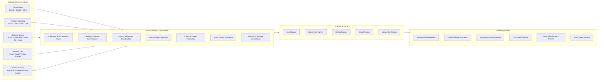

## Nivora とは

Nivora はデリバリー制御プレーンです。以下を調整します:

- Pipeline execution
- Release planning
- Deployment execution
- Runner assignment
- Executor selection
- Artifact traceability
- Policy evaluation
- Approval flow
- Audit records
- Runtime events
- Delivery timeline
- Visualization API read models

Nivora は複数のバイナリを持つ **モジュラーモノリシック** として開始します:

```text
nivora-server
nivora-worker
nivora-runner
nivora CLI
```

これにより、将来のサービス抽出へのパスを保持しながら、プロジェクトを理解しやすくします。

## Nivora ではないもの

Nivora は以下ではありません:

- Jenkins クローン
- Argo CD の代替
- Kubernetes のみのプラットフォーム
- クラウドプロバイダ固有のシステム
- フロントエンドファーストなプロジェクト
- ブラックボックス自動化ツール
- すべてのモデル化された統合が本番検証を完了したという声明

Nivora は明示的なポートとアダプターを通じて既存のシステムと統合されるべきです。

## 目標アーキテクチャ

目標アーキテクチャは **Control Plane** と **Execution Plane** を分離します。

制御プレーンは状態、オーケストレーション、ポリシー、監査、API、統合構成を所有します。実行プレーンはジョブ実行、ログ、ハートビート、ランタイム結果を所有します。

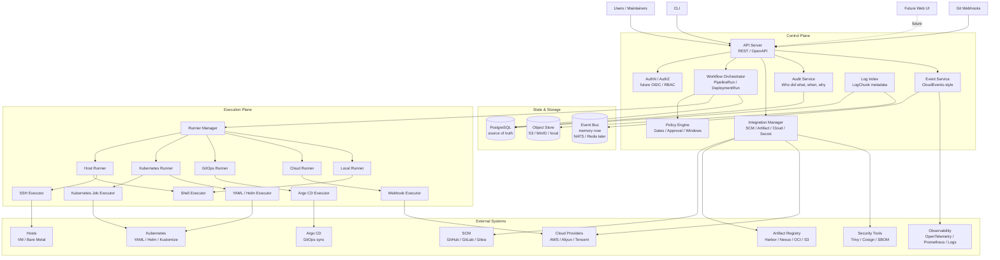

## アーキテクチャ原則

### Control Plane と Execution Plane は分離される

制御プレーンは API、状態、オーケストレーション、ポリシー、監査、統合構成、イベントタイムラインを所有します。実行プレーンはジョブ実行、ログ、ハートビート、ランタイム結果報告を所有します。

API サーバーはデプロイメントジョブを直接実行すべきではありません。

### Runner と Executor は異なる

```text
Runner = who executes
Executor = how execution happens
```

| Runner | Executor |
|---|---|
| Local Runner | Shell Executor |
| Host Runner | SSH Executor |
| Kubernetes Runner | Kubernetes Job Executor |
| GitOps Runner | Argo CD Executor |
| Cloud Runner | Webhook / Cloud Adapter |

この分離により、Nivora はコアオーケストレーションロジックを書き直すことなく、多くの実行環境をサポートできます。

### GitOps は一つのデプロイメントモードである

Nivora は GitOps をサポートしますが、GitOps は製品全体ではありません。

将来のデプロイメントモードには、ホストデプロイメント、生の Kubernetes YAML、Helm、Kustomize、Argo CD GitOps、ウェブフックベースのデリバリー、クラウドプロバイダ固有のデリバリーが含まれます。

### Ports and Adapters First

外部システムは安定したインターフェースを通じて統合されるべきです:

```text
SCMProvider
ArtifactProvider
CloudProvider
Executor
WorkflowRuntime
SecretProvider
NotificationProvider
PolicyEngine
EventBus
ObjectStore
```

コアユースケースは具体的なベンダーではなく、機能に依存すべきです。

### Artifacts Should Be Immutable

リリースは可能な限り不変のアーティファクトを指すべきです: イメージダイジェスト、不変バージョン、署名済みアーティファクト、SBOM 参照。`latest` タグ、デプロイメント中の暗黙的再ビルド、追跡されないアーティファクト変異は避けてください。

### Audit Is Not Optional

重要なデリバリーアクションは監査可能であるべきです: パイプライン開始、ジョブ割り当て、アーティファクト選択、承認許可または拒否、デプロイメント開始、ロールバック実行、ポリシー違反検出、ランナー登録、資格情報使用。

監査記録は秘密値を含んではなりません。

### No Fake Production Readiness

Nivora は今日何が存在し、何が目標アーキテクチャかを明示すべきです。初期フェーズは本番準備状況、完全な統合、永続スケジューリング、実装および検証されていないセキュリティ保証を主張すべきではありません。

## End-to-End Delivery Flow

これは Nivora が設計されている長期的なフローです。初期フェーズはシェルベースの PipelineRun サブセットのみを実装します: 定義パース、キューイングされた実行作成、ローカルランナー実行、ログ、イベント、監査記録、リトライ、タイムアウト、キャンセル、タイムラインクエリ。

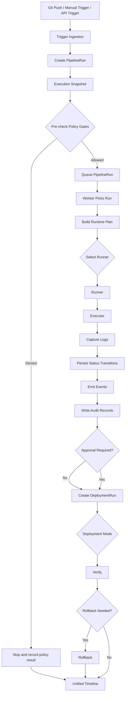

## PipelineRun Runtime Model

これは Nivora が構築している最初の実行基盤です。現在の実装は最小限のシェルベースの PipelineRun 実行に限定されています。

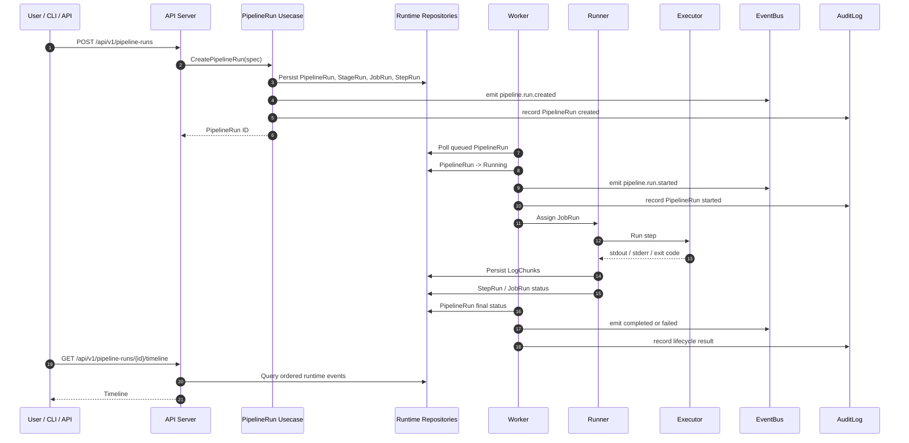

## PipelineRun State Model

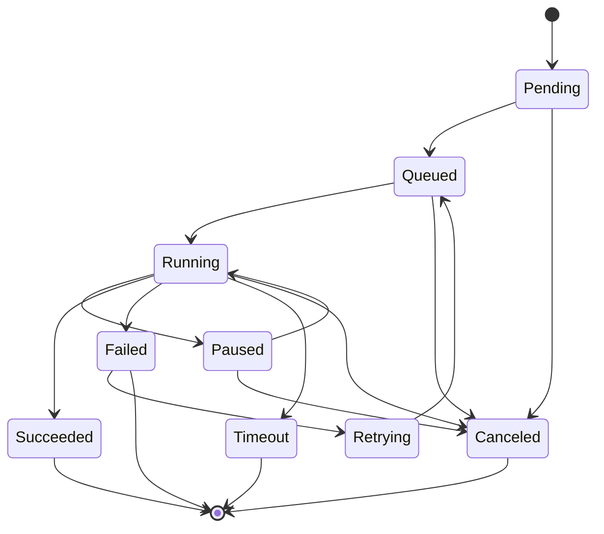

## Runner and Executor Model

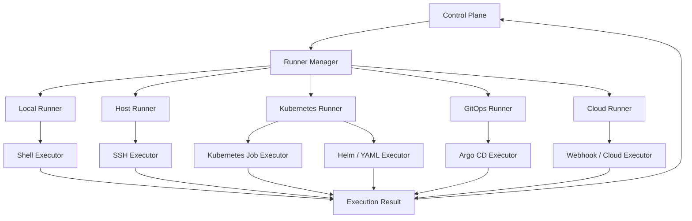

## Deployment Model

デプロイメント実行は目標アーキテクチャです。現在のフェーズでは完全な本番デプロイメントエンジンとして実装されていません。

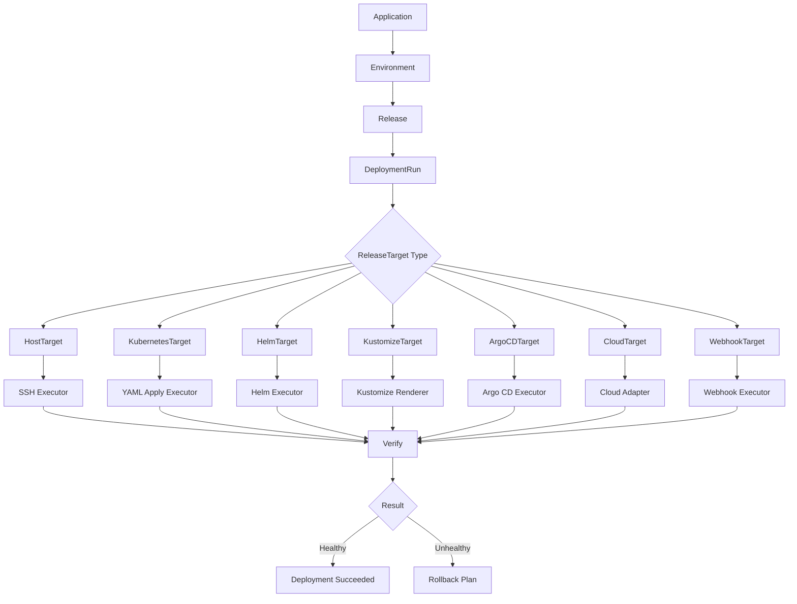

## Integration Model

すべての外部システムはポートとアダプターを通じて接続されるべきです。以下のアダプター名は、明示的に実装済みと文書化されていない限り、目標統合方向です。

読み取り専用 `/api/v1/integrations` エンドポイントは現在のアダプター/プラグイン機能インデックスを公開します。これはメタデータのみです: プロバイダを設定したり、外部サービスを呼び出したり、資格情報を返したりしません。スケルトン、noop、基盤のみ、実験的アダプターはそれぞれラベル付けされています。

```bash
go run ./cmd/nivora integrations list --local
go run ./cmd/nivora integrations list --server http://localhost:8080
```

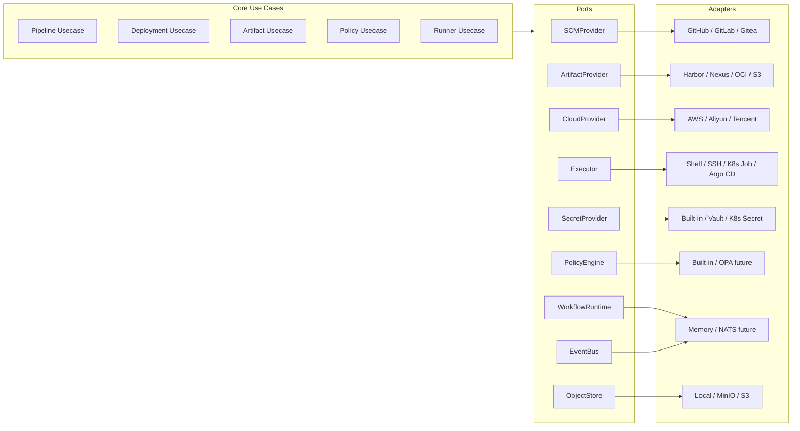

## Observability and Audit Model

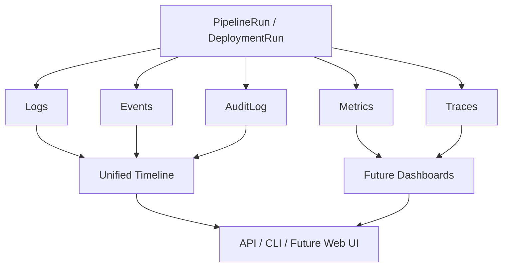

## Core Concepts

| 概念 | 意味 |
|---|---|
| Application | Nivora によって管理される製品またはサービス |
| Environment | dev、staging、prod、またはカスタムターゲットグループなどのデリバリーコンテキスト |
| ReleaseTarget | ホストグループ、Kubernetes クラスタ、Argo CD アプリケーション、クラウドターゲット、ウェブフックターゲットなどの具体的なデプロイメントターゲット |
| Pipeline | ステージ、ジョブ、ステップの再利用可能な定義 |
| PipelineRun | Pipeline の一回の実行 |
| StageRun | 一つのステージの実行記録 |
| JobRun | 一つのジョブの実行記録 |
| StepRun | 一つのステップの実行記録 |
| Release | 通常不変のアーティファクトに紐づくバージョン付きデリバリー意図 |
| DeploymentRun | ターゲットに対するリリースまたはデプロイメント計画の一実行 |
| Runner | ジョブを受け取り実行するコンポーネント |
| Executor | Runner が作業を実行するために使用するメカニズム |
| Artifact | イメージ、jar、バイナリ、チャート、パッケージなどのビルド出力 |
| Artifact Registry | アーティファクトを格納するシステム |
| Policy | 許可、拒否、承認要求ができるゲート |
| AuditLog | 重要なアクションの永続記録 |
| Event | デリバリーライフサイクル中に発生するランタイムシグナル |
| LogChunk | 順序付き stdout、stderr、またはシステムログセグメント |

## Repository Layout

```text
nivora/
  cmd/
    nivora-server/
    nivora-worker/
    nivora-runner/
    nivora/

  internal/
    app/
    domain/
    usecase/
    ports/
    adapters/
    infra/
    api/

  api/
    openapi/
    asyncapi/
    proto/

  configs/
  deployments/
  examples/
  docs/
  scripts/
  test/

  AGENTS.md
  PROJECT_CHARTER.md
  README.md
  ROADMAP.md
  CONTRIBUTING.md
```

| ディレクトリ | 目的 |
|---|---|
| `cmd/` | バイナリエントリポイントのみ |
| `internal/domain/` | 純粋なドメイン概念とステータス |
| `internal/usecase/` | ビジネスオーケストレーション |
| `internal/ports/` | 外部機能インターフェース |
| `internal/adapters/` | ポートの実装 |
| `internal/infra/` | 技術インフラ |
| `internal/api/` | HTTP / gRPC トランスポート |
| `api/` | OpenAPI、AsyncAPI、proto 定義 |
| `docs/` | アーキテクチャ、ロードマップ、概念、コミュニティドキュメント |
| `examples/` | サンプルパイプラインとデプロイメント仕様 |

## Quick Start

### Prerequisites

- Go
- Make
- Docker、ローカル compose 用オプション
- PostgreSQL、ランタイムモードに応じてオプション

### Build

```bash
make build
```

### Test

```bash
make test
```

### Verify

```bash
make verify
```

### Package

```bash
make docker-build
make helm-template
make helm-lint
```

パッケージングドキュメント:

- [Docker Compose install](docs/operations/install-docker-compose.md)
- [Kubernetes install](docs/operations/install-kubernetes.md)
- [Configuration](docs/operations/configuration.md)
- [Performance and load testing](docs/operations/performance.md)
- [Backup and restore](docs/operations/backup-restore.md)
- [HA and disaster recovery](docs/operations/ha-disaster-recovery.md)

### Smoke Tests

```bash
make smoke-local
make smoke-api
```

### Run Server

```bash
make run-server
```

### Run Web UI

```bash
make run-web
```

ウェブコンソールは `web/` 下にあり、既存のランタイム、可視化、アーティファクト、ポリシー、証拠、プラグイン、統合メタデータ API を消費します。これは完全なフロントエンド製品ではなく、最小限の Phase 6.4 基盤です。

バックエンドに到達できない場合、コンソールはすべてのダッシュボードカードをフェッチ失敗としてレンダリングするのではなく、単一の接続診断ページで停止します。`make run-web` 経由で開始するか、`web/` から Vite を実行して、チェックイン済みウェブパッケージから依存関係が解決されるようにしてください。

### Health Check

```bash
curl http://localhost:8080/healthz
curl http://localhost:8080/readyz
curl http://localhost:8080/api/v1/version
curl http://localhost:8080/api/v1/system/runtime
curl http://localhost:8080/api/v1/system/diagnostics
curl http://localhost:8080/metrics
```

`/readyz` と `/api/v1/system/diagnostics` には、データベース、オブジェクトストア、イベントバス、アウトボックスリカバリー、ランナー再接続姿勢の軽量依存チェックが含まれます。

### Run Worker

```bash
make run-worker
```

### Run Runner

```bash
make run-runner
```

### CLI

```bash
go run ./cmd/nivora version
go run ./cmd/nivora pipeline run --local examples/pipelines/simple-shell.yaml
go run ./cmd/nivora pipeline get <pipeline-run-id> --server http://localhost:8080 --token-env NIVORA_AUTH_TOKEN
go run ./cmd/nivora pipeline logs <pipeline-run-id> --server http://localhost:8080 --token-env NIVORA_AUTH_TOKEN
go run ./cmd/nivora pipeline timeline <pipeline-run-id> --server http://localhost:8080
go run ./cmd/nivora deployment plan --local examples/deployments/yaml-dry-run.yaml
go run ./cmd/nivora deployment dry-run --local examples/deployments/yaml-dry-run.yaml
go run ./cmd/nivora deployment apply --local examples/deployments/yaml-apply-local.yaml --confirm
go run ./cmd/nivora deployment host plan --file examples/deployments/host-dry-run.yaml --local
go run ./cmd/nivora deployment host run --file examples/deployments/host-dry-run.yaml --local
go run ./cmd/nivora release plan --file examples/releases/multi-target-release.yaml --local
go run ./cmd/nivora release deploy --file examples/releases/sequential-release.yaml --local
go run ./cmd/nivora cloud providers --local
go run ./cmd/nivora plugins list --local
go run ./cmd/nivora plugins inspect artifact-oci --local
go run ./cmd/nivora plugins validate --local --file examples/plugins/templates/scanner-plugin.yaml
```

## Local Development

Nivora は Makefile、docker-compose、ローカルオブジェクトストア、メモリイベントバス、シェルエグゼキューター、サンプルパイプラインを通じてローカル開発をサポートします。

このリポジトリはローカルツールでニュートラルなデフォルト Go プロキシを使用します:

```bash
GOPROXY=https://proxy.golang.org,direct
```

中国の開発者はプロジェクトデフォルトを変更せずに上書きできます:

```bash
GOPROXY=https://goproxy.cn,direct make verify
```

または:

```bash
export GOPROXY=https://goproxy.cn,direct
make verify
```

## Example Pipeline

```yaml
apiVersion: nivora.io/v1alpha1
kind: Pipeline
metadata:
  name: hello-shell
spec:
  stages:
    - name: build
      jobs:
        - name: echo
          executor: shell
          steps:
            - name: say-hello
              run: echo "hello from nivora"
```

ローカルで実行:

```bash
go run ./cmd/nivora pipeline run --local examples/pipelines/simple-shell.yaml
```

## Example YAML Deployment Dry-Run

現在の Phase 2 基盤は、非破壊的な YAML デプロイメント計画と dry-run バリデーション、およびランタイムテスト用の明示的なローカル no-op apply をサポートします。静的マニフェストをレンダリングし、基本的な形状を検証し、DeploymentPlan を作成し、リソースインベントリを記録し、バインドされたアーティファクトに対してマニフェストイメージを検証し、ログ/イベント/監査/タイムラインデータを記録し、デフォルトではリソースをクラスターに適用しません。

```yaml
apiVersion: nivora.io/v1alpha1
kind: Deployment
metadata:
  name: demo-yaml-deployment
spec:
  application: demo-springboot
  environment: dev
  target:
    type: kubernetes-yaml
    name: dev-kind
    namespace: default
  manifests:
    - examples/yaml/configmap.yaml
    - examples/yaml/deployment.yaml
    - examples/yaml/service.yaml
  options:
    dryRun: true
    apply: false
```

ローカルで実行:

```bash
go run ./cmd/nivora deployment plan --local examples/deployments/yaml-dry-run.yaml
go run ./cmd/nivora deployment dry-run --local examples/deployments/yaml-dry-run.yaml
```

明示的なローカル apply には別コマンドと確認が必要です:

```bash
go run ./cmd/nivora deployment apply --local examples/deployments/yaml-apply-local.yaml --confirm
```

デフォルトのローカル apply パスは安全な no-op マニフェストクライアントを使用します。本番 Kubernetes apply セマンティクス、Helm、Kustomize、Argo CD、クラウドプロバイダ、リモートホストデプロイメント、レジストリ統合は将来の作業です。

## Example Host Deployment Dry-Run

Phase 8.1 は安全なホストデプロイメント基盤を強化します。バージョン付きリリースディレクトリへのバイナリパッケージデプロイメント計画、シンボリックリンク切り替え、HTTP/TCP/コマンドヘルスチェック、バッチ実行、ガード付きシンボリックリンクロールバック準備が可能です。デフォルトランタイムは noop ホストエグゼキューターを使用し、リモート SSH を実行しません。

```bash
go run ./cmd/nivora deployment host plan --file examples/deployments/host-dry-run.yaml --local
go run ./cmd/nivora deployment host run --file examples/deployments/host-dry-run.yaml --local
```

リモートホストデプロイメントは、資格情報参照、確認、許可フラグ付きアダプタートランスポートが明示的に構成されない限り無効のままです。

## Example Multi-Target Release

Phase 2.7 はローカル ReleasePlan / ReleaseExecution 基盤を追加します。複数のターゲットにわたる Release を計画し、ターゲットレベルの DeploymentRun またはプレースホルダーターゲットを通じて安全なターゲットをシーケンシャルに実行できます。

```bash
go run ./cmd/nivora release plan --file examples/releases/multi-target-release.yaml --local
go run ./cmd/nivora release deploy --file examples/releases/sequential-release.yaml --local
```

サーバー backed リリースとデプロイメントコマンドは RBAC 保護されています。トークン値を直接渡すのではなく、サーバー呼び出しには `--token-env NIVORA_AUTH_TOKEN` を使用してください。

これは本番ワークフローエンジンではありません。並列実行、永続承認、ホスト/クラウドターゲット、本番 GitOps 自動化は将来の作業です。

API 経由で最小限のシェル PipelineRun を実行:

```bash
curl -X POST http://localhost:8080/api/v1/pipeline-runs \
  -H 'Content-Type: application/json' \
  -d '{
    "apiVersion": "nivora.io/v1alpha1",
    "kind": "Pipeline",
    "metadata": {"name": "hello-shell"},
    "spec": {
      "stages": [{
        "name": "build",
        "jobs": [{
          "name": "echo",
          "executor": "shell",
          "steps": [{"name": "say-hello", "run": "echo hello from nivora"}]
        }]
      }]
    }
  }'
```

未実装の API グループはフェイクデータではなく構造化された応答を返します:

```json
{
  "code": "not_implemented",
  "message": "This endpoint is reserved for a future phase.",
  "path": "/api/v1/integrations"
}
```

## Events

Nivora は CloudEvents スタイルのイベントエンベロープを使用します。

```json
{
  "specversion": "1.0",
  "id": "evt_01HX",
  "type": "devops.pipeline.run.started",
  "source": "/projects/example/pipelines/hello-shell",
  "subject": "pipelineRun/pr_123",
  "time": "2026-05-18T10:00:00Z",
  "datacontenttype": "application/json",
  "data": {
    "pipelineRunId": "pr_123",
    "status": "Running"
  }
}
```

OpenAPI 定義は `api/openapi/openapi.yaml` 下に、AsyncAPI 定義は `api/asyncapi/asyncapi.yaml` 下に存在します。

コア API グループには以下が含まれます:

```text
/api/v1/orgs
/api/v1/projects
/api/v1/applications
/api/v1/environments
/api/v1/repositories
/api/v1/artifact-registries
/api/v1/pipelines
/api/v1/pipeline-runs
/api/v1/jobs
/api/v1/releases
/api/v1/deployments
/api/v1/runner-groups
/api/v1/runners
/api/v1/approvals
/api/v1/policies
/api/v1/audit-logs
/api/v1/events
/api/v1/logs
/api/v1/timeline
/api/v1/integrations
/api/v1/visualization
```

集約ランタイム検査には CLI エントリポイントもあります:

```bash
nivora events search --pipeline-run-id <pipeline-run-id> --limit 50
nivora logs search --pipeline-run-id <pipeline-run-id> --contains "error"
nivora timeline search --pipeline-run-id <pipeline-run-id> --limit 50
nivora audit search --subject-id <subject-id> --scope-type project --scope-id <project-id>
```

## Roadmap

```mermaid
flowchart LR
    P0["Phase 0<br/>Backend Skeleton"]
    P05["Phase 0.5<br/>Guardrails"]
    P06["Phase 0.6<br/>Public Planning"]
    P1["Phase 1<br/>Minimal Runtime"]
    P15["Phase 1.5<br/>Durable Runtime Foundation"]
    P16["Phase 1.6<br/>Runtime DX & Acceptance"]
    P2["Phase 2.0<br/>YAML Planning Foundation"]
    P21["Phase 2.1<br/>Kubernetes YAML Runtime"]
    P22["Phase 2.2<br/>Artifact & Release Binding"]
    P23["Phase 2.3<br/>GitOps & Argo CD Foundation"]
    P24["Phase 2.4<br/>Kubernetes Inventory & Rollback Foundation"]
    P25["Phase 2.5<br/>OCI Digest Resolution"]
    P26["Phase 2.6<br/>Argo CD Guarded Sync"]
    P27["Phase 2.7<br/>Release Orchestration"]
    P30["Phase 3.0<br/>DevSecOps Foundation"]
    P31["Phase 3.1<br/>Secret & Credential Foundation"]
    P32["Phase 3.2<br/>Auth & RBAC Foundation"]
    P33["Phase 3.3<br/>Approvals & Change Windows"]
    P34["Phase 3.4<br/>Multi-cloud Inventory"]
    P35["Phase 3.5<br/>Host Deployment Foundation"]
    P36["Phase 3.6<br/>Durable Runner Runtime"]
    P3["Future Phase 3<br/>Multi-cloud & DevSecOps"]
    P40["Phase 4.0<br/>Visualization Backend APIs"]
    P41["Phase 4.1<br/>Web UI Foundation"]
    P4["Future Phase 4<br/>Frontend Visualization"]

    P0 --> P05 --> P06 --> P1 --> P15 --> P16 --> P2 --> P21 --> P22 --> P23 --> P24 --> P25 --> P26 --> P27 --> P30 --> P31 --> P32 --> P33 --> P34 --> P35 --> P36 --> P3 --> P40 --> P41 --> P4
```

詳細は [ROADMAP.md](ROADMAP.md) と [docs/roadmap/overview.md](docs/roadmap/overview.md) を参照してください。

## Contribution Map

```mermaid
flowchart TB
    C["Contributor"]
    C --> G1["Good First Contributions"]
    C --> G2["Intermediate Contributions"]
    C --> G3["Advanced Contributions"]
    C --> G4["Requires RFC"]
    G1 --> D1["Documentation"]
    G1 --> D2["Examples"]
    G1 --> D3["Tests"]
    G1 --> D4["CLI polish"]
    G1 --> D5["API schema cleanup"]
    G2 --> I1["Shell executor improvements"]
    G2 --> I2["Memory event bus"]
    G2 --> I3["Local object store"]
    G2 --> I4["Config validation"]
    G2 --> I5["Pipeline state tests"]
    G3 --> A1["PipelineRun state machine"]
    G3 --> A2["Runner protocol"]
    G3 --> A3["Log streaming"]
    G3 --> A4["Persistence"]
    G3 --> A5["Kubernetes Job executor"]
    G3 --> A6["YAML renderer"]
    G3 --> A7["Argo CD adapter"]
    G3 --> A8["Policy engine"]
    G4 --> R1["Runner protocol changes"]
    G4 --> R2["Workflow runtime changes"]
    G4 --> R3["Database model changes"]
    G4 --> R4["Cloud provider adapters"]
    G4 --> R5["Kubernetes / Argo CD integration design"]
    G4 --> R6["Plugin system changes"]
    G4 --> R7["Security model changes"]
    G4 --> R8["Public API breaking changes"]
```

コントリビューション前に以下をお読みください:

- [AGENTS.md](AGENTS.md)
- [CONTRIBUTING.md](CONTRIBUTING.md)
- [PROJECT_CHARTER.md](PROJECT_CHARTER.md)
- [docs/README.md](docs/README.md)
- [docs/rfcs/README.md](docs/rfcs/README.md)
- [docs/architecture/architecture-contract.md](docs/architecture/architecture-contract.md)
- [docs/architecture/module-boundaries.md](docs/architecture/module-boundaries.md)
- [docs/engineering/testing-policy.md](docs/engineering/testing-policy.md)
- [docs/engineering/dependency-policy.md](docs/engineering/dependency-policy.md)

基本的な期待:

- 変更を小さく保つ
- アーキテクチャ境界を保持する
- 投機的抽象を追加しない
- 秘密をコミットしない
- 本番準備状況を主張しない
- アーキテクチャ変更時にドキュメントを更新する
- 公開動作変更時に OpenAPI / AsyncAPI を更新する
- 動作変更に対してテストを追加する

## Contributor Automation

自動化コーディングツールと人間のコントリビューターは同じリポジトリルールを使用します。規範的な指示ファイルは [AGENTS.md](AGENTS.md) です。

ツール固有の指示ファイルは、競合する動作を定義するのではなく `AGENTS.md` を指すべきです。すべての変更はアーキテクチャ境界、フェーズ境界、依存ポリシー、テストポリシー、セキュリティベースライン、ドキュメント一貫性を保持しなければなりません。

## Verification

完全な検証スイートを実行:

```bash
make verify
```

期待されるチェックには以下が含まれます:

```text
gofmt check
go mod tidy check
go vet ./...
go test ./...
go build ./cmd/nivora-server
go build ./cmd/nivora-worker
go build ./cmd/nivora-runner
go build ./cmd/nivora
architecture verification
secret scanning
```

## Security

Nivora は秘密をコミットまたは公開すべきではありません。

トークン、パスワード、秘密鍵、kubeconfig、クラウド資格情報、レジストリ資格情報、またはリアルなフェイク資格情報をコミットしないでください。秘密値はログに記録されたり、通常の API によって返されたり、監査記録に格納されたり、サンプルに埋め込まれたり、テストに埋め込まれたりすべきではありません。

[SECURITY.md](SECURITY.md) と [docs/engineering/security-baseline.md](docs/engineering/security-baseline.md) を参照してください。

Phase 3.0 はローカル DevSecOps 基盤を追加します:

```bash
go run ./cmd/nivora security scan artifact registry.example.com/demo/app:latest --local
go run ./cmd/nivora security scan manifest examples/security/manifest-privileged-warning.yaml --local
go run ./cmd/nivora policy evaluate --subject registry.example.com/demo/app:latest
```

これらのコマンドは noop/fake フレンドリーなスキャナー基盤と組み込みポリシーゲートを使用します。Trivy、Cosign、SBOM 生成、OPA、Kyverno、Gatekeeper、本番セキュリティ自動化は将来の作業です。

Phase 3.1 は SecretRef と Credential メタデータを追加します:

```bash
go run ./cmd/nivora secret put --name local-registry-token --value-env NIVORA_TOKEN --token-env NIVORA_AUTH_TOKEN
go run ./cmd/nivora secret provider validate --token-env NIVORA_AUTH_TOKEN
go run ./cmd/nivora credential create --file examples/credentials/registry-credential.yaml --token-env NIVORA_AUTH_TOKEN
```

秘密値は作成とローテーション境界でのみ受け入れられ、通常の API によって返されません。サーバー backed コマンドは `--token-env` を使用して API トークンをシェル履歴から遠ざけるべきです。コマンドがサポートする場合は、プロセス内開発パスで `--local` を使用できます。組み込みプロバイダは開発専用です。Phase 7.1 は Vault と Kubernetes Secret アダプター基盤、クラウド KMS プレースホルダーを追加します。本番外部秘密ストレージは将来の作業です。

Phase 7.0 はローカル認証と RBAC 基盤を強化します:

```bash
go run ./cmd/nivora auth whoami
go run ./cmd/nivora auth users
go run ./cmd/nivora auth roles
go run ./cmd/nivora auth permissions
go run ./cmd/nivora project members add <project-id> --user-id <user-id> --role developer
go run ./cmd/nivora auth service-account create --name ci --role developer
go run ./cmd/nivora auth token create --subject-id <service-account-id>
```

Dev 認証は本番認証ではありません。静的トークンモードは環境変数からトークン値を読み取ります。OIDC はプロバイダ構成済みバックエンド基盤作業です。完全なブラウザ SSO とプロバイダライフサイクル操作は将来の作業です。

システム診断は CLI または HTTP 経由で読み取れます:

```bash
go run ./cmd/nivora system runtime
go run ./cmd/nivora system diagnostics
```

Phase 7.2 はマルチテナンシーとクォータ基盤を追加します:

```bash
go run ./cmd/nivora quota view --scope-type project --scope-id demo --token-env NIVORA_AUTH_TOKEN
go run ./cmd/nivora usage summary --scope-type project --scope-id demo --token-env NIVORA_AUTH_TOKEN
```

スコープ付き API トークンは org/project/environment スタイルの境界に制限でき、クォータ読み取りモデルは並列性、ランナー、アーティファクト、ログストレージ、レート制限基盤を公開します。永続分散クォータ強制は将来の作業です。

Phase 7.3 はコンプライアンス監査と証拠基盤を追加します:

```bash
go run ./cmd/nivora audit search --subject <subject-id>
go run ./cmd/nivora evidence list --subject-type pipelineRun --subject-id <pipeline-run-id> --token-env NIVORA_AUTH_TOKEN
go run ./cmd/nivora evidence export pipelineRun <pipeline-run-id> --format markdown --token-env NIVORA_AUTH_TOKEN
```

証拠バンドルは安全なリリース、アーティファクト、承認、ポリシー、セキュリティ、デプロイメント、ログ参照、イベント、監査コンテキストを集めます。秘密ライクな値はエクスポート前にレダクトされます。不変外部監査ストレージと保持強制ジョブは将来の作業です。

## Documentation

| 文書 | 目的 |
|---|---|
| [PROJECT_CHARTER.md](PROJECT_CHARTER.md) | プロジェクトの目的と原則 |
| [ROADMAP.md](ROADMAP.md) | 高レベルロードマップ |
| [docs/README.md](docs/README.md) | ドキュメントインデックス |
| [docs/architecture/](docs/architecture/overview.md) | アーキテクチャモデル |
| [docs/concepts/](docs/concepts/overview.md) | コア概念 |
| [docs/product/](docs/product/vision.md) | 製品計画 |
| [docs/community/](docs/community/governance.md) | コントリビューションとガバナンス |
| [docs/rfcs/](docs/rfcs/README.md) | RFC プロセス |
| [docs/adr/](docs/adr/0001-use-go-as-primary-language.md) | アーキテクチャ決定記録 |
| [AGENTS.md](AGENTS.md) | 自動化とコントリビューションルール |

## Design North Star

Nivora はデリバリーシステムをより一貫性のあるものにするために構築されています。一つのツール、一つのクラウド、一つのランタイム、一つのデプロイメントモデルを前提としません。

長期的な目標は、以下のようなデリバリー制御プレーンを提供することです:

```text
pipelines are repeatable
releases are artifact-based
deployments are auditable
policies are explicit
runners are isolated
integrations are replaceable
events are observable
rollback is traceable
```

Nivora は小さく開始します。最初のマイルストーンはすべてのツールをサポートすることではありません。最初のマイルストーンは正しい基盤を構築することです。

## License

Nivora is licensed under the Apache License 2.0. See [LICENSE](LICENSE).
