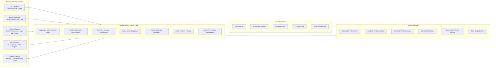
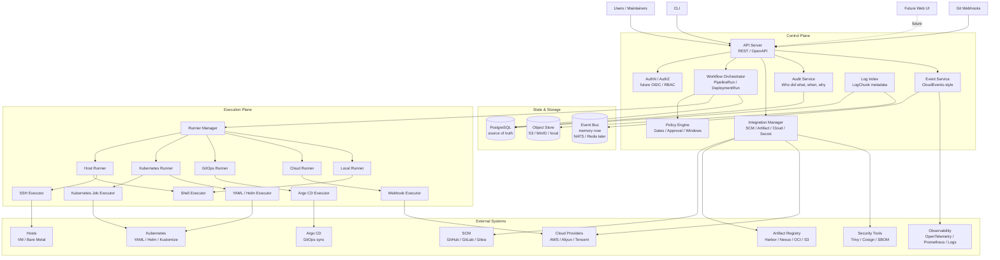
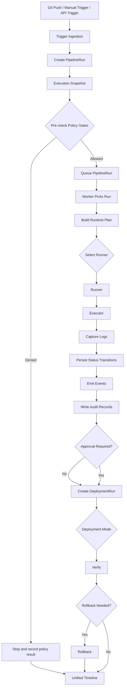
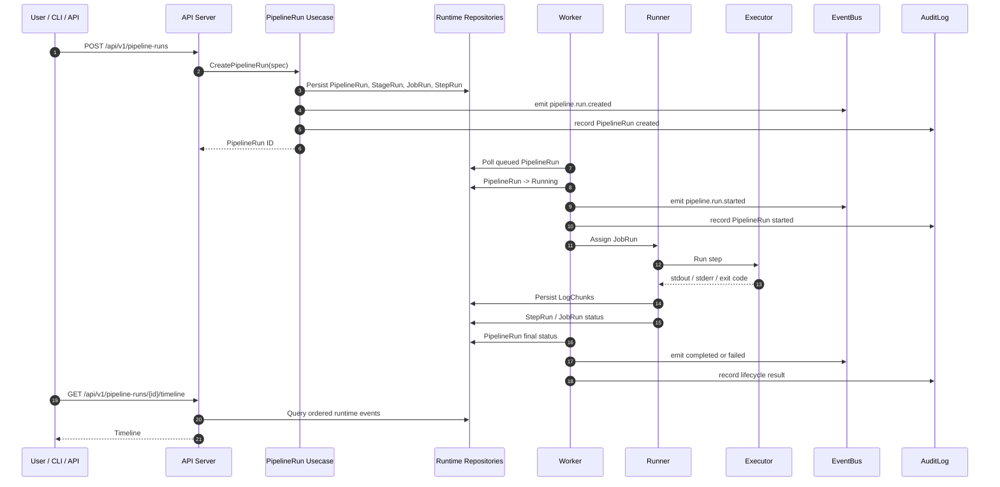
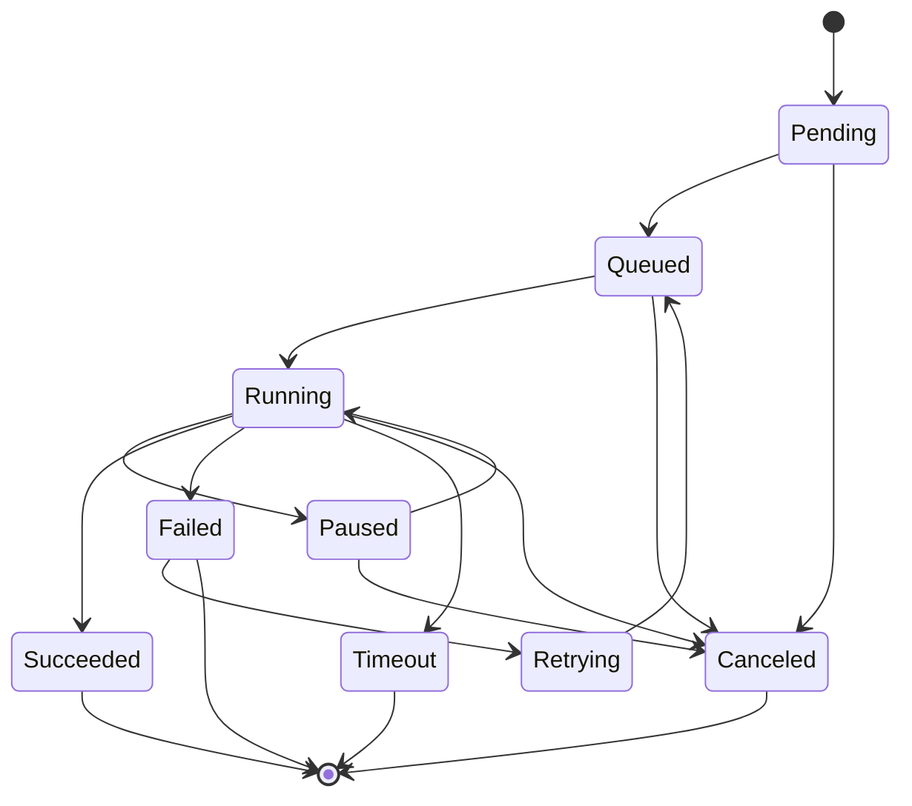
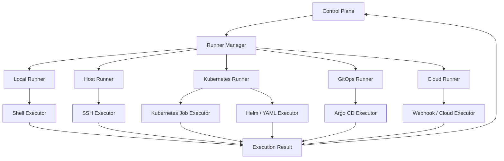
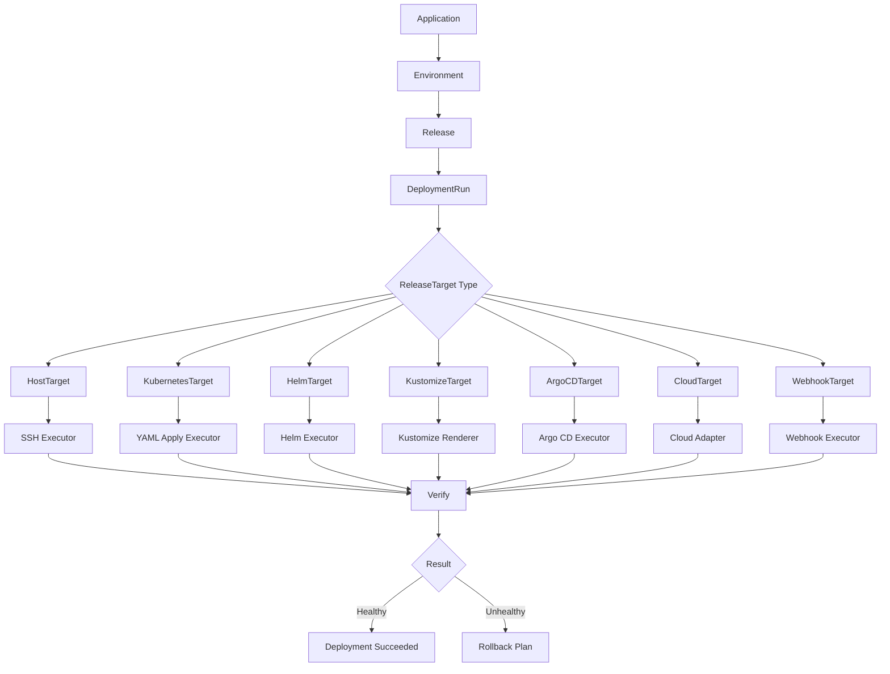
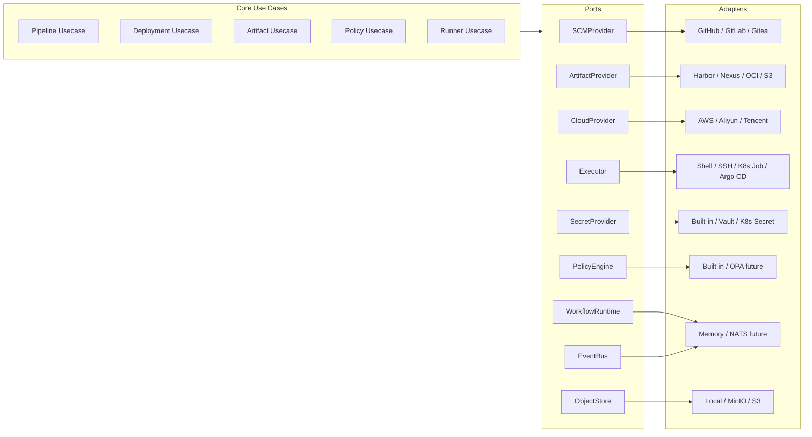
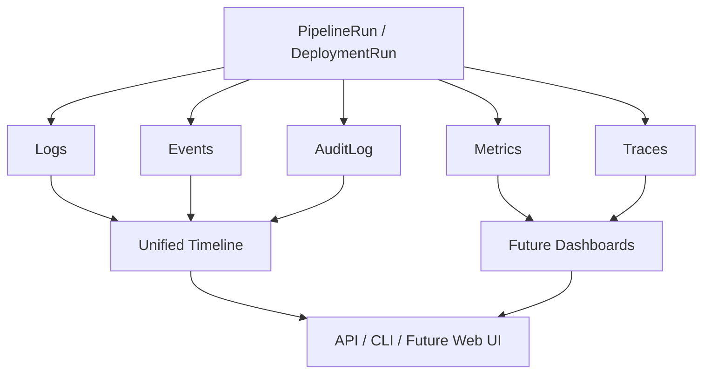

# Nivora

<p align="center">
  <strong>🌐 Languages</strong>:
  <a href="README.md">English</a> |
  <a href="README.zh-CN.md">中文</a> |
  <a href="README.ja-JP.md">日本語</a> |
  <a href="README.ko-KR.md">한국어</a> |
  <a href="README.es-ES.md">Español</a>
</p>

> 파이프라인, 릴리스, 배포, 러너, 정책 게이트, 승인, 감사 기록을 위한 백엔드 우선 전달 제어 평면.

**Nivora**는 `sevoniva` 조직 하의 오픈 소스 DevOps 전달 제어 평면입니다.

이 프로젝트는 파이프라인, 릴리스, 아티팩트, 배포, 러너, 정책 결정, 승인, 로그, 이벤트, 감사 기록에 걸쳐 전달 의도와 상태를 기록합니다. 기존 도구를 대체하는 것이 아니라 그 주위에 자리 잡도록 설계되었습니다.

Nivora는 **Jenkins, Argo CD, Kubernetes, Harbor, 클라우드 제어 평면, 스캐너가 아닙니다**. 이러한 시스템은 별도로 유지되며, Nivora는 전달 작업이 그들을 통해 어떻게 이동하는지를 모델링하고 감사합니다.

현재 성숙도: **강화된 베타 후보 기반**. Nivora는 **프로덕션 준비가 되지 않았습니다**. 저장소에는 작동하는 백엔드 기반, 핵심 런타임 영역과 제어 평면 카탈로그 메타데이터를 위한 PostgreSQL 기반 저장소, 보호된 배포 작업, RBAC 테스트, 패키징 자산, 검증 스크립트가 있습니다. 프로덕션 사용에는 러너 격리, 라이브 설치/복원 드릴, 외부 통합, 프로덕션 규모 운영에 대한 추가 검증이 필요합니다.

미래 `v1.0.0` 문서는 계획 체크리스트이며 GA에 도달했다는 증거가 아닙니다. 현재 단일 진실 공급원은 [Capability Status](docs/status/CAPABILITY_STATUS.md)이며, 역사적 감사 컨텍스트는 [Implementation Audit](docs/status/IMPLEMENTATION_AUDIT.md)에 있습니다.

엔터프라이즈 준비도 추적은 [Enterprise Production Baseline](docs/status/ENTERPRISE_PRODUCTION_BASELINE.md), [Enterprise Readiness Matrix](docs/status/ENTERPRISE_READINESS_MATRIX.md), [Enterprise Production Readiness Review](docs/status/ENTERPRISE_PRODUCTION_READINESS_REVIEW.md), [Enterprise Risk Register](docs/status/ENTERPRISE_RISK_REGISTER.md)에 있습니다. 이 문서들은 릴리스 강화 증거이며 프로덕션 승인이 아닙니다.

## 현재 상태

| 영역 | 상태 |
|---|---|
| PipelineRun 런타임 | 로그/이벤트/감사 및 아티팩트/캐시/주석/요약 메타데이터 읽기를 포함한 로컬 셸 실행에 대해 구현됨; 완전한 워크플로우 엔진은 아님 |
| DeploymentRun 런타임 | 부분적; YAML dry-run, 보호된 apply, 인벤토리, 헬스, diff, 감사, PostgreSQL 지속성 기반이 존재 |
| Release 및 ReleaseExecution | 부분적; 순차 오케스트레이션과 PostgreSQL 지속성 기반이 존재 |
| Release target catalog | 기반; `/api/v1/release-targets`와 `nivora target`이 구성된 서버 모드에서 PostgreSQL 지속성과 기본 비활성화된 안전하지 않은 작업으로 타겟 메타데이터를 관리 |
| Repository catalog / intelligence | 기반; 저장소 메타데이터 카탈로그, 파일 기반 `nivora repository create --file`, 로컬/일반 읽기 전용 스냅샷, 정적 언어/빌드/테스트/패키지 감지, 계획 전용 DevOps 요약, 구성된 서버/MCP 모드에서 PostgreSQL 기반 스냅샷/지능 저장소, `nivora repository inspect/snapshot/analyze/devops-plan`, 저장소 MCP 읽기/계획 도구가 존재; 외부 SCM 작성은 향후 작업 |
| Nivora Workflow | 기반; `.nivora/workflows/*.yaml` 파서, 검증기, DAG/매트릭스 플래너, 아티팩트/캐시 힌트, 계획 전용 보안/릴리스/배포 의도, 파이프라인 정의 변환, 저장된 계획 기록, 보호된 WorkflowRun 메타데이터, `nivora workflow validate/plan/run/cancel/reconcile/retry`, 계획 전용 API/MCP 표면이 존재; WorkflowRun은 연결된 PipelineRun 기록을 대기/취소/재시도하고 연결된 PipelineRun 상태에서 상태를 조정하고 아티팩트/캐시 메타데이터를 기록할 수 있지만 완전한 워크플로우 엔진은 아님 |
| Runner protocol | 부분적; 토큰, 하트비트, 클레임, 로그, 상태, 격리 프로파일이 존재; OS 수준 샌드박싱은 여전히 운영자 작업 |
| Kubernetes YAML | 실험적 보호된 apply/rollback 기반; 기본 파괴적 동작 없음 |
| GitOps / Argo CD | 실험적 계획/상태/보호된 동기화 기반; 프로덕션 Argo 자동화 없음 |
| Artifact / OCI | 부분적; OCI 파싱, digest 기반, PostgreSQL 기반 레지스트리 카탈로그; 완전한 레지스트리 제품 통합 없음 |
| DevSecOps / policy | 기반; noop/fake 스캐너 경로, 내장 규칙, PostgreSQL 기반 정책 카탈로그; Trivy/Cosign/SBOM 프로덕션 통합 없음 |
| Secrets / credentials | 부분적; 메타데이터, 적출, 제공자 스켈레톤; 프로덕션 제공자 수명 주기는 향후 작업 |
| Auth / RBAC | 부분적; 로컬/토큰/OIDC 기반과 라우트 테스트; 완전한 엔터프라이즈 SSO는 향후 작업 |
| Approvals / change windows / notifications | 기반; 백엔드 전용, ITSM 워크플로우 없음 |
| Multi-cloud | 플레이스홀더/기반 인벤토리 전용; 클라우드 배포 없음 |
| Host deployment | 실험적 계획/dry-run/noop과 보호된 SSH 표면 |
| Web console | 백엔드 API를 소비하는 실험적 최소 UI |
| MCP control plane | 기반; 로컬 stdio 읽기 전용과 계획 전용 AI 접근 및 실험적 옵트인 원격 읽기 전용 JSON-RPC, 저장소/워크플로우 계획 도구, 집계 이벤트/로그 읽기, 거부된 작업 도구, 러너 토큰 거부, 준수 기반 감사, 31개 검증된 운영자 시나리오와 골든 답변; 원격 MCP는 광범위하게 노출되지 않거나 프로덕션 준비가 되지 않음 |
| Integration capability index | 기반; 읽기 전용 `/api/v1/integrations`가 내장, 스켈레톤, noop, 기반, 실험적 어댑터 기능을 라벨링 |
| Packaging | 부분적; Docker Compose, Helm, 프로덕션 유사 값, 스모크 체크가 존재 |
| Observability / audit | 부분적; 메트릭, 런타임 복구 센터, 프로덕션 진단, 읽기 전용 시각화 API 인덱스, 런북, 감사/증거 내보내기 기반; 프로덕션 보존/내보내기는 여전히 강화 필요 |

현재 초점:

```text
keep public status accurate
keep examples and docs aligned with implemented behavior
stabilize CI, packaging, and local demo paths
continue runtime, install, restore, runner, and audit hardening
turn operator-facing checks into repeatable product workflows
```

상태 참조:

- [Alpha Capability Matrix](docs/ALPHA_CAPABILITY_MATRIX.md)
- [Beta Capability Matrix](docs/BETA_CAPABILITY_MATRIX.md)
- [API Inventory](docs/API_INVENTORY.md)
- [Alpha Demo Guide](docs/demo/alpha-demo.md)
- [v0.1.0-alpha.1 Checklist](docs/releases/v0.1.0-alpha.1-checklist.md)
- [v0.5.0-beta Checklist](docs/releases/v0.5.0-beta-checklist.md)
- [v0.5.0-beta Release Notes Draft](docs/releases/v0.5.0-beta-release-notes-draft.md)
- [v1.0.0-rc.1 Checklist](docs/releases/v1.0.0-rc.1-checklist.md)
- [Future v1.0.0 GA Readiness Capability Matrix](docs/releases/v1.0.0-ga-capability-matrix.md)
- [Future v1.0.0 GA Readiness Checklist](docs/releases/v1.0.0-ga-checklist.md)
- [Future v1.0.0 Release Notes Draft](docs/releases/v1.0.0-release-notes.md)
- [Implementation Audit](docs/status/IMPLEMENTATION_AUDIT.md)
- [Capability Status](docs/status/CAPABILITY_STATUS.md)
- [AI Control Plane Product Review](docs/status/AI_CONTROL_PLANE_PRODUCT_REVIEW.md)
- [AI Control Plane Beta Readiness](docs/status/AI_CONTROL_PLANE_BETA_READINESS.md)
- [AI Control Plane Deep Audit](docs/status/AI_CONTROL_PLANE_DEEP_AUDIT.md)
- [AI Operator Journeys](docs/status/AI_OPERATOR_JOURNEYS.md)
- [AI Control Plane Go / No-Go](docs/status/AI_CONTROL_PLANE_GO_NO_GO.md)
- [Remote MCP Readiness Audit](docs/status/REMOTE_MCP_READINESS_AUDIT.md)
- [MCP Enterprise Opening Decision](docs/status/MCP_ENTERPRISE_OPENING_DECISION.md)
- [Enterprise Production Readiness Review](docs/status/ENTERPRISE_PRODUCTION_READINESS_REVIEW.md)
- [Enterprise Next Goals](docs/status/ENTERPRISE_NEXT_GOALS.md)
- [Security Threat Model](docs/security/threat-model.md)
- [MCP Threat Model](docs/security/mcp-threat-model.md)
- [Security Review Checklist](docs/security/security-review-checklist.md)
- [User Guide](docs/user/README.md)
- [Operator Guide](docs/operator/README.md)
- [Developer Guide](docs/developer/README.md)
- [Tutorials](docs/tutorials/README.md)
- [Release Playbook](docs/releases/release-playbook.md)
- [Production-Direction Install](docs/operations/production-install.md)
- [프로덕션 진단](docs/operations/production-doctor.md)
- [Upgrade Guide](docs/operations/upgrade.md)
- [Release Automation](docs/operations/release-automation.md)
- [Changelog](CHANGELOG.md)

## Nivora가 존재하는 이유

전달 상태는 종종 여러 시스템에 분산되어 있습니다.

| 영역 | 일반적인 도구 |
|---|---|
| 소스 컨트롤 | GitHub, GitLab, Gitea |
| CI 실행 | Jenkins, GitLab CI, GitHub Actions, Tekton |
| 아티팩트 저장 | Harbor, Nexus, JFrog, OCI 레지스트리, S3 |
| Kubernetes 전달 | kubectl, Helm, Kustomize |
| GitOps | Argo CD |
| 호스트 배포 | SSH, systemd, 스크립트 |
| 클라우드 타겟 | AWS, Aliyun, Tencent Cloud |
| 보안 | Trivy, Cosign, SBOM 도구, 정책 엔진 |
| 관찰 가능성 | OpenTelemetry, Prometheus, 로그 |
| 인간 프로세스 | 승인, 변경 창, 릴리스 감사 |

문제는 개별 도구가 아닙니다. 문제는 전달 의도, 실행 상태, 감사, 정책, 아티팩트 추적성, 롤백 컨텍스트가 종종 별도로 저장된다는 것입니다.

Nivora는 그 상태를 위한 백엔드 제어 평면 모델을 제공합니다.

## 제품 포지셔닝

Nivora는 **전달 제어 평면**입니다. CI 도구만은 아니며 CD 도구만도 아닙니다.

다음 사항을 조정합니다:

```text
source code
-> pipeline execution
-> artifact selection
-> policy evaluation
-> approval
-> deployment
-> verification
-> rollback
-> audit
-> timeline
```

Nivora는 다음과 같은 운영 질문을 답변하는 것을 목표로 합니다:

- 어떤 커밋이 이 릴리스를 생성했는가?
- 어떤 아티팩트가 배포되었는가?
- 누가 프로덕션 배포를 승인했는가?
- 어떤 러너가 작업을 실행했는가?
- 어떤 정책 게이트가 통과했거나 실패했는가?
- 어떤 환경이 릴리스를 받았는가?
- 두 배포 사이에 무엇이 변경되었는가?
- 이 전달에 어떤 로그, 이벤트, 감사 기록이 속하는가?
- 이 배포를 안전하게 롤백할 수 있는가?
- 어떤 외부 시스템이 전달에 참여했는가?

## Nivora 가치 맵

이 다이어그램은 외부 시스템, Nivora의 제어 평면, 실행 메커니즘, 전달 기록 사이의 의도된 경계를 보여줍니다.



## Nivora가 무엇인가

Nivora는 전달 제어 평면입니다. 다음을 조정합니다:

- 파이프라인 실행
- 릴리스 계획
- 배포 실행
- 러너 할당
- 실행기 선택
- 아티팩트 추적성
- 정책 평가
- 승인 흐름
- 감사 기록
- 런타임 이벤트
- 전달 타임라인
- 시각화 API 읽기 모델

Nivora는 여러 바이너리를 가진 **모듈러 모노리스**로 시작합니다:

```text
nivora-server
nivora-worker
nivora-runner
nivora CLI
```

이것은 프로젝트가 이해하기 쉬우면서 미래 서비스 추출로의 경로를 보존합니다.

## Nivora가 아닌 것

Nivora는 다음이 아닙니다:

- Jenkins 클론
- Argo CD 대체
- Kubernetes 전용 플랫폼
- 클라우드 제공자 특정 시스템
- 프론트엔드 우선 프로젝트
- 블랙박스 자동화 도구
- 모든 모델링된 통합이 프로덕션 검증을 완료했다는 진술

Nivora는 명시적인 포트와 어댑터를 통해 기존 시스템과 통합해야 합니다.

## 목표 아키텍처

목표 아키텍처는 **제어 평면**과 **실행 평면**을 분리합니다.

제어 평면은 상태, 오케스트레이션, 정책, 감사, API, 통합 구성을 소유합니다. 실행 평면은 작업 실행, 로그, 하트비트, 런타임 결과를 소유합니다.



## 아키텍처 원칙

### 제어 평면과 실행 평면은 분리됨

제어 평면은 API, 상태, 오케스트레이션, 정책, 감사, 통합 구성, 이벤트 타임라인을 소유합니다. 실행 평면은 작업 실행, 로그, 하트비트, 런타임 결과 보고를 소유합니다.

API 서버는 배포 작업을 직접 실행해서는 안 됩니다.

### 러너와 실행기는 다름

```text
Runner = who executes
Executor = how execution happens
```

| 러너 | 실행기 |
|---|---|
| Local Runner | Shell Executor |
| Host Runner | SSH Executor |
| Kubernetes Runner | Kubernetes Job Executor |
| GitOps Runner | Argo CD Executor |
| Cloud Runner | Webhook / Cloud Adapter |

이 분리는 Nivora가 핵심 오케스트레이션 로직을 다시 작성하지 않고도 많은 실행 환경을 지원할 수 있게 합니다.

### GitOps는 하나의 배포 모드임

Nivora는 GitOps를 지원하지만 GitOps는 전체 제품이 아닙니다.

미래 배포 모드에는 호스트 배포, 원시 Kubernetes YAML, Helm, Kustomize, Argo CD GitOps, 웹훅 기반 전달, 클라우드 제공자 특정 전달이 포함됩니다.

### 포트와 어댑터 우선

외부 시스템은 안정적인 인터페이스를 통해 통합되어야 합니다:

```text
SCMProvider
ArtifactProvider
CloudProvider
Executor
WorkflowRuntime
SecretProvider
NotificationProvider
PolicyEngine
EventBus
ObjectStore
```

핵심 사용 사례는 구체적인 벤더가 아닌 기능에 의존해야 합니다.

### 아티팩트는 불변해야 함

릴리스는 가능한 한 불변 아티팩트를 가리켜야 합니다: 이미지 digest, 불변 버전, 서명된 아티팩트, SBOM 참조. `latest` 태그, 배포 중 암시적 재빌드, 추적되지 않는 아티팩트 변경을 피하십시오.

### 감사는 선택이 아님

중요한 전달 작업은 감사 가능해야 합니다: 파이프라인 시작, 작업 할당, 아티팩트 선택, 승인 부여 또는 거부, 배포 시작, 롤백 실행, 정책 위반 감지, 러너 등록, 자격 증명 사용.

감사 기록은 비밀 값을 포함해서는 안 됩니다.

### 가짜 프로덕션 준비도 없음

Nivora는 현재 존재하는 것과 목표 아키텍처가 무엇인지 명시해야 합니다. 초기 단계는 구현되고 검증되지 않은 프로덕션 준비도, 완전한 통합, 내구성 스케줄링, 보안 보장을 주장해서는 안 됩니다.

## 종단 간 전달 흐름

이것은 Nivora가 설계된 장기 흐름입니다. 초기 단계는 셸 기반 PipelineRun 하위 집합만 구현합니다: 정의 파싱, 대기열 실행 생성, 로컬 러너 실행, 로그, 이벤트, 감사 기록, 재시도, 타임아웃, 취소, 타임라인 쿼리.



## PipelineRun 런타임 모델

이것은 Nivora가 구축하는 첫 번째 실행 기반입니다. 현재 구현은 최소 셸 기반 PipelineRun 실행으로 제한됩니다.



## PipelineRun 상태 모델



## 러너와 실행기 모델



## 배포 모델

배포 실행은 목표 아키텍처입니다. 현재 단계에서 완전한 프로덕션 배포 엔진으로 구현되지 않았습니다.



## 통합 모델

모든 외부 시스템은 포트와 어댑터를 통해 연결되어야 합니다. 아래 어댑터 이름은 명시적으로 구현된 것으로 문서화되지 않는 한 목표 통합 방향입니다.

읽기 전용 `/api/v1/integrations` 엔드포인트는 현재 어댑터/플러그인 기능 인덱스를 노출합니다. 메타데이터 전용입니다: 제공자를 구성하거나 외부 서비스를 호출하거나 자격 증명을 반환하지 않습니다. 스켈레톤, noop, 기반 전용, 실험적 어댑터는 그렇게 라벨링됩니다.

```bash
go run ./cmd/nivora integrations list --local
go run ./cmd/nivora integrations list --server http://localhost:8080
```



## 관찰 가능성과 감사 모델



## 핵심 개념

| 개념 | 의미 |
|---|---|
| Application | Nivora가 관리하는 제품 또는 서비스 |
| Environment | dev, staging, prod 또는 사용자 정의 타겟 그룹과 같은 전달 컨텍스트 |
| ReleaseTarget | 호스트 그룹, Kubernetes 클러스터, Argo CD 애플리케이션, 클라우드 타겟, 웹훅 타겟과 같은 구체적인 배포 타겟 |
| Pipeline | 스테이지, 작업, 단계의 재사용 가능한 정의 |
| PipelineRun | 파이프라인의 한 실행 |
| StageRun | 한 스테이지의 실행 기록 |
| JobRun | 한 작업의 실행 기록 |
| StepRun | 한 단계의 실행 기록 |
| Release | 일반적으로 불변 아티팩트에 연결된 버전화된 전달 의도 |
| DeploymentRun | 타겟에 대한 릴리스 또는 배포 계획의 한 실행 |
| Runner | 작업을 수신하고 실행하는 컴포넌트 |
| Executor | 러너가 작업을 실행하는 데 사용하는 메커니즘 |
| Artifact | 이미지, jar, 바이너리, 차트, 패키지와 같은 빌드 출력 |
| Artifact Registry | 아티팩트를 저장하는 시스템 |
| Policy | 허용, 거부, 승인 요구가 가능한 게이트 |
| AuditLog | 중요한 작업의 내구성 기록 |
| Event | 전달 수명 주기 동안 방출되는 런타임 신호 |
| LogChunk | 순서화된 stdout, stderr 또는 시스템 로그 세그먼트 |

## 저장소 레이아웃

```text
nivora/
  cmd/
    nivora-server/
    nivora-worker/
    nivora-runner/
    nivora/

  internal/
    app/
    domain/
    usecase/
    ports/
    adapters/
    infra/
    api/

  api/
    openapi/
    asyncapi/
    proto/

  configs/
  deployments/
  examples/
  docs/
  scripts/
  test/

  AGENTS.md
  PROJECT_CHARTER.md
  README.md
  ROADMAP.md
  CONTRIBUTING.md
```

| 디렉토리 | 목적 |
|---|---|
| `cmd/` | 바이너리 진입점 전용 |
| `internal/domain/` | 순수 도메인 개념과 상태 |
| `internal/usecase/` | 비즈니스 오케스트레이션 |
| `internal/ports/` | 외부 기능 인터페이스 |
| `internal/adapters/` | 포트 구현 |
| `internal/infra/` | 기술 인프라 |
| `internal/api/` | HTTP / gRPC 전송 |
| `api/` | OpenAPI, AsyncAPI, proto 정의 |
| `docs/` | 아키텍처, 로드맵, 개념, 커뮤니티 문서 |
| `examples/` | 예시 파이프라인과 배포 스펙 |

## 빠른 시작

### 사전 요구 사항

- Go
- Make
- Docker, 로컬 compose에 선택적
- PostgreSQL, 런타임 모드에 따라 선택적

### 빌드

```bash
make build
```

### 테스트

```bash
make test
```

### 검증

```bash
make verify
```

### 패키징

```bash
make docker-build
make helm-template
make helm-lint
```

패키징 문서:

- [Docker Compose install](docs/operations/install-docker-compose.md)
- [Kubernetes install](docs/operations/install-kubernetes.md)
- [Configuration](docs/operations/configuration.md)
- [Performance and load testing](docs/operations/performance.md)
- [Backup and restore](docs/operations/backup-restore.md)
- [HA and disaster recovery](docs/operations/ha-disaster-recovery.md)

### 스모크 테스트

```bash
make smoke-local
make smoke-api
```

### 서버 실행

```bash
make run-server
```

### 웹 UI 실행

```bash
make run-web
```

웹 콘솔은 `web/` 하에 있으며 기존 런타임, 시각화, 아티팩트, 정책, 증거, 플러그인, 통합 메타데이터 API를 소비합니다. 완전한 프론트엔드 제품이 아닌 최소 Phase 6.4 기반입니다.

백엔드에 도달할 수 없으면 콘솔은 이제 모든 대시보드 카드를 fetch 실패로 렌더링하는 대신 단일 연결 진단 페이지에서 멈춥니다. `make run-web`를 통해 시작하거나 `web/`에서 Vite를 실행하여 체크인된 웹 패키지에서 종속성이 해결되도록 하십시오.

### 헬스 체크

```bash
curl http://localhost:8080/healthz
curl http://localhost:8080/readyz
curl http://localhost:8080/api/v1/version
curl http://localhost:8080/api/v1/system/runtime
curl http://localhost:8080/api/v1/system/diagnostics
curl http://localhost:8080/metrics
```

`/readyz`와 `/api/v1/system/diagnostics`는 데이터베이스, 객체 저장소, 이벤트 버스, 아웃박스 복구, 러너 재연결 태도에 대한 경량 종속성 확인을 포함합니다.

### 워커 실행

```bash
make run-worker
```

### 러너 실행

```bash
make run-runner
```

### CLI

```bash
go run ./cmd/nivora version
go run ./cmd/nivora pipeline run --local examples/pipelines/simple-shell.yaml
go run ./cmd/nivora pipeline get <pipeline-run-id> --server http://localhost:8080 --token-env NIVORA_AUTH_TOKEN
go run ./cmd/nivora pipeline logs <pipeline-run-id> --server http://localhost:8080 --token-env NIVORA_AUTH_TOKEN
go run ./cmd/nivora pipeline timeline <pipeline-run-id> --server http://localhost:8080
go run ./cmd/nivora deployment plan --local examples/deployments/yaml-dry-run.yaml
go run ./cmd/nivora deployment dry-run --local examples/deployments/yaml-dry-run.yaml
go run ./cmd/nivora deployment apply --local examples/deployments/yaml-apply-local.yaml --confirm
go run ./cmd/nivora deployment host plan --file examples/deployments/host-dry-run.yaml --local
go run ./cmd/nivora deployment host run --file examples/deployments/host-dry-run.yaml --local
go run ./cmd/nivora release plan --file examples/releases/multi-target-release.yaml --local
go run ./cmd/nivora release deploy --file examples/releases/sequential-release.yaml --local
go run ./cmd/nivora cloud providers --local
go run ./cmd/nivora plugins list --local
go run ./cmd/nivora plugins inspect artifact-oci --local
go run ./cmd/nivora plugins validate --local --file examples/plugins/templates/scanner-plugin.yaml
```

## 로컬 개발

Nivora는 Makefile, docker-compose, 로컬 객체 저장소, 메모리 이벤트 버스, 셸 실행기, 예시 파이프라인을 통해 로컬 개발을 지원합니다.

이 저장소는 로컬 도구에서 중립적 기본 Go 프록시를 사용합니다:

```bash
GOPROXY=https://proxy.golang.org,direct
```

중국의 개발자는 프로젝트 기본값을 변경하지 않고 이를 재정의할 수 있습니다:

```bash
GOPROXY=https://goproxy.cn,direct make verify
```

또는:

```bash
export GOPROXY=https://goproxy.cn,direct
make verify
```

## 예시 파이프라인

```yaml
apiVersion: nivora.io/v1alpha1
kind: Pipeline
metadata:
  name: hello-shell
spec:
  stages:
    - name: build
      jobs:
        - name: echo
          executor: shell
          steps:
            - name: say-hello
              run: echo "hello from nivora"
```

로컬에서 실행:

```bash
go run ./cmd/nivora pipeline run --local examples/pipelines/simple-shell.yaml
```

## 예시 YAML 배포 Dry-Run

현재 Phase 2 기반은 비파괴적 YAML 배포 계획과 dry-run 유효성 검사, 런타임 테스트를 위한 명시적 로컬 no-op apply를 지원합니다. 정적 매니페스트를 렌더링하고 기본 모양을 유효성 검사하고 DeploymentPlan을 생성하고 리소스 인벤토리를 기록하고 바인딩된 아티팩트에 대해 매니페스트 이미지를 검증하고 로그/이벤트/감사/타임라인 데이터를 기록하며 기본적으로 클러스터에 리소스를 적용하지 않습니다.

```yaml
apiVersion: nivora.io/v1alpha1
kind: Deployment
metadata:
  name: demo-yaml-deployment
spec:
  application: demo-springboot
  environment: dev
  target:
    type: kubernetes-yaml
    name: dev-kind
    namespace: default
  manifests:
    - examples/yaml/configmap.yaml
    - examples/yaml/deployment.yaml
    - examples/yaml/service.yaml
  options:
    dryRun: true
    apply: false
```

로컬에서 실행:

```bash
go run ./cmd/nivora deployment plan --local examples/deployments/yaml-dry-run.yaml
go run ./cmd/nivora deployment dry-run --local examples/deployments/yaml-dry-run.yaml
```

명시적 로컬 apply는 별도의 명령과 확인을 필요로 합니다:

```bash
go run ./cmd/nivora deployment apply --local examples/deployments/yaml-apply-local.yaml --confirm
```

기본 로컬 apply 경로는 안전한 no-op 매니페스트 클라이언트를 사용합니다. 프로덕션 Kubernetes apply 의미, Helm, Kustomize, Argo CD, 클라우드 제공자, 원격 호스트 배포, 레지스트리 통합은 향후 작업입니다.

## 예시 호스트 배포 Dry-Run

Phase 8.1은 안전한 호스트 배포 기반을 강화합니다. 바이너리 패키지를 버전화된 릴리스 디렉토리에 배포하고 심볼릭 링크를 전환하고 HTTP/TCP/명령 헬스를 확인하고 배치를 실행하며 보호된 심볼릭 링크 롤백을 준비하는 계획을 구축할 수 있습니다. 기본 런타임은 no-op 호스트 실행기를 사용하고 원격 SSH를 실행하지 않습니다.

```bash
go run ./cmd/nivora deployment host plan --file examples/deployments/host-dry-run.yaml --local
go run ./cmd/nivora deployment host run --file examples/deployments/host-dry-run.yaml --local
```

원격 호스트 배포는 자격 증명 참조, 확인, 허용 플래그와 함께 어댑터 전송이 명시적으로 구성되지 않는 한 비활성화된 상태로 유지됩니다.

## 예시 다중 타겟 릴리스

Phase 2.7은 로컬 ReleasePlan / ReleaseExecution 기반을 추가합니다. 여러 타겟에 걸쳐 릴리스를 계획하고 타겟 수준 DeploymentRun 또는 플레이스홀더 타겟을 통해 안전한 타겟을 순차적으로 실행할 수 있습니다.

```bash
go run ./cmd/nivora release plan --file examples/releases/multi-target-release.yaml --local
go run ./cmd/nivora release deploy --file examples/releases/sequential-release.yaml --local
```

서버 기반 릴리스 및 배포 명령은 RBAC로 보호됩니다. 토큰 값을 직접 전달하는 대신 서버 호출에 `--token-env NIVORA_AUTH_TOKEN`을 사용하십시오.

이것은 프로덕션 워크플로우 엔진이 아닙니다. 병렬 실행, 내구성 승인, 호스트/클라우드 타겟, 프로덕션 GitOps 자동화는 향후 작업입니다.

API를 통해 최소 셸 PipelineRun을 실행:

```bash
curl -X POST http://localhost:8080/api/v1/pipeline-runs \
  -H 'Content-Type: application/json' \
  -d '{
    "apiVersion": "nivora.io/v1alpha1",
    "kind": "Pipeline",
    "metadata": {"name": "hello-shell"},
    "spec": {
      "stages": [{
        "name": "build",
        "jobs": [{
          "name": "echo",
          "executor": "shell",
          "steps": [{"name": "say-hello", "run": "echo hello from nivora"}]
        }]
      }]
    }
  }'
```

구현되지 않은 API 그룹은 가짜 데이터가 아닌 구조화된 응답을 반환합니다:

```json
{
  "code": "not_implemented",
  "message": "This endpoint is reserved for a future phase.",
  "path": "/api/v1/integrations"
}
```

## 이벤트

Nivora는 CloudEvents 스타일 이벤트信封을 사용합니다.

```json
{
  "specversion": "1.0",
  "id": "evt_01HX",
  "type": "devops.pipeline.run.started",
  "source": "/projects/example/pipelines/hello-shell",
  "subject": "pipelineRun/pr_123",
  "time": "2026-05-18T10:00:00Z",
  "datacontenttype": "application/json",
  "data": {
    "pipelineRunId": "pr_123",
    "status": "Running"
  }
}
```

OpenAPI 정의는 `api/openapi/openapi.yaml` 하에 있습니다. AsyncAPI 정의는 `api/asyncapi/asyncapi.yaml` 하에 있습니다.

핵심 API 그룹에는 다음이 포함됩니다:

```text
/api/v1/orgs
/api/v1/projects
/api/v1/applications
/api/v1/environments
/api/v1/repositories
/api/v1/artifact-registries
/api/v1/pipelines
/api/v1/pipeline-runs
/api/v1/jobs
/api/v1/releases
/api/v1/deployments
/api/v1/runner-groups
/api/v1/runners
/api/v1/approvals
/api/v1/policies
/api/v1/audit-logs
/api/v1/events
/api/v1/logs
/api/v1/timeline
/api/v1/integrations
/api/v1/visualization
```

집계 런타임 검사에도 CLI 진입점이 있습니다:

```bash
nivora events search --pipeline-run-id <pipeline-run-id> --limit 50
nivora logs search --pipeline-run-id <pipeline-run-id> --contains "error"
nivora timeline search --pipeline-run-id <pipeline-run-id> --limit 50
nivora audit search --subject-id <subject-id> --scope-type project --scope-id <project-id>
```

## 로드맵


자세한 내용은 [ROADMAP.md](ROADMAP.md)와 [docs/roadmap/overview.md](docs/roadmap/overview.md)를 참조하십시오.

## 기여 맵

```mermaid
flowchart TB
    C["Contributor"]
    C --> G1["Good First Contributions"]
    C --> G2["Intermediate Contributions"]
    C --> G3["Advanced Contributions"]
    C --> G4["Requires RFC"]
    G1 --> D1["Documentation"]
    G1 --> D2["Examples"]
    G1 --> D3["Tests"]
    G1 --> D4["CLI polish"]
    G1 --> D5["API schema cleanup"]
    G2 --> I1["Shell executor improvements"]
    G2 --> I2["Memory event bus"]
    G2 --> I3["Local object store"]
    G2 --> I4["Config validation"]
    G2 --> I5["Pipeline state tests"]
    G3 --> A1["PipelineRun state machine"]
    G3 --> A2["Runner protocol"]
    G3 --> A3["Log streaming"]
    G3 --> A4["Persistence"]
    G3 --> A5["Kubernetes Job executor"]
    G3 --> A6["YAML renderer"]
    G3 --> A7["Argo CD adapter"]
    G3 --> A8["Policy engine"]
    G4 --> R1["Runner protocol changes"]
    G4 --> R2["Workflow runtime changes"]
    G4 --> R3["Database model changes"]
    G4 --> R4["Cloud provider adapters"]
    G4 --> R5["Kubernetes / Argo CD integration design"]
    G4 --> R6["Plugin system changes"]
    G4 --> R7["Security model changes"]
    G4 --> R8["Public API breaking changes"]
```



기여하기 전에 다음을 읽으십시오:

- [AGENTS.md](AGENTS.md)
- [CONTRIBUTING.md](CONTRIBUTING.md)
- [PROJECT_CHARTER.md](PROJECT_CHARTER.md)
- [docs/README.md](docs/README.md)
- [docs/rfcs/README.md](docs/rfcs/README.md)
- [docs/architecture/architecture-contract.md](docs/architecture/architecture-contract.md)
- [docs/architecture/module-boundaries.md](docs/architecture/module-boundaries.md)
- [docs/engineering/testing-policy.md](docs/engineering/testing-policy.md)
- [docs/engineering/dependency-policy.md](docs/engineering/dependency-policy.md)

기본 기대 사항:

- 변경을 작게 유지
- 아키텍처 경계 보존
- 추측적 추상화 추가 금지
- 비밀 커밋 금지
- 프로덕션 준비도 주장 금지
- 아키텍처 변경 시 문서 업데이트
- 공개 동작 변경 시 OpenAPI / AsyncAPI 업데이트
- 동작 변경에 대한 테스트 추가

## 기여 자동화

자동화된 코딩 도구와 인간 기여자는 동일한 저장소 규칙을 사용합니다. 정령 지침 파일은 [AGENTS.md](AGENTS.md)입니다.

도구별 지침 파일은 충돌하는 동작을 정의하는 대신 `AGENTS.md`를 가리켜야 합니다. 모든 변경은 아키텍처 경계, 단계 경계, 종속성 정책, 테스트 정책, 보안 기준, 문서 일관성을 보존해야 합니다.

## 검증

전체 검증 스위트 실행:

```bash
make verify
```

예상 확인 항목:

```text
gofmt check
go mod tidy check
go vet ./...
go test ./...
go build ./cmd/nivora-server
go build ./cmd/nivora-worker
go build ./cmd/nivora-runner
go build ./cmd/nivora
architecture verification
secret scanning
```

## 보안

Nivora는 비밀을 커밋하거나 노출해서는 안 됩니다.

토큰, 비밀번호, 개인 키, kubeconfig, 클라우드 자격 증명, 레지스트리 자격 증명, 실제처럼 보이는 가짜 자격 증명을 커밋하지 마십시오. 비밀 값은 로그, 일반 API, 감사 기록, 예시, 테스트에 기록, 반환, 저장, 임베드되어서는 안 됩니다.

[SECURITY.md](SECURITY.md)와 [docs/engineering/security-baseline.md](docs/engineering/security-baseline.md)를 참조하십시오.

Phase 3.0은 로컬 DevSecOps 기반을 추가합니다:

```bash
go run ./cmd/nivora security scan artifact registry.example.com/demo/app:latest --local
go run ./cmd/nivora security scan manifest examples/security/manifest-privileged-warning.yaml --local
go run ./cmd/nivora policy evaluate --subject registry.example.com/demo/app:latest
```

이 명령들은 noop/fake 친화적 스캐너 기반과 내장 정책 게이트를 사용합니다. Trivy, Cosign, SBOM 생성, OPA, Kyverno, Gatekeeper, 프로덕션 보안 자동화는 향후 작업입니다.

Phase 3.1은 SecretRef와 Credential 메타데이터를 추가합니다:

```bash
go run ./cmd/nivora secret put --name local-registry-token --value-env NIVORA_TOKEN --token-env NIVORA_AUTH_TOKEN
go run ./cmd/nivora secret provider validate --token-env NIVORA_AUTH_TOKEN
go run ./cmd/nivora credential create --file examples/credentials/registry-credential.yaml --token-env NIVORA_AUTH_TOKEN
```

비밀 값은 생성과 회전 경계에서만 수락되며 일반 API에 의해 반환되지 않습니다. 서버 기반 명령은 API 토큰이 셸 히스토리에 남지 않도록 `--token-env`를 사용해야 합니다; 명령이 지원하는 경우 프로세스 내 개발 경로는 `--local`을 사용할 수 있습니다. 내장 제공자는 개발 전용입니다. Phase 7.1은 Vault와 Kubernetes Secret 어댑터 기반과 클라우드 KMS 플레이스홀더를 추가합니다; 프로덕션 외부 비밀 저장은 향후 작업입니다.

Phase 7.0은 로컬 인증과 RBAC 기반을 강화합니다:

```bash
go run ./cmd/nivora auth whoami
go run ./cmd/nivora auth users
go run ./cmd/nivora auth roles
go run ./cmd/nivora auth permissions
go run ./cmd/nivora project members add <project-id> --user-id <user-id> --role developer
go run ./cmd/nivora auth service-account create --name ci --role developer
go run ./cmd/nivora auth token create --subject-id <service-account-id>
```

개발 인증은 프로덕션 인증이 아닙니다. 정적 토큰 모드는 환경 변수에서 토큰 값을 읽습니다. OIDC는 제공자 구성 백엔드 기반 작업입니다; 완전한 브라우저 SSO와 제공자 수명 주기 작업은 향후 작업입니다.

시스템 진단은 CLI 또는 HTTP를 통해 읽을 수 있습니다:

```bash
go run ./cmd/nivora system runtime
go run ./cmd/nivora system diagnostics
```

Phase 7.2는 다중 테넌시와 할당량 기반을 추가합니다:

```bash
go run ./cmd/nivora quota view --scope-type project --scope-id demo --token-env NIVORA_AUTH_TOKEN
go run ./cmd/nivora usage summary --scope-type project --scope-id demo --token-env NIVORA_AUTH_TOKEN
```

범위 지정 API 토큰은 org/project/environment 스타일 경계로 제한될 수 있으며, 할당량 읽기 모델은 동시성, 러너, 아티팩트, 로그 저장소, 속도 제한 기반을 노출합니다. 지속적인 분산 할당량 강제 적용은 향후 작업입니다.

Phase 7.3은 준수 감사와 증거 기반을 추가합니다:

```bash
go run ./cmd/nivora audit search --subject <subject-id>
go run ./cmd/nivora evidence list --subject-type pipelineRun --subject-id <pipeline-run-id> --token-env NIVORA_AUTH_TOKEN
go run ./cmd/nivora evidence export pipelineRun <pipeline-run-id> --format markdown --token-env NIVORA_AUTH_TOKEN
```

증거 번들은 안전한 릴리스, 아티팩트, 승인, 정책, 보안, 배포, 로그 참조, 이벤트, 감사 컨텍스트를 수집합니다. 비밀 유사 값은 내보내기 전에 적출됩니다; 불변 외부 감사 저장소와 보존 강제 적용 작업은 향후 작업입니다.

## 문서

| 문서 | 목적 |
|---|---|
| [PROJECT_CHARTER.md](PROJECT_CHARTER.md) | 프로젝트 목적과 원칙 |
| [ROADMAP.md](ROADMAP.md) | 고수준 로드맵 |
| [docs/README.md](docs/README.md) | 문서 인덱스 |
| [docs/architecture/](docs/architecture/overview.md) | 아키텍처 모델 |
| [docs/concepts/](docs/concepts/overview.md) | 핵심 개념 |
| [docs/product/](docs/product/vision.md) | 제품 계획 |
| [docs/community/](docs/community/governance.md) | 기여와 거버넌스 |
| [docs/rfcs/](docs/rfcs/README.md) | RFC 프로세스 |
| [docs/adr/](docs/adr/0001-use-go-as-primary-language.md) | 아키텍처 결정 기록 |
| [AGENTS.md](AGENTS.md) | 자동화와 기여 규칙 |

## 설계 북스타

Nivora는 전달 시스템을 더 일관되게 만들기 위해 구축되고 있습니다. 하나의 도구, 하나의 클라우드, 하나의 런타임, 하나의 배포 모델을 가정하지 않습니다.

장기 목표는 다음과 같은 전달 제어 평면을 제공하는 것입니다:

```text
pipelines are repeatable
releases are artifact-based
deployments are auditable
policies are explicit
runners are isolated
integrations are replaceable
events are observable
rollback is traceable
```

Nivora는 작게 시작합니다. 첫 번째 마일스톤은 모든 도구를 지원하는 것이 아닙니다. 첫 번째 마일스톤은 올바른 기반을 구축하는 것입니다.

## 라이선스

Nivora는 Apache License 2.0에 따라 라이선스됩니다. [LICENSE](LICENSE)를 참조하십시오.
