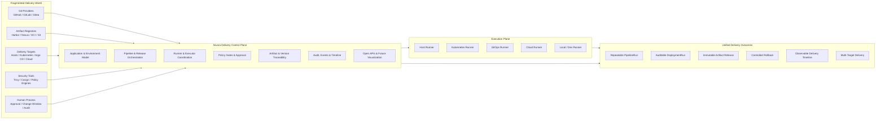
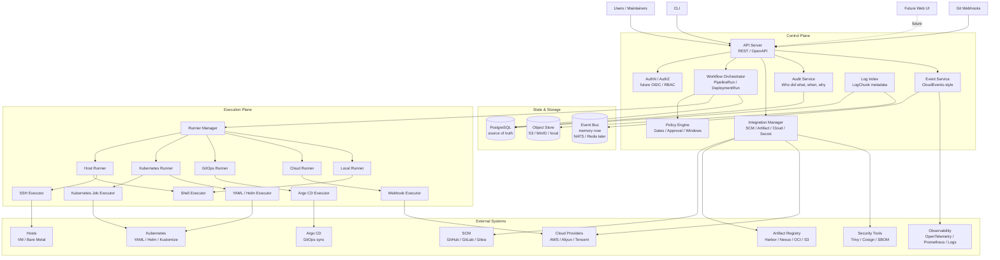
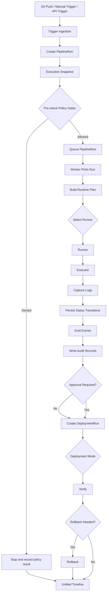
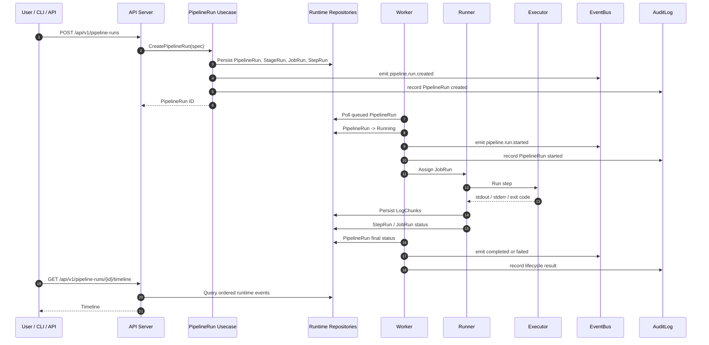
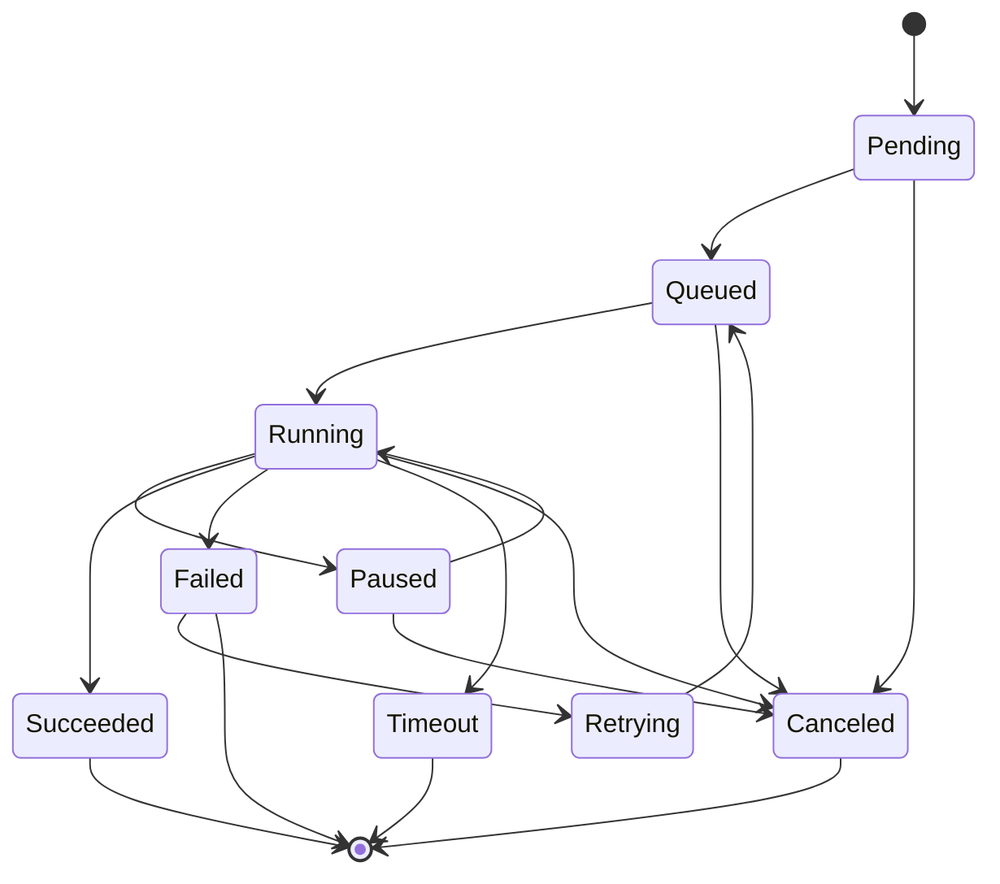
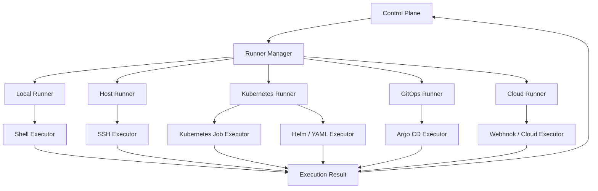
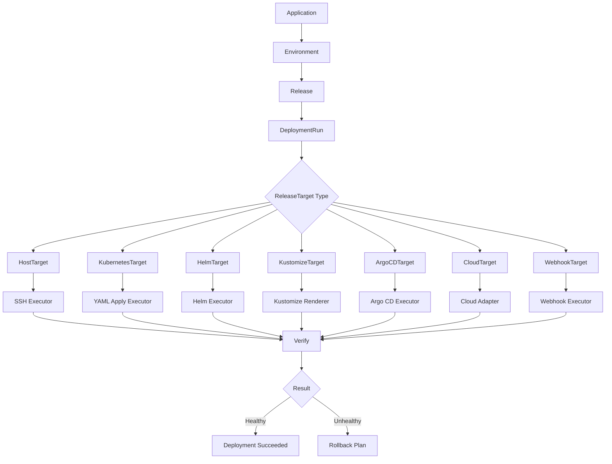
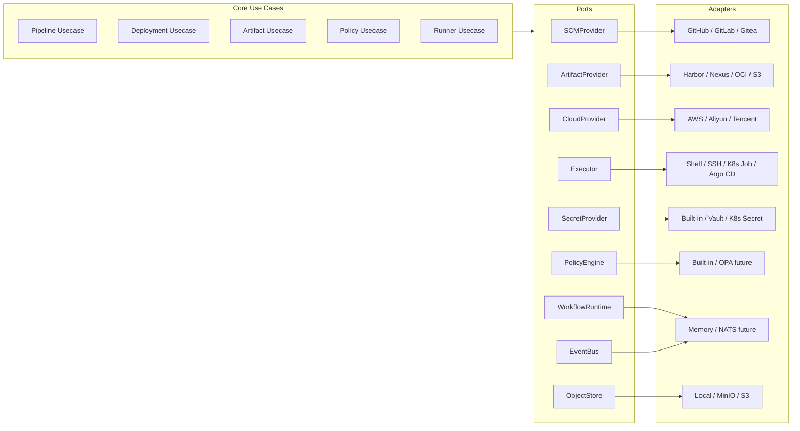
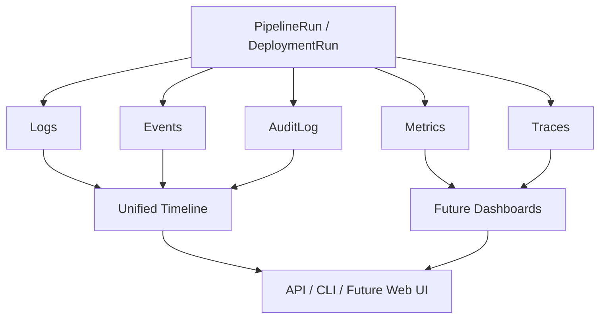

# Nivora

> Open-source DevOps delivery control plane for CI/CD, GitOps, multi-target deployment, artifact orchestration, policy gates, runners, approvals, release audit, and future visualization APIs.

**Nivora** is an open-source DevOps delivery control plane under the `sevoniva` organization.

It is designed to coordinate fragmented delivery systems across Git providers, CI runners, artifact registries, host deployments, Kubernetes deployments, Argo CD / GitOps releases, cloud delivery targets, policy gates, approvals, audit trails, and future visualization APIs.

Nivora is **not** trying to replace every DevOps tool. It integrates mature systems through stable ports and adapters while providing a unified model for delivery intent, execution state, policy, artifact traceability, audit, and future visualization.

```text
Nivora turns fragmented delivery tools into an auditable, extensible,
multi-target delivery control plane.
```

Nivora is early-stage and **not production-ready**. The current focus is the `v0.1.0-alpha.1` foundation: backend architecture boundaries, shell PipelineRun runtime, controlled Kubernetes YAML DeploymentRun dry-run/apply foundation, Kubernetes resource inventory and health foundation, OCI artifact digest resolution foundation, artifact and release binding foundation, guarded Argo CD status/sync modeling, GitOps planning foundation, multi-target ReleasePlan / ReleaseExecution orchestration foundation, DevSecOps policy gates, SecretRef/Credential metadata, local auth/RBAC, approval/change-window foundations, multi-cloud inventory foundations, runner/executor model, logs/events/audit, visualization APIs, minimal web UI, plugin registry, packaging, and open-source contribution foundation. Production Kubernetes apply semantics, destructive rollback, production Argo CD automation, cloud deployment, Git provider, host SSH, full Harbor/Nexus/JFrog integrations, external notification adapters, ITSM integration, signing, and scanning remain future phases.

## Current Status

| Area | Status |
|---|---|
| Backend skeleton | Completed |
| AI / architecture guardrails | Completed |
| Public planning docs | Completed |
| Minimal shell PipelineRun runtime | Completed |
| Durable runtime foundation | Initial shell-only foundation completed |
| Kubernetes YAML planning / dry-run / explicit local apply | Phase 2.1 foundation |
| Artifact and ReleaseArtifact binding | Phase 2.2 foundation |
| Argo CD GitOps | Phase 2.3 planning / adapter foundation |
| Kubernetes inventory / health / rollback plan | Phase 2.4 foundation |
| OCI / Harbor-compatible digest resolution | Phase 2.5 foundation |
| Argo CD status / guarded sync | Phase 2.6 foundation |
| Multi-target release orchestration | Phase 2.7 foundation |
| DevSecOps policy gates | Phase 3.0 foundation |
| Secret and credential foundation | Phase 3.1 foundation |
| AuthN/AuthZ and RBAC | Phase 3.2 foundation |
| Approvals, change windows, notifications | Phase 3.3 foundation |
| Multi-cloud inventory | Phase 3.4 foundation |
| Host deployment | Phase 3.5 planning / noop execution foundation |
| Durable runner runtime | Phase 3.6 protocol / outbox foundation |
| Visualization backend APIs | Phase 4.0 read-model foundation |
| Web UI foundation | Phase 4.1 minimal Vite / React app |
| Observability and operations | Phase 4.2 request/correlation IDs, diagnostics, and local metrics |
| Plugin and extension registry | Phase 4.3 manifest / capability registry foundation |
| Packaging and deployment foundation | Phase 4.4 Docker Compose / Helm / Kubernetes manifests |
| Alpha release hardening | Phase 5.0 in progress for `v0.1.0-alpha.1` |
| Production multi-cloud adapters | Planned |
| Production DevSecOps integrations | Planned |
| Complete frontend visualization product | Future phase |

Current focus:

```text
v0.1.0-alpha.1 readiness
honest capability boundaries
self-contained demo path
runtime and packaging verification
logs / events / audit consistency
```

Alpha release references:

- [Alpha Capability Matrix](docs/ALPHA_CAPABILITY_MATRIX.md)
- [Alpha Demo Guide](docs/demo/alpha-demo.md)
- [v0.1.0-alpha.1 Checklist](docs/releases/v0.1.0-alpha.1-checklist.md)
- [Changelog](CHANGELOG.md)

## Why Nivora Exists

Modern delivery systems are powerful but fragmented.

| Area | Common Tools |
|---|---|
| Source control | GitHub, GitLab, Gitea |
| CI execution | Jenkins, GitLab CI, GitHub Actions, Tekton |
| Artifact storage | Harbor, Nexus, JFrog, OCI registries, S3 |
| Kubernetes delivery | kubectl, Helm, Kustomize |
| GitOps | Argo CD |
| Host deployment | SSH, systemd, scripts |
| Cloud targets | AWS, Aliyun, Tencent Cloud |
| Security | Trivy, Cosign, SBOM tooling, policy engines |
| Observability | OpenTelemetry, Prometheus, logs |
| Human process | approvals, change windows, release audit |

The problem is not that these tools are bad. The problem is that delivery intent, execution state, audit, policy, artifact traceability, and rollback context are often spread across different systems.

Nivora provides a control plane that coordinates them.

## Product Positioning

Nivora is a **delivery control plane**. It is not only a CI tool, and it is not only a CD tool.

It coordinates:

```text
source code
-> pipeline execution
-> artifact selection
-> policy evaluation
-> approval
-> deployment
-> verification
-> rollback
-> audit
-> timeline
```

Nivora aims to answer questions that are difficult to answer when delivery systems are fragmented:

- Which commit produced this release?
- Which artifact was deployed?
- Who approved the production deployment?
- Which runner executed the job?
- Which policy gates passed or failed?
- Which environment received the release?
- What changed between two deployments?
- What logs, events, and audit records belong to this delivery?
- Can this deployment be rolled back safely?
- Which external systems participated in the delivery?

## Nivora Value Map

This is the main value map of Nivora. It shows how fragmented delivery tools become a unified, auditable, extensible delivery control plane.



## What Nivora Is

Nivora is a delivery control plane. It coordinates:

- Pipeline execution
- Release planning
- Deployment execution
- Runner assignment
- Executor selection
- Artifact traceability
- Policy evaluation
- Approval flow
- Audit records
- Runtime events
- Delivery timeline
- Future visualization APIs

Nivora starts as a **modular monolith** with multiple binaries:

```text
nivora-server
nivora-worker
nivora-runner
nivora CLI
```

This keeps the early project understandable while preserving a path toward future service extraction.

## What Nivora Is Not

Nivora is not:

- a Jenkins clone
- an Argo CD replacement
- a Kubernetes-only platform
- a cloud-provider-specific system
- a frontend-first project
- a black-box automation tool
- production-ready in the current phase

Nivora should integrate with existing systems rather than hide everything behind opaque magic.

## Target Architecture

The target architecture separates the **Control Plane** from the **Execution Plane**.

The control plane owns state, orchestration, policies, audit, APIs, and integration configuration. The execution plane owns job execution, logs, heartbeats, and runtime results.



## Architecture Principles

### Control Plane and Execution Plane Are Separate

The control plane owns API, state, orchestration, policy, audit, integration configuration, and event timeline. The execution plane owns job execution, logs, heartbeat, and runtime result reporting.

The API server should not directly execute deployment jobs.

### Runner and Executor Are Different

```text
Runner = who executes
Executor = how execution happens
```

| Runner | Executor |
|---|---|
| Local Runner | Shell Executor |
| Host Runner | SSH Executor |
| Kubernetes Runner | Kubernetes Job Executor |
| GitOps Runner | Argo CD Executor |
| Cloud Runner | Webhook / Cloud Adapter |

This separation allows Nivora to support many execution environments without rewriting the core orchestration logic.

### GitOps Is One Deployment Mode

Nivora supports GitOps, but GitOps is not the whole product.

Future deployment modes include host deployment, raw Kubernetes YAML, Helm, Kustomize, Argo CD GitOps, webhook-based delivery, and cloud-provider-specific delivery.

### Ports and Adapters First

External systems must be integrated through stable interfaces:

```text
SCMProvider
ArtifactProvider
CloudProvider
Executor
WorkflowRuntime
SecretProvider
NotificationProvider
PolicyEngine
EventBus
ObjectStore
```

The core use cases should depend on capabilities, not concrete vendors.

### Artifacts Should Be Immutable

A release should point to immutable artifacts whenever possible: image digest, immutable version, signed artifact, and SBOM reference. Avoid `latest` tags, implicit rebuilds during deployment, and untracked artifact mutation.

### Audit Is Not Optional

Important delivery actions must be auditable: pipeline started, job assigned, artifact selected, approval granted or rejected, deployment started, rollback executed, policy violation detected, runner registered, and credential used.

Audit records must not contain secret values.

### No Fake Production Readiness

Nivora should be explicit about what exists today and what is target architecture. Early phases must not claim production readiness, complete integrations, durable scheduling, or security guarantees that have not been implemented and verified.

## End-to-End Delivery Flow

This is the long-term flow Nivora is designed around. Early phases implement only the shell-based PipelineRun subset: definition parsing, queued run creation, local runner execution, logs, events, audit records, retry, timeout, cancellation, and timeline queries.



## PipelineRun Runtime Model

This is the first execution foundation Nivora is building. Current implementation is limited to minimal shell-based PipelineRun execution.



## PipelineRun State Model



## Runner and Executor Model



## Deployment Model

Deployment execution is target architecture. It is not implemented as a full production deployment engine in the current phase.



## Integration Model

All external systems should connect through ports and adapters. The adapter names below are target integration directions unless explicitly documented as implemented.



## Observability and Audit Model



## Core Concepts

| Concept | Meaning |
|---|---|
| Application | A product or service managed by Nivora |
| Environment | A delivery context such as dev, staging, prod, or a custom target group |
| ReleaseTarget | A concrete deployment target such as host group, Kubernetes cluster, Argo CD application, cloud target, or webhook target |
| Pipeline | A reusable definition of stages, jobs, and steps |
| PipelineRun | One execution of a Pipeline |
| StageRun | Execution record for one stage |
| JobRun | Execution record for one job |
| StepRun | Execution record for one step |
| Release | A versioned delivery intent, usually tied to immutable artifacts |
| DeploymentRun | One execution of a release or deployment plan against a target |
| Runner | A component that receives and executes jobs |
| Executor | A mechanism used by a Runner to execute work |
| Artifact | A build output such as image, jar, binary, chart, or package |
| Artifact Registry | A system that stores artifacts |
| Policy | A gate that can allow, deny, or require approval |
| AuditLog | Durable record of important actions |
| Event | Runtime signal emitted during delivery lifecycle |
| LogChunk | Ordered stdout, stderr, or system log segment |

## Repository Layout

```text
nivora/
  cmd/
    nivora-server/
    nivora-worker/
    nivora-runner/
    nivora/

  internal/
    app/
    domain/
    usecase/
    ports/
    adapters/
    infra/
    api/

  api/
    openapi/
    asyncapi/
    proto/

  configs/
  deployments/
  examples/
  docs/
  scripts/
  test/

  AGENTS.md
  PROJECT_CHARTER.md
  README.md
  ROADMAP.md
  CONTRIBUTING.md
```

| Directory | Purpose |
|---|---|
| `cmd/` | Binary entrypoints only |
| `internal/domain/` | Pure domain concepts and statuses |
| `internal/usecase/` | Business orchestration |
| `internal/ports/` | External capability interfaces |
| `internal/adapters/` | Implementations of ports |
| `internal/infra/` | Technical infrastructure |
| `internal/api/` | HTTP / gRPC transport |
| `api/` | OpenAPI, AsyncAPI, proto definitions |
| `docs/` | Architecture, roadmap, concepts, community docs |
| `examples/` | Example pipelines and deployment specs |

## Quick Start

### Prerequisites

- Go
- Make
- Docker, optional for local compose
- PostgreSQL, optional depending on runtime mode

### Build

```bash
make build
```

### Test

```bash
make test
```

### Verify

```bash
make verify
```

### Package

```bash
make docker-build
make helm-template
make helm-lint
```

Packaging docs:

- [Docker Compose install](docs/operations/install-docker-compose.md)
- [Kubernetes install](docs/operations/install-kubernetes.md)
- [Configuration](docs/operations/configuration.md)

### Smoke Tests

```bash
make smoke-local
make smoke-api
```

### Run Server

```bash
make run-server
```

### Run Web UI

```bash
make run-web
```

The web UI lives under `web/` and consumes the existing `/api/v1/visualization/*` backend APIs. It is a minimal Phase 4.1 foundation, not a complete frontend product.

### Health Check

```bash
curl http://localhost:8080/healthz
curl http://localhost:8080/readyz
curl http://localhost:8080/api/v1/version
curl http://localhost:8080/api/v1/system/runtime
curl http://localhost:8080/api/v1/system/diagnostics
curl http://localhost:8080/metrics
```

### Run Worker

```bash
make run-worker
```

### Run Runner

```bash
make run-runner
```

### CLI

```bash
go run ./cmd/nivora version
go run ./cmd/nivora pipeline run --local examples/pipelines/simple-shell.yaml
go run ./cmd/nivora pipeline get <pipeline-run-id> --server http://localhost:8080
go run ./cmd/nivora pipeline logs <pipeline-run-id> --server http://localhost:8080
go run ./cmd/nivora pipeline timeline <pipeline-run-id> --server http://localhost:8080
go run ./cmd/nivora deployment plan --local examples/deployments/yaml-dry-run.yaml
go run ./cmd/nivora deployment dry-run --local examples/deployments/yaml-dry-run.yaml
go run ./cmd/nivora deployment apply --local examples/deployments/yaml-apply-local.yaml --confirm
go run ./cmd/nivora deployment host plan --file examples/deployments/host-dry-run.yaml --local
go run ./cmd/nivora deployment host run --file examples/deployments/host-dry-run.yaml --local
go run ./cmd/nivora release plan --file examples/releases/multi-target-release.yaml --local
go run ./cmd/nivora release deploy --file examples/releases/sequential-release.yaml --local
go run ./cmd/nivora plugins list --local
go run ./cmd/nivora plugins inspect artifact-oci --local
```

## Local Development

Nivora supports local development through the Makefile, docker-compose, a local object store, a memory event bus, the shell executor, and example pipelines.

This repository uses a neutral default Go proxy in local tooling:

```bash
GOPROXY=https://proxy.golang.org,direct
```

Developers in China can override it without changing project defaults:

```bash
GOPROXY=https://goproxy.cn,direct make verify
```

or:

```bash
export GOPROXY=https://goproxy.cn,direct
make verify
```

## Example Pipeline

```yaml
apiVersion: nivora.io/v1alpha1
kind: Pipeline
metadata:
  name: hello-shell
spec:
  stages:
    - name: build
      jobs:
        - name: echo
          executor: shell
          steps:
            - name: say-hello
              run: echo "hello from nivora"
```

Run it locally:

```bash
go run ./cmd/nivora pipeline run --local examples/pipelines/simple-shell.yaml
```

## Example YAML Deployment Dry-Run

The current Phase 2 foundation supports non-destructive YAML deployment planning and dry-run validation, plus explicit local no-op apply for runtime testing. It renders static manifests, validates their basic shape, creates a DeploymentPlan, records resource inventory, verifies manifest images against bound artifacts, records logs/events/audit/timeline data, and does not apply resources to a cluster by default.

```yaml
apiVersion: nivora.io/v1alpha1
kind: Deployment
metadata:
  name: demo-yaml-deployment
spec:
  application: demo-springboot
  environment: dev
  target:
    type: kubernetes-yaml
    name: dev-kind
    namespace: default
  manifests:
    - examples/yaml/configmap.yaml
    - examples/yaml/deployment.yaml
    - examples/yaml/service.yaml
  options:
    dryRun: true
    apply: false
```

Run it locally:

```bash
go run ./cmd/nivora deployment plan --local examples/deployments/yaml-dry-run.yaml
go run ./cmd/nivora deployment dry-run --local examples/deployments/yaml-dry-run.yaml
```

Explicit local apply requires a separate command and confirmation:

```bash
go run ./cmd/nivora deployment apply --local examples/deployments/yaml-apply-local.yaml --confirm
```

The default local apply path uses the safe no-op manifest client. Production Kubernetes apply semantics, Helm, Kustomize, Argo CD, cloud providers, remote host deployment, and registry integrations remain future work.

## Example Host Deployment Dry-Run

Phase 3.5 adds a safe host deployment foundation. It can build a plan for deploying a binary package to versioned release directories, switching symlinks, checking health, and preparing a rollback baseline. The default runtime uses a noop host executor and does not execute remote SSH.

```bash
go run ./cmd/nivora deployment host plan --file examples/deployments/host-dry-run.yaml --local
go run ./cmd/nivora deployment host run --file examples/deployments/host-dry-run.yaml --local
```

Remote host deployment remains disabled unless future adapters provide explicit configuration, credential references, confirmation, and allow flags.

## Example Multi-Target Release

Phase 2.7 adds a local ReleasePlan / ReleaseExecution foundation. It can plan a Release across multiple targets and execute safe targets sequentially through target-level DeploymentRuns or placeholder targets.

```bash
go run ./cmd/nivora release plan --file examples/releases/multi-target-release.yaml --local
go run ./cmd/nivora release deploy --file examples/releases/sequential-release.yaml --local
```

This is not a production workflow engine. Parallel execution, durable approvals, host/cloud targets, and production GitOps automation remain future work.

Run a minimal shell PipelineRun through the API:

```bash
curl -X POST http://localhost:8080/api/v1/pipeline-runs \
  -H 'Content-Type: application/json' \
  -d '{
    "apiVersion": "nivora.io/v1alpha1",
    "kind": "Pipeline",
    "metadata": {"name": "hello-shell"},
    "spec": {
      "stages": [{
        "name": "build",
        "jobs": [{
          "name": "echo",
          "executor": "shell",
          "steps": [{"name": "say-hello", "run": "echo hello from nivora"}]
        }]
      }]
    }
  }'
```

Unimplemented API groups return structured responses, not fake data:

```json
{
  "code": "not_implemented",
  "message": "This endpoint is reserved for a future phase.",
  "path": "/api/v1/integrations"
}
```

## Events

Nivora uses CloudEvents-style event envelopes.

```json
{
  "specversion": "1.0",
  "id": "evt_01HX",
  "type": "devops.pipeline.run.started",
  "source": "/projects/example/pipelines/hello-shell",
  "subject": "pipelineRun/pr_123",
  "time": "2026-05-18T10:00:00Z",
  "datacontenttype": "application/json",
  "data": {
    "pipelineRunId": "pr_123",
    "status": "Running"
  }
}
```

OpenAPI definitions live under `api/openapi/openapi.yaml`. AsyncAPI definitions live under `api/asyncapi/asyncapi.yaml`.

Core API groups include:

```text
/api/v1/orgs
/api/v1/projects
/api/v1/applications
/api/v1/environments
/api/v1/repositories
/api/v1/artifact-registries
/api/v1/pipelines
/api/v1/pipeline-runs
/api/v1/jobs
/api/v1/releases
/api/v1/deployments
/api/v1/runners
/api/v1/approvals
/api/v1/policies
/api/v1/audit-logs
/api/v1/events
/api/v1/logs
/api/v1/integrations
/api/v1/visualization
```

## Roadmap


See [ROADMAP.md](ROADMAP.md) and [docs/roadmap/overview.md](docs/roadmap/overview.md) for details.

## Contribution Map

```mermaid
flowchart TB
    C["Contributor"]
    C --> G1["Good First Contributions"]
    C --> G2["Intermediate Contributions"]
    C --> G3["Advanced Contributions"]
    C --> G4["Requires RFC"]
    G1 --> D1["Documentation"]
    G1 --> D2["Examples"]
    G1 --> D3["Tests"]
    G1 --> D4["CLI polish"]
    G1 --> D5["API schema cleanup"]
    G2 --> I1["Shell executor improvements"]
    G2 --> I2["Memory event bus"]
    G2 --> I3["Local object store"]
    G2 --> I4["Config validation"]
    G2 --> I5["Pipeline state tests"]
    G3 --> A1["PipelineRun state machine"]
    G3 --> A2["Runner protocol"]
    G3 --> A3["Log streaming"]
    G3 --> A4["Persistence"]
    G3 --> A5["Kubernetes Job executor"]
    G3 --> A6["YAML renderer"]
    G3 --> A7["Argo CD adapter"]
    G3 --> A8["Policy engine"]
    G4 --> R1["Runner protocol changes"]
    G4 --> R2["Workflow runtime changes"]
    G4 --> R3["Database model changes"]
    G4 --> R4["Cloud provider adapters"]
    G4 --> R5["Kubernetes / Argo CD integration design"]
    G4 --> R6["Plugin system changes"]
    G4 --> R7["Security model changes"]
    G4 --> R8["Public API breaking changes"]
```



Before contributing, read:

- [AGENTS.md](AGENTS.md)
- [CONTRIBUTING.md](CONTRIBUTING.md)
- [PROJECT_CHARTER.md](PROJECT_CHARTER.md)
- [docs/README.md](docs/README.md)
- [docs/rfcs/README.md](docs/rfcs/README.md)
- [docs/architecture/architecture-contract.md](docs/architecture/architecture-contract.md)
- [docs/architecture/module-boundaries.md](docs/architecture/module-boundaries.md)
- [docs/engineering/testing-policy.md](docs/engineering/testing-policy.md)
- [docs/engineering/dependency-policy.md](docs/engineering/dependency-policy.md)

Basic expectations:

- keep changes small
- preserve architecture boundaries
- do not add speculative abstractions
- do not commit secrets
- do not claim production readiness
- update docs when architecture changes
- update OpenAPI / AsyncAPI when public behavior changes
- add tests for behavior changes

## AI Coding Agents

Nivora expects AI coding agents to participate in development. The canonical instruction file is [AGENTS.md](AGENTS.md).

Other tool-specific files should point to `AGENTS.md` rather than creating conflicting rules. AI-generated changes must follow architecture boundaries, phase boundaries, dependency policy, testing policy, security baseline, and documentation consistency.

## Verification

Run the full verification suite:

```bash
make verify
```

Expected checks include:

```text
gofmt check
go mod tidy check
go vet ./...
go test ./...
go build ./cmd/nivora-server
go build ./cmd/nivora-worker
go build ./cmd/nivora-runner
go build ./cmd/nivora
architecture verification
secret scanning
```

## Security

Nivora must not commit or expose secrets.

Do not commit tokens, passwords, private keys, kubeconfigs, cloud credentials, registry credentials, or realistic-looking fake credentials. Secret values must not be logged, returned by normal APIs, stored in audit records, embedded in examples, or embedded in tests.

See [SECURITY.md](SECURITY.md) and [docs/engineering/security-baseline.md](docs/engineering/security-baseline.md).

Phase 3.0 adds local DevSecOps foundations:

```bash
go run ./cmd/nivora security scan artifact registry.example.com/demo/app:latest --local
go run ./cmd/nivora security scan manifest examples/security/manifest-privileged-warning.yaml --local
go run ./cmd/nivora policy evaluate --subject registry.example.com/demo/app:latest
```

These commands use noop/fake-friendly scanner foundations and built-in policy gates. Trivy, Cosign, SBOM generation, OPA, Kyverno, Gatekeeper, and production security automation remain future work.

Phase 3.1 adds SecretRef and Credential metadata:

```bash
go run ./cmd/nivora secret put --name local-registry-token --value-env NIVORA_TOKEN
go run ./cmd/nivora credential create --file examples/credentials/registry-credential.yaml --local
```

Secret values are accepted only at creation boundaries and are not returned by normal APIs. The builtin provider is development-only; Vault, Kubernetes Secret, and cloud KMS adapters remain future work.

Phase 3.2 adds local auth and RBAC foundations:

```bash
go run ./cmd/nivora auth whoami
go run ./cmd/nivora auth permissions
```

Dev auth is not production authentication. Static token mode reads token values from environment variables, and OIDC/Keycloak integration remains future work.

## Documentation

| Document | Purpose |
|---|---|
| [PROJECT_CHARTER.md](PROJECT_CHARTER.md) | Project purpose and principles |
| [ROADMAP.md](ROADMAP.md) | High-level roadmap |
| [docs/README.md](docs/README.md) | Documentation index |
| [docs/architecture/](docs/architecture/overview.md) | Architecture model |
| [docs/concepts/](docs/concepts/overview.md) | Core concepts |
| [docs/product/](docs/product/vision.md) | Product planning |
| [docs/community/](docs/community/governance.md) | Contribution and governance |
| [docs/rfcs/](docs/rfcs/README.md) | RFC process |
| [docs/adr/](docs/adr/0001-use-go-as-primary-language.md) | Architecture decision records |
| [AGENTS.md](AGENTS.md) | AI coding agent rules |

## Design North Star

Nivora is being built to make delivery systems more coherent. It does not assume one tool, one cloud, one runtime, or one deployment model.

The long-term goal is to provide a delivery control plane where:

```text
pipelines are repeatable
releases are artifact-based
deployments are auditable
policies are explicit
runners are isolated
integrations are replaceable
events are observable
rollback is traceable
```

Nivora starts small. The first milestone is not to support every tool. The first milestone is to build the correct foundation.

## License

Nivora is licensed under the Apache License 2.0. See [LICENSE](LICENSE).
