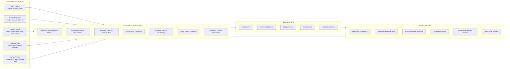
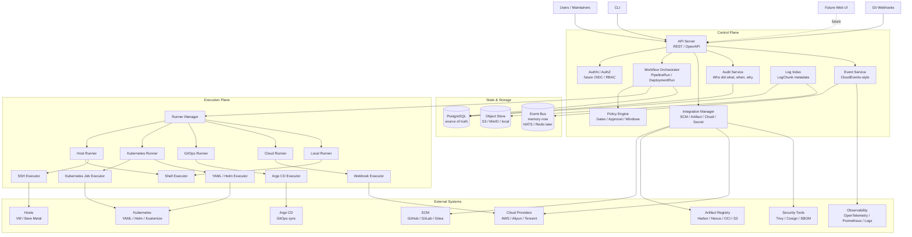
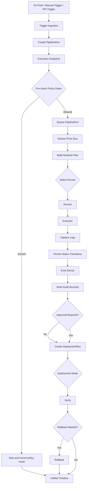
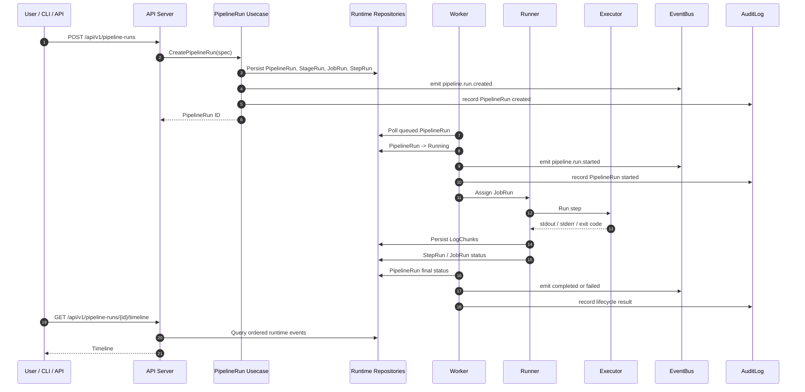
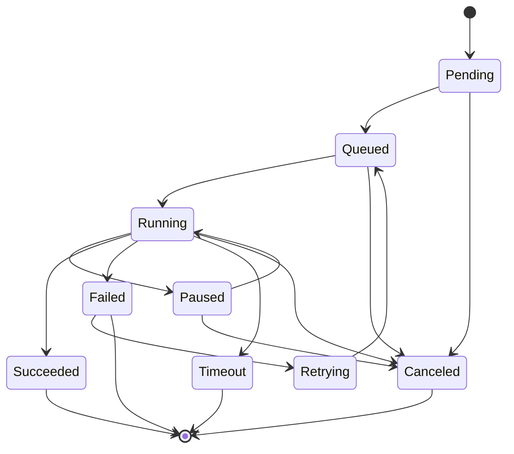
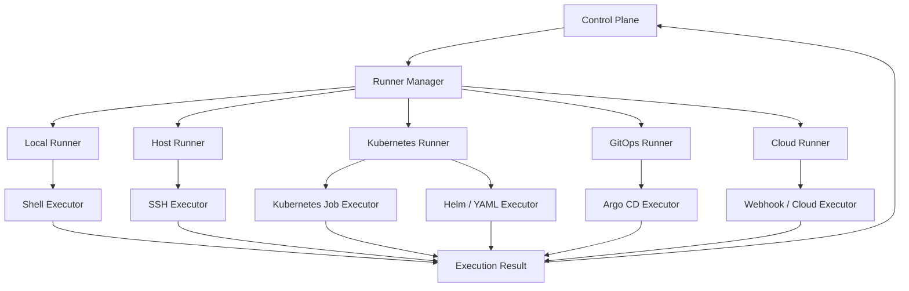
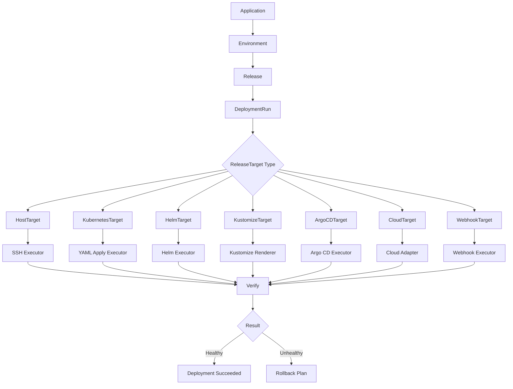
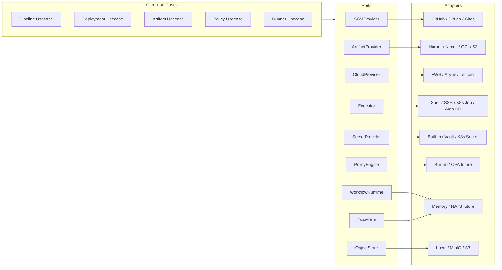
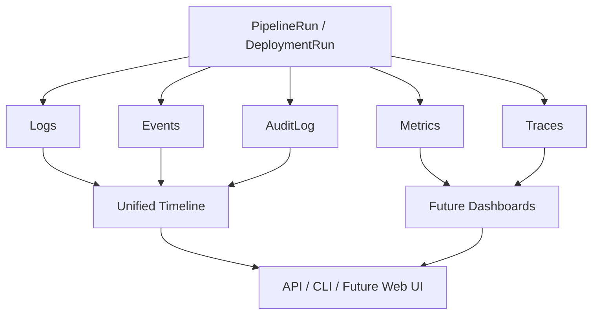

# Nivora

<p align="center">
  <strong>🌐 Languages</strong>:
  <a href="README.md">English</a> |
  <a href="README.zh-CN.md">中文</a> |
  <a href="README.ja-JP.md">日本語</a> |
  <a href="README.ko-KR.md">한국어</a> |
  <a href="README.es-ES.md">Español</a>
</p>

> 面向流水线、发布、部署、运行器、策略门禁、审批和审计记录的后台优先交付控制平面。

**Nivora** 是 `sevoniva` 组织下的一个开源 DevOps 交付控制平面。

该项目记录跨流水线、发布、制品、部署、运行器、策略决策、审批、日志、事件和审计记录的交付意图与状态。它的设计目标是围绕现有工具工作，而非替代它们。

Nivora **不是** Jenkins、Argo CD、Kubernetes、Harbor、云控制平面或扫描器。这些系统保持独立；Nivora 建模并审计交付工作如何在它们之间流转。

当前成熟度：**经过加固的 beta 候选基础**。Nivora **尚未达到生产就绪**。仓库具备可用的后台基础、核心运行时区域和控制平面目录元数据的 PostgreSQL 存储、受保护的部署操作、RBAC 测试、打包资产和验证脚本。生产使用仍需在运行器隔离、在线安装/恢复演练、外部集成和生产规模运维方面进行更多验证。

未来的 `v1.0.0` 文档是规划清单，并非 GA 已达成的证明。当前的权威来源是 [Capability Status](docs/status/CAPABILITY_STATUS.md)，历史审计上下文见 [Implementation Audit](docs/status/IMPLEMENTATION_AUDIT.md)。

企业就绪跟踪记录在 [Enterprise Production Baseline](docs/status/ENTERPRISE_PRODUCTION_BASELINE.md)、[Enterprise Readiness Matrix](docs/status/ENTERPRISE_READINESS_MATRIX.md)、[Enterprise Production Readiness Review](docs/status/ENTERPRISE_PRODUCTION_READINESS_REVIEW.md) 和 [Enterprise Risk Register](docs/status/ENTERPRISE_RISK_REGISTER.md) 中。这些文档是发布加固证据，而非生产批准。

## 当前状态

| 领域 | 状态 |
|---|---|
| PipelineRun 运行时 | 已实现本地 shell 执行，支持日志/事件/审计以及制品/缓存/注解/摘要元数据读取；不是完整的流水线引擎 |
| DeploymentRun 运行时 | 部分实现；YAML 预演、受保护的 apply、清单、健康检查、差异、审计和 PostgreSQL 持久化基础已存在 |
| Release 和 ReleaseExecution | 部分实现；顺序编排和 PostgreSQL 持久化基础已存在 |
| Release 目标目录 | 基础；`/api/v1/release-targets` 和 `nivora target` 管理目标元数据，在已配置的服务器模式下支持 PostgreSQL 持久化，默认禁用不安全操作 |
| 仓库目录 / 智能 | 基础；仓库元数据目录、基于文件的 `nivora repository create --file`、本地/通用只读快照、静态语言/构建/测试/包检测、仅计划的 DevOps 摘要、在已配置的服务器/MCP 模式下支持 PostgreSQL 快照/智能存储、`nivora repository inspect/snapshot/analyze/devops-plan` 以及仓库 MCP 读取/计划工具已存在；外部 SCM 写入仍为未来工作 |
| Nivora Workflow | 基础；`.nivora/workflows/*.yaml` 解析器、验证器、DAG/矩阵规划器、制品/缓存提示、仅计划的安全/发布/部署意图、Pipeline 定义转换、存储的计划记录、受保护的 WorkflowRun 元数据、`nivora workflow validate/plan/run/cancel/reconcile/retry` 以及仅计划的 API/MCP 接口已存在；WorkflowRun 可以排队/取消/重试关联的 PipelineRun 记录、从关联的 PipelineRun 状态协调状态、记录制品/缓存元数据，但它不是完整的流水线引擎 |
| 运行器协议 | 部分实现；令牌、心跳、认领、日志、状态和隔离配置已存在；操作系统级沙箱仍是运维工作 |
| Kubernetes YAML | 实验性受保护的 apply/回滚基础；无默认破坏性行为 |
| GitOps / Argo CD | 实验性规划/状态/受保护的同步基础；无生产级 Argo 自动化 |
| 制品 / OCI | 部分实现；OCI 解析、摘要基础和 PostgreSQL 支持的注册表目录；无完整的注册表产品集成 |
| DevSecOps / 策略 | 基础；noop/fake 扫描器路径、内置规则和 PostgreSQL 支持的策略目录；无 Trivy/Cosign/SBOM 生产集成 |
| 密钥 / 凭证 | 部分实现；元数据、脱敏、提供者骨架；生产级提供者生命周期仍为未来工作 |
| 认证 / RBAC | 部分实现；本地/令牌/OIDC 基础和路由测试；完整的企业 SSO 仍为未来工作 |
| 审批 / 变更窗口 / 通知 | 基础；仅后台，无 ITSM 工作流 |
| 多云 | 仅占位/基础清单；无云部署 |
| 主机部署 | 实验性计划/预演/noop 和受保护的 SSH 接口 |
| Web 控制台 | 实验性最小 UI，消费后台 API |
| MCP 控制平面 | 基础；本地 stdio 只读和仅计划的 AI 访问，加上实验性可选远程只读 JSON-RPC、仓库/工作流计划工具、聚合事件/日志读取、拒绝操作工具、运行器令牌拒绝、合规支持的审计，以及 31 个带标准答案的已验证运维场景；远程 MCP 尚未广泛暴露或达到生产就绪 |
| 集成能力索引 | 基础；只读 `/api/v1/integrations` 标记内置、骨架、noop、基础和实验性适配器能力 |
| 打包 | 部分实现；Docker Compose、Helm、生产级配置和冒烟检查已存在 |
| 可观测性 / 审计 | 部分实现；指标、运行时恢复中心、生产诊断、只读可视化 API 索引、运维手册和审计/证据导出基础；生产级保留/导出仍需加固 |

当前重点：

```text
keep public status accurate
keep examples and docs aligned with implemented behavior
stabilize CI, packaging, and local demo paths
continue runtime, install, restore, runner, and audit hardening
turn operator-facing checks into repeatable product workflows
```

状态参考：

- [Alpha Capability Matrix](docs/ALPHA_CAPABILITY_MATRIX.md)
- [Beta Capability Matrix](docs/BETA_CAPABILITY_MATRIX.md)
- [API Inventory](docs/API_INVENTORY.md)
- [Alpha Demo Guide](docs/demo/alpha-demo.md)
- [v0.1.0-alpha.1 Checklist](docs/releases/v0.1.0-alpha.1-checklist.md)
- [v0.5.0-beta Checklist](docs/releases/v0.5.0-beta-checklist.md)
- [v0.5.0-beta Release Notes Draft](docs/releases/v0.5.0-beta-release-notes-draft.md)
- [v1.0.0-rc.1 Checklist](docs/releases/v1.0.0-rc.1-checklist.md)
- [Future v1.0.0 GA Readiness Capability Matrix](docs/releases/v1.0.0-ga-capability-matrix.md)
- [Future v1.0.0 GA Readiness Checklist](docs/releases/v1.0.0-ga-checklist.md)
- [Future v1.0.0 Release Notes Draft](docs/releases/v1.0.0-release-notes.md)
- [Implementation Audit](docs/status/IMPLEMENTATION_AUDIT.md)
- [Capability Status](docs/status/CAPABILITY_STATUS.md)
- [AI Control Plane Product Review](docs/status/AI_CONTROL_PLANE_PRODUCT_REVIEW.md)
- [AI Control Plane Beta Readiness](docs/status/AI_CONTROL_PLANE_BETA_READINESS.md)
- [AI Control Plane Deep Audit](docs/status/AI_CONTROL_PLANE_DEEP_AUDIT.md)
- [AI Operator Journeys](docs/status/AI_OPERATOR_JOURNEYS.md)
- [AI Control Plane Go / No-Go](docs/status/AI_CONTROL_PLANE_GO_NO_GO.md)
- [Remote MCP Readiness Audit](docs/status/REMOTE_MCP_READINESS_AUDIT.md)
- [MCP Enterprise Opening Decision](docs/status/MCP_ENTERPRISE_OPENING_DECISION.md)
- [Enterprise Production Readiness Review](docs/status/ENTERPRISE_PRODUCTION_READINESS_REVIEW.md)
- [Enterprise Next Goals](docs/status/ENTERPRISE_NEXT_GOALS.md)
- [Security Threat Model](docs/security/threat-model.md)
- [MCP Threat Model](docs/security/mcp-threat-model.md)
- [Security Review Checklist](docs/security/security-review-checklist.md)
- [User Guide](docs/user/README.md)
- [Operator Guide](docs/operator/README.md)
- [Developer Guide](docs/developer/README.md)
- [Tutorials](docs/tutorials/README.md)
- [Release Playbook](docs/releases/release-playbook.md)
- [Production-Direction Install](docs/operations/production-install.md)
- [生产诊断](docs/operations/production-doctor.md)
- [Upgrade Guide](docs/operations/upgrade.md)
- [Release Automation](docs/operations/release-automation.md)
- [Changelog](CHANGELOG.md)

## Nivora 存在的意义

交付状态通常分散在多个系统中。

| 领域 | 常见工具 |
|---|---|
| 源代码管理 | GitHub, GitLab, Gitea |
| CI 执行 | Jenkins, GitLab CI, GitHub Actions, Tekton |
| 制品存储 | Harbor, Nexus, JFrog, OCI 注册表, S3 |
| Kubernetes 交付 | kubectl, Helm, Kustomize |
| GitOps | Argo CD |
| 主机部署 | SSH, systemd, 脚本 |
| 云目标 | AWS, Aliyun, Tencent Cloud |
| 安全 | Trivy, Cosign, SBOM 工具, 策略引擎 |
| 可观测性 | OpenTelemetry, Prometheus, 日志 |
| 人工流程 | 审批, 变更窗口, 发布审计 |

问题不在于单个工具。问题在于交付意图、执行状态、审计、策略、制品可追溯性和回滚上下文通常被分开存储。

Nivora 为该状态提供了一个后台控制平面模型。

## 产品定位

Nivora 是一个**交付控制平面**。它不仅是 CI 工具，也不仅是 CD 工具。

它协调：

```text
source code
-> pipeline execution
-> artifact selection
-> policy evaluation
-> approval
-> deployment
-> verification
-> rollback
-> audit
-> timeline
```

Nivora 旨在回答以下运维问题：

- 哪个提交产生了这个发布？
- 部署了哪个制品？
- 谁批准了生产部署？
- 哪个运行器执行了任务？
- 哪些策略门禁通过或失败？
- 哪个环境接收了发布？
- 两次部署之间发生了什么变化？
- 哪些日志、事件和审计记录属于这次交付？
- 这个部署能否安全回滚？
- 哪些外部系统参与了交付？

## Nivora 价值地图

此图展示了外部系统、Nivora 控制平面、执行机制和交付记录之间的预期边界。



## Nivora 是什么

Nivora 是一个交付控制平面。它协调：

- 流水线执行
- 发布规划
- 部署执行
- 运行器分配
- 执行器选择
- 制品可追溯性
- 策略评估
- 审批流程
- 审计记录
- 运行时事件
- 交付时间线
- 可视化 API 读取模型

Nivora 以**模块化单体**起步，包含多个二进制：

```text
nivora-server
nivora-worker
nivora-runner
nivora CLI
```

这使项目保持可理解，同时保留了未来服务提取的路径。

## Nivora 不是什么

Nivora 不是：

- Jenkins 的克隆
- Argo CD 的替代品
- 仅 Kubernetes 的平台
- 云厂商特定的系统
- 前端优先的项目
- 黑盒自动化工具
- 声称每个建模集成都已完成生产验证的声明

Nivora 应通过显式的端口和适配器与现有系统集成。

## 目标架构

目标架构将**控制平面**与**执行平面**分离。

控制平面拥有状态、编排、策略、审计、API 和集成配置。执行平面拥有任务执行、日志、心跳和运行时结果。



## 架构原则

### 控制平面与执行平面分离

控制平面拥有 API、状态、编排、策略、审计、集成配置和事件时间线。执行平面拥有任务执行、日志、心跳和运行时结果上报。

API 服务器不应直接执行部署任务。

### 运行器与执行器不同

```text
Runner = who executes
Executor = how execution happens
```

| 运行器 | 执行器 |
|---|---|
| Local Runner | Shell Executor |
| Host Runner | SSH Executor |
| Kubernetes Runner | Kubernetes Job Executor |
| GitOps Runner | Argo CD Executor |
| Cloud Runner | Webhook / Cloud Adapter |

这种分离使 Nivora 能够支持多种执行环境，而无需重写核心编排逻辑。

### GitOps 只是一种部署模式

Nivora 支持 GitOps，但 GitOps 不是整个产品。

未来的部署模式包括主机部署、原始 Kubernetes YAML、Helm、Kustomize、Argo CD GitOps、基于 webhook 的交付和云厂商特定的交付。

### 端口和适配器优先

外部系统必须通过稳定的接口集成：

```text
SCMProvider
ArtifactProvider
CloudProvider
Executor
WorkflowRuntime
SecretProvider
NotificationProvider
PolicyEngine
EventBus
ObjectStore
```

核心用例应依赖能力，而非具体的厂商实现。

### 制品应不可变

发布应尽可能指向不可变的制品：镜像摘要、不可变版本、签名制品和 SBOM 引用。避免 `latest` 标签、部署期间的隐式重建和未跟踪的制品变更。

### 审计不是可选的

重要的交付操作必须可审计：流水线启动、任务分配、制品选择、审批通过或拒绝、部署启动、回滚执行、策略违规检测、运行器注册和凭证使用。

审计记录不得包含密钥值。

### 不伪造生产就绪

Nivora 应明确说明当前存在什么、什么是目标架构。早期阶段不得声称生产就绪、完整集成、持久化调度或尚未实现和验证的安全保证。

## 端到端交付流程

这是 Nivora 围绕其设计的长期流程。早期阶段仅实现基于 shell 的 PipelineRun 子集：定义解析、排队运行创建、本地运行器执行、日志、事件、审计记录、重试、超时、取消和时间线查询。



## PipelineRun 运行时模型

这是 Nivora 正在构建的第一个执行基础。当前实现仅限于最小化的基于 shell 的 PipelineRun 执行。



## PipelineRun 状态模型



## 运行器与执行器模型



## 部署模型

部署执行是目标架构。在当前阶段，它尚未作为完整的生产部署引擎实现。



## 集成模型

所有外部系统都应通过端口和适配器连接。以下适配器名称是目标集成方向，除非明确文档说明已实现。

只读的 `/api/v1/integrations` 端点暴露当前的适配器/插件能力索引。它仅是元数据：不配置提供者、不调用外部服务、不返回凭证。骨架、noop、仅基础和实验性适配器均会标记。

```bash
go run ./cmd/nivora integrations list --local
go run ./cmd/nivora integrations list --server http://localhost:8080
```



## 可观测性与审计模型



## 核心概念

| 概念 | 含义 |
|---|---|
| Application | 由 Nivora 管理的产品或服务 |
| Environment | 交付上下文，如 dev、staging、prod 或自定义目标组 |
| ReleaseTarget | 具体的部署目标，如主机组、Kubernetes 集群、Argo CD 应用、云目标或 webhook 目标 |
| Pipeline | 阶段、任务和步骤的可复用定义 |
| PipelineRun | 一次 Pipeline 的执行 |
| StageRun | 一个阶段的执行记录 |
| JobRun | 一个任务的执行记录 |
| StepRun | 一个步骤的执行记录 |
| Release | 版本化的交付意图，通常与不可变制品绑定 |
| DeploymentRun | 针对目标的一次发布或部署计划的执行 |
| Runner | 接收并执行任务的组件 |
| Executor | 运行器用来执行工作的机制 |
| Artifact | 构建输出，如镜像、jar、二进制、chart 或包 |
| Artifact Registry | 存储制品的系统 |
| Policy | 可允许、拒绝或要求审批的门禁 |
| AuditLog | 重要操作的持久化记录 |
| Event | 交付生命周期中发出的运行时信号 |
| LogChunk | 有序的 stdout、stderr 或系统日志片段 |

## 仓库布局

```text
nivora/
  cmd/
    nivora-server/
    nivora-worker/
    nivora-runner/
    nivora/

  internal/
    app/
    domain/
    usecase/
    ports/
    adapters/
    infra/
    api/

  api/
    openapi/
    asyncapi/
    proto/

  configs/
  deployments/
  examples/
  docs/
  scripts/
  test/

  AGENTS.md
  PROJECT_CHARTER.md
  README.md
  ROADMAP.md
  CONTRIBUTING.md
```

| 目录 | 用途 |
|---|---|
| `cmd/` | 仅二进制入口 |
| `internal/domain/` | 纯领域概念和状态 |
| `internal/usecase/` | 业务编排 |
| `internal/ports/` | 外部能力接口 |
| `internal/adapters/` | 端口的实现 |
| `internal/infra/` | 技术基础设施 |
| `internal/api/` | HTTP / gRPC 传输 |
| `api/` | OpenAPI、AsyncAPI、proto 定义 |
| `docs/` | 架构、路线图、概念、社区文档 |
| `examples/` | 示例流水线和部署规范 |

## 快速开始

### 前置条件

- Go
- Make
- Docker，本地 compose 可选
- PostgreSQL，根据运行时模式可选

### 构建

```bash
make build
```

### 测试

```bash
make test
```

### 验证

```bash
make verify
```

### 打包

```bash
make docker-build
make helm-template
make helm-lint
```

打包文档：

- [Docker Compose 安装](docs/operations/install-docker-compose.md)
- [Kubernetes 安装](docs/operations/install-kubernetes.md)
- [配置](docs/operations/configuration.md)
- [性能与负载测试](docs/operations/performance.md)
- [备份与恢复](docs/operations/backup-restore.md)
- [高可用与灾难恢复](docs/operations/ha-disaster-recovery.md)

### 冒烟测试

```bash
make smoke-local
make smoke-api
```

### 运行服务器

```bash
make run-server
```

### 运行 Web UI

```bash
make run-web
```

Web 控制台位于 `web/` 下，消费现有的运行时、可视化、制品、策略、证据、插件和集成元数据 API。它是 Phase 6.4 的最小基础，不是完整的前端产品。

如果后台不可达，控制台现在会停在单一的连接诊断页面，而不是将每个仪表盘卡片渲染为获取失败。通过 `make run-web` 启动，或从 `web/` 运行 Vite，使依赖从已提交的 web 包中解析。

### 健康检查

```bash
curl http://localhost:8080/healthz
curl http://localhost:8080/readyz
curl http://localhost:8080/api/v1/version
curl http://localhost:8080/api/v1/system/runtime
curl http://localhost:8080/api/v1/system/diagnostics
curl http://localhost:8080/metrics
```

`/readyz` 和 `/api/v1/system/diagnostics` 包含对数据库、对象存储、事件总线、outbox 恢复和运行器重连状态的轻量级依赖检查。

### 运行 Worker

```bash
make run-worker
```

### 运行 Runner

```bash
make run-runner
```

### CLI

```bash
go run ./cmd/nivora version
go run ./cmd/nivora pipeline run --local examples/pipelines/simple-shell.yaml
go run ./cmd/nivora pipeline get <pipeline-run-id> --server http://localhost:8080 --token-env NIVORA_AUTH_TOKEN
go run ./cmd/nivora pipeline logs <pipeline-run-id> --server http://localhost:8080 --token-env NIVORA_AUTH_TOKEN
go run ./cmd/nivora pipeline timeline <pipeline-run-id> --server http://localhost:8080
go run ./cmd/nivora deployment plan --local examples/deployments/yaml-dry-run.yaml
go run ./cmd/nivora deployment dry-run --local examples/deployments/yaml-dry-run.yaml
go run ./cmd/nivora deployment apply --local examples/deployments/yaml-apply-local.yaml --confirm
go run ./cmd/nivora deployment host plan --file examples/deployments/host-dry-run.yaml --local
go run ./cmd/nivora deployment host run --file examples/deployments/host-dry-run.yaml --local
go run ./cmd/nivora release plan --file examples/releases/multi-target-release.yaml --local
go run ./cmd/nivora release deploy --file examples/releases/sequential-release.yaml --local
go run ./cmd/nivora cloud providers --local
go run ./cmd/nivora plugins list --local
go run ./cmd/nivora plugins inspect artifact-oci --local
go run ./cmd/nivora plugins validate --local --file examples/plugins/templates/scanner-plugin.yaml
```

## 本地开发

Nivora 通过 Makefile、docker-compose、本地对象存储、内存事件总线、shell 执行器和示例流水线支持本地开发。

本仓库在本地工具中使用中性的默认 Go 代理：

```bash
GOPROXY=https://proxy.golang.org,direct
```

中国开发者可在不改变项目默认值的情况下覆盖它：

```bash
GOPROXY=https://goproxy.cn,direct make verify
```

或：

```bash
export GOPROXY=https://goproxy.cn,direct
make verify
```

## 示例流水线

```yaml
apiVersion: nivora.io/v1alpha1
kind: Pipeline
metadata:
  name: hello-shell
spec:
  stages:
    - name: build
      jobs:
        - name: echo
          executor: shell
          steps:
            - name: say-hello
              run: echo "hello from nivora"
```

在本地运行：

```bash
go run ./cmd/nivora pipeline run --local examples/pipelines/simple-shell.yaml
```

## 示例 YAML 部署预演

当前 Phase 2 基础支持非破坏性的 YAML 部署规划和预演验证，以及用于运行时测试的显式本地 noop apply。它渲染静态清单、验证其基本结构、创建 DeploymentPlan、记录资源清单、验证清单镜像与绑定的制品、记录日志/事件/审计/时间线数据，默认不将资源 apply 到集群。

```yaml
apiVersion: nivora.io/v1alpha1
kind: Deployment
metadata:
  name: demo-yaml-deployment
spec:
  application: demo-springboot
  environment: dev
  target:
    type: kubernetes-yaml
    name: dev-kind
    namespace: default
  manifests:
    - examples/yaml/configmap.yaml
    - examples/yaml/deployment.yaml
    - examples/yaml/service.yaml
  options:
    dryRun: true
    apply: false
```

在本地运行：

```bash
go run ./cmd/nivora deployment plan --local examples/deployments/yaml-dry-run.yaml
go run ./cmd/nivora deployment dry-run --local examples/deployments/yaml-dry-run.yaml
```

显式本地 apply 需要单独的命令和确认：

```bash
go run ./cmd/nivora deployment apply --local examples/deployments/yaml-apply-local.yaml --confirm
```

默认本地 apply 路径使用安全的 noop 清单客户端。生产级 Kubernetes apply 语义、Helm、Kustomize、Argo CD、云厂商、远程主机部署和注册表集成仍为未来工作。

## 示例主机部署预演

Phase 8.1 加固了安全的主机部署基础。它可以构建将二进制包部署到版本化发布目录、切换符号链接、检查 HTTP/TCP/命令健康、运行批次和准备受保护的符号链接回滚的计划。默认运行时使用 noop 主机执行器，不执行远程 SSH。

```bash
go run ./cmd/nivora deployment host plan --file examples/deployments/host-dry-run.yaml --local
go run ./cmd/nivora deployment host run --file examples/deployments/host-dry-run.yaml --local
```

远程主机部署保持禁用状态，除非适配器传输明确配置了凭证引用、确认和允许标志。

## 示例多目标发布

Phase 2.7 添加了本地 ReleasePlan / ReleaseExecution 基础。它可以规划跨多个目标的发布，并通过目标级 DeploymentRun 或占位目标顺序执行安全目标。

```bash
go run ./cmd/nivora release plan --file examples/releases/multi-target-release.yaml --local
go run ./cmd/nivora release deploy --file examples/releases/sequential-release.yaml --local
```

服务器支持的发布和部署命令受 RBAC 保护。对服务器调用使用 `--token-env NIVORA_AUTH_TOKEN`，而非直接传递令牌值。

这不是生产级流水线引擎。并行执行、持久化审批、主机/云目标和生产级 GitOps 自动化仍为未来工作。

通过 API 运行最小化的 shell PipelineRun：

```bash
curl -X POST http://localhost:8080/api/v1/pipeline-runs \
  -H 'Content-Type: application/json' \
  -d '{
    "apiVersion": "nivora.io/v1alpha1",
    "kind": "Pipeline",
    "metadata": {"name": "hello-shell"},
    "spec": {
      "stages": [{
        "name": "build",
        "jobs": [{
          "name": "echo",
          "executor": "shell",
          "steps": [{"name": "say-hello", "run": "echo hello from nivora"}]
        }]
      }]
    }
  }'
```

未实现的 API 组返回结构化响应，而非假数据：

```json
{
  "code": "not_implemented",
  "message": "This endpoint is reserved for a future phase.",
  "path": "/api/v1/integrations"
}
```

## 事件

Nivora 使用 CloudEvents 风格的事件信封。

```json
{
  "specversion": "1.0",
  "id": "evt_01HX",
  "type": "devops.pipeline.run.started",
  "source": "/projects/example/pipelines/hello-shell",
  "subject": "pipelineRun/pr_123",
  "time": "2026-05-18T10:00:00Z",
  "datacontenttype": "application/json",
  "data": {
    "pipelineRunId": "pr_123",
    "status": "Running"
  }
}
```

OpenAPI 定义位于 `api/openapi/openapi.yaml`。AsyncAPI 定义位于 `api/asyncapi/asyncapi.yaml`。

核心 API 组包括：

```text
/api/v1/orgs
/api/v1/projects
/api/v1/applications
/api/v1/environments
/api/v1/repositories
/api/v1/artifact-registries
/api/v1/pipelines
/api/v1/pipeline-runs
/api/v1/jobs
/api/v1/releases
/api/v1/deployments
/api/v1/runner-groups
/api/v1/runners
/api/v1/approvals
/api/v1/policies
/api/v1/audit-logs
/api/v1/events
/api/v1/logs
/api/v1/timeline
/api/v1/integrations
/api/v1/visualization
```

聚合运行时检查也有 CLI 入口：

```bash
nivora events search --pipeline-run-id <pipeline-run-id> --limit 50
nivora logs search --pipeline-run-id <pipeline-run-id> --contains "error"
nivora timeline search --pipeline-run-id <pipeline-run-id> --limit 50
nivora audit search --subject-id <subject-id> --scope-type project --scope-id <project-id>
```

## 路线图


详见 [ROADMAP.md](ROADMAP.md) 和 [docs/roadmap/overview.md](docs/roadmap/overview.md)。

## 贡献地图

```mermaid
flowchart TB
    C["Contributor"]
    C --> G1["Good First Contributions"]
    C --> G2["Intermediate Contributions"]
    C --> G3["Advanced Contributions"]
    C --> G4["Requires RFC"]
    G1 --> D1["Documentation"]
    G1 --> D2["Examples"]
    G1 --> D3["Tests"]
    G1 --> D4["CLI polish"]
    G1 --> D5["API schema cleanup"]
    G2 --> I1["Shell executor improvements"]
    G2 --> I2["Memory event bus"]
    G2 --> I3["Local object store"]
    G2 --> I4["Config validation"]
    G2 --> I5["Pipeline state tests"]
    G3 --> A1["PipelineRun state machine"]
    G3 --> A2["Runner protocol"]
    G3 --> A3["Log streaming"]
    G3 --> A4["Persistence"]
    G3 --> A5["Kubernetes Job executor"]
    G3 --> A6["YAML renderer"]
    G3 --> A7["Argo CD adapter"]
    G3 --> A8["Policy engine"]
    G4 --> R1["Runner protocol changes"]
    G4 --> R2["Workflow runtime changes"]
    G4 --> R3["Database model changes"]
    G4 --> R4["Cloud provider adapters"]
    G4 --> R5["Kubernetes / Argo CD integration design"]
    G4 --> R6["Plugin system changes"]
    G4 --> R7["Security model changes"]
    G4 --> R8["Public API breaking changes"]
```



贡献前请阅读：

- [AGENTS.md](AGENTS.md)
- [CONTRIBUTING.md](CONTRIBUTING.md)
- [PROJECT_CHARTER.md](PROJECT_CHARTER.md)
- [docs/README.md](docs/README.md)
- [docs/rfcs/README.md](docs/rfcs/README.md)
- [docs/architecture/architecture-contract.md](docs/architecture/architecture-contract.md)
- [docs/architecture/module-boundaries.md](docs/architecture/module-boundaries.md)
- [docs/engineering/testing-policy.md](docs/engineering/testing-policy.md)
- [docs/engineering/dependency-policy.md](docs/engineering/dependency-policy.md)

基本要求：

- 保持变更小
- 保留架构边界
- 不添加推测性抽象
- 不提交密钥
- 不声称生产就绪
- 架构变更时更新文档
- 公开行为变更时更新 OpenAPI / AsyncAPI
- 行为变更时添加测试

## 贡献者自动化

自动编码工具和人工贡献者使用相同的仓库规则。规范指令文件是 [AGENTS.md](AGENTS.md)。

工具特定的指令文件应指向 `AGENTS.md`，而非定义冲突的行为。所有变更必须保留架构边界、阶段边界、依赖策略、测试策略、安全基线和文档一致性。

## 验证

运行完整的验证套件：

```bash
make verify
```

预期检查包括：

```text
gofmt check
go mod tidy check
go vet ./...
go test ./...
go build ./cmd/nivora-server
go build ./cmd/nivora-worker
go build ./cmd/nivora-runner
go build ./cmd/nivora
architecture verification
secret scanning
```

## 安全

Nivora 不得提交或暴露密钥。

不要提交令牌、密码、私钥、kubeconfig、云凭证、注册表凭证或看起来像真实凭证的假凭证。密钥值不得被记录、由普通 API 返回、存储在审计记录中、嵌入在示例中或嵌入在测试中。

详见 [SECURITY.md](SECURITY.md) 和 [docs/engineering/security-baseline.md](docs/engineering/security-baseline.md)。

Phase 3.0 添加了本地 DevSecOps 基础：

```bash
go run ./cmd/nivora security scan artifact registry.example.com/demo/app:latest --local
go run ./cmd/nivora security scan manifest examples/security/manifest-privileged-warning.yaml --local
go run ./cmd/nivora policy evaluate --subject registry.example.com/demo/app:latest
```

这些命令使用 noop/fake 友好的扫描器基础和内置策略门禁。Trivy、Cosign、SBOM 生成、OPA、Kyverno、Gatekeeper 和生产级安全自动化仍为未来工作。

Phase 3.1 添加了 SecretRef 和 Credential 元数据：

```bash
go run ./cmd/nivora secret put --name local-registry-token --value-env NIVORA_TOKEN --token-env NIVORA_AUTH_TOKEN
go run ./cmd/nivora secret provider validate --token-env NIVORA_AUTH_TOKEN
go run ./cmd/nivora credential create --file examples/credentials/registry-credential.yaml --token-env NIVORA_AUTH_TOKEN
```

密钥值仅在创建和轮换边界接受，不由普通 API 返回。服务器支持的命令应使用 `--token-env`，使 API 令牌不进入 shell 历史；进程内开发路径在命令支持的情况下可使用 `--local`。内置提供者仅限开发使用。Phase 7.1 添加了 Vault 和 Kubernetes Secret 适配器基础以及云 KMS 占位符；生产级外部密钥存储仍为未来工作。

Phase 7.0 加固了本地认证和 RBAC 基础：

```bash
go run ./cmd/nivora auth whoami
go run ./cmd/nivora auth users
go run ./cmd/nivora auth roles
go run ./cmd/nivora auth permissions
go run ./cmd/nivora project members add <project-id> --user-id <user-id> --role developer
go run ./cmd/nivora auth service-account create --name ci --role developer
go run ./cmd/nivora auth token create --subject-id <service-account-id>
```

开发认证不是生产认证。静态令牌模式从环境变量读取令牌值。OIDC 是提供者配置的后台基础工作；完整的浏览器 SSO 和提供者生命周期操作仍为未来工作。

系统诊断可通过 CLI 或 HTTP 读取：

```bash
go run ./cmd/nivora system runtime
go run ./cmd/nivora system diagnostics
```

Phase 7.2 添加了多租户和配额基础：

```bash
go run ./cmd/nivora quota view --scope-type project --scope-id demo --token-env NIVORA_AUTH_TOKEN
go run ./cmd/nivora usage summary --scope-type project --scope-id demo --token-env NIVORA_AUTH_TOKEN
```

作用域 API 令牌可约束在 org/project/environment 风格的边界内，配额读取模型暴露并发、运行器、制品、日志存储和速率限制基础。持久化分布式配额执行仍为未来工作。

Phase 7.3 添加了合规审计和证据基础：

```bash
go run ./cmd/nivora audit search --subject <subject-id>
go run ./cmd/nivora evidence list --subject-type pipelineRun --subject-id <pipeline-run-id> --token-env NIVORA_AUTH_TOKEN
go run ./cmd/nivora evidence export pipelineRun <pipeline-run-id> --format markdown --token-env NIVORA_AUTH_TOKEN
```

证据包收集安全的发布、制品、审批、策略、安全、部署、日志引用、事件和审计上下文。类密钥值在导出前被脱敏；不可变的外部审计存储和保留强制执行任务仍为未来工作。

## 文档

| 文档 | 用途 |
|---|---|
| [PROJECT_CHARTER.md](PROJECT_CHARTER.md) | 项目目的和原则 |
| [ROADMAP.md](ROADMAP.md) | 高级路线图 |
| [docs/README.md](docs/README.md) | 文档索引 |
| [docs/architecture/](docs/architecture/overview.md) | 架构模型 |
| [docs/concepts/](docs/concepts/overview.md) | 核心概念 |
| [docs/product/](docs/product/vision.md) | 产品规划 |
| [docs/community/](docs/community/governance.md) | 贡献与治理 |
| [docs/rfcs/](docs/rfcs/README.md) | RFC 流程 |
| [docs/adr/](docs/adr/0001-use-go-as-primary-language.md) | 架构决策记录 |
| [AGENTS.md](AGENTS.md) | 自动化与贡献规则 |

## 设计北极星

Nivora 旨在使交付系统更加连贯。它不假设单一工具、单一云、单一运行时或单一部署模型。

长期目标是提供一个交付控制平面，其中：

```text
pipelines are repeatable
releases are artifact-based
deployments are auditable
policies are explicit
runners are isolated
integrations are replaceable
events are observable
rollback is traceable
```

Nivora 从小做起。第一个里程碑不是支持所有工具。第一个里程碑是构建正确的基础。

## 许可证

Nivora 采用 Apache License 2.0 许可证。详见 [LICENSE](LICENSE)。
