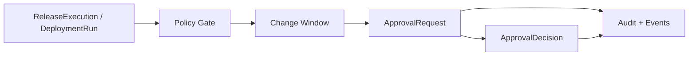

# Approval Model

Phase 3.3 introduces a small governance foundation for human decisions in delivery flows.

## Current Scope

- `ApprovalRequest` records that a release, deployment, or pipeline needs a human decision.
- `ApprovalDecision` records approve, reject, or cancel decisions.
- `ChangeWindow` records simple environment-level delivery windows.
- `NotificationProvider` is a port for future notification adapters.
- The in-memory Phase 3.3 runtime can place ReleaseExecution or DeploymentRun records into `WaitingApproval`.

## Flow

## Boundaries

Approval is a domain concept. Notification delivery is a port. Real Slack, Feishu, DingTalk, email, ITSM, and ticketing adapters are future work. No external notification is sent by default.

Phase 3.3 is not a full workflow engine. Approval resume behavior is intentionally minimal and will be hardened in later phases.
