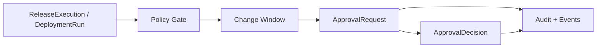

# Approval Model

Phase 6.3 hardens the governance foundation for beta-direction delivery flows.

## Current Scope

- `ApprovalRequest` records that a release, deployment, or pipeline needs a human decision.
- `ApprovalPolicy` can scope requirements by environment, target, severity, and policy result.
- `ApprovalDecision` records approve, reject, cancel, and expire lifecycle outcomes.
- `ChangeWindow` evaluates timezone, day-of-week, and time ranges for environment gates.
- `NotificationProvider` supports noop/log adapters and a guarded webhook adapter that is disabled unless explicitly allowed.
- ReleaseExecution and DeploymentRun records can be placed into `WaitingApproval` by governance gates.

## Flow

## Boundaries

Approval is a domain concept. Notification delivery is a port. Real Slack, Feishu, DingTalk, email, ITSM, and ticketing adapters are future work. No external notification is sent by default.

Phase 6.3 is still not a full workflow engine or ITSM replacement. Governance state is auditable and safe for local/backend validation, but Nivora is not GA production-ready.
