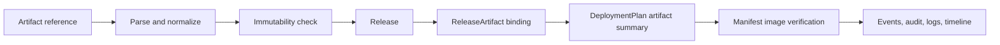

# Artifact Model

Nivora treats artifacts as delivery inputs that should be explicit, immutable where possible, and auditable from release creation through deployment planning.

## Current Phase 2.2 Scope

Phase 2.2 adds the foundation only:

- parse artifact references without network access
- normalize OCI image references
- detect digest-backed immutable references
- warn for `latest` and missing tag or digest
- bind artifacts to a Release as ReleaseArtifacts
- carry artifact summaries and warnings into DeploymentPlan output
- verify simple Kubernetes workload image references against bound artifacts

It does not implement full Harbor, Nexus, JFrog, AWS ECR, Aliyun ACR, Tencent TCR, Git provider, or DevSecOps scanner integrations.

## Reference Flow

## Immutability Rules

- Digest references such as `registry.example.com/team/app@sha256:...` are treated as immutable.
- Explicit tags such as `app:1.0.0` are accepted but less strong than digests.
- `latest` produces a warning.
- Missing tag and digest produces a warning.

These checks are intentionally lightweight. They are not a substitute for registry policy, image signing, SBOM verification, or vulnerability scanning.

## Ports and Adapters

The `ArtifactProvider` port owns registry-facing capabilities such as inspection, listing, credential validation, and digest resolution. Phase 2.2 includes a generic OCI foundation that can parse and inspect references locally and returns clear unsupported errors for registry operations that would require real integration work.

Future adapters should remain behind the port and must not leak registry SDK types into domain or use case packages.
