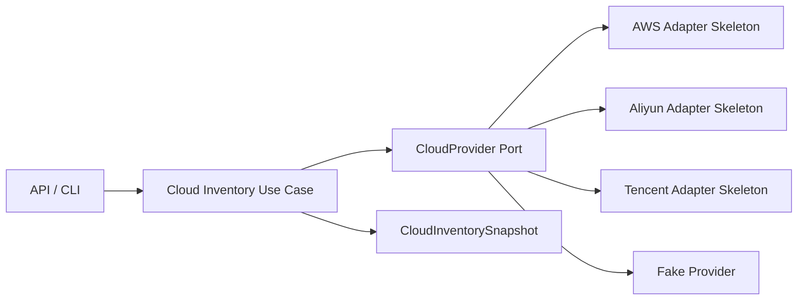

# Cloud Provider Model

Phase 3.4 adds a multi-cloud inventory foundation for AWS, Aliyun, Tencent Cloud, and generic cloud targets.

## Current Scope

- Cloud account metadata.
- Provider configuration with `CredentialRef`.
- Region, cluster, host, and registry inventory records.
- Deterministic fake provider adapters for tests and local development.
- AWS, Aliyun, and Tencent adapter skeletons without cloud SDKs.

## Boundaries

Cloud providers are adapters. Domain and usecase packages do not import cloud SDKs. Credentials must be referenced through `CredentialRef` or `SecretRef`; secret values must never be stored in cloud account models.

Phase 3.4 does not deploy infrastructure, create clusters, mutate cloud resources, or claim production-ready cloud integration.
