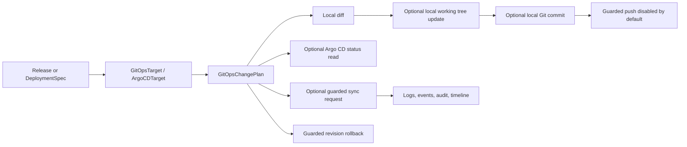

# GitOps Model

GitOps is one deployment mode in Nivora, not the whole product. Phase 6.1 hardens the safe foundation for planning GitOps changes, committing local working tree updates, reading Argo CD status, and requesting guarded sync without claiming GA production automation.

## Current Scope

Phase 6.1 supports:

- `argocd` ReleaseTarget fields in deployment specs
- GitOps change plans
- local working tree reads/writes when explicitly confirmed
- local Git commit generation and revision tracking
- guarded push modeling; push remains disabled unless explicitly requested, allowed, and confirmed
- guarded rollback by Git revision checkout
- simple image reference update planning
- a noop Argo CD provider for deterministic status, resources, sync, and watch tests
- logs, events, audit records, and timeline entries for GitOps DeploymentRuns

It does not implement Argo CD application creation, Git provider authentication, default remote push, Helm rendering, Kustomize rendering, SSO, RBAC hardening, or multi-cluster GitOps operations.

## Flow

## Safety Defaults

- `sync` defaults to `false`.
- `push` defaults to `false`.
- `allowPush` defaults to `false`.
- `writeToWorkingTree` defaults to `false`.
- Local writes require CLI confirmation.
- Sync requires `gitops.allowSync=true`, explicit confirmation, and allow flags.
- Push requires `gitops.push=true`, `gitops.allowPush=true`, and confirmation.
- Rollback by revision requires `gitops.rollback=true`, a `rollbackRevision`, and confirmation.
- Repository catalog URLs are metadata only and must not contain inline username/password userinfo. Credentials stay behind `CredentialRef`/`SecretRef` boundaries and are not resolved by planning.
- `prune` defaults to `false`.
- `force` is rejected in the current Argo CD sync foundation.
- Credentials are referenced by name only and are not stored in specs.

Future real adapters must stay behind ports and must not leak Argo CD or Git client types into domain or use case packages.
