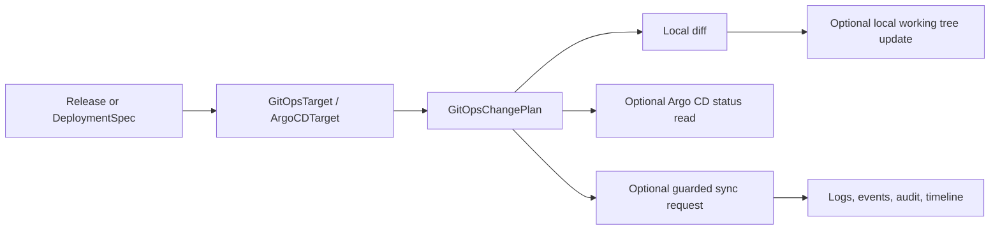

# GitOps Model

GitOps is one deployment mode in Nivora, not the whole product. Phase 2.6 adds a safe foundation for planning GitOps changes, reading modeled Argo CD status, and requesting guarded sync without claiming production automation.

## Current Scope

Phase 2.6 supports:

- `argocd` ReleaseTarget fields in deployment specs
- GitOps change plans
- local working tree reads/writes when explicitly confirmed
- simple image reference update planning
- a noop Argo CD provider for deterministic status, resources, sync, and watch tests
- logs, events, audit records, and timeline entries for GitOps DeploymentRuns

It does not implement production Argo CD sync, Git provider authentication, remote push, Helm rendering, Kustomize rendering, SSO, RBAC hardening, or multi-cluster GitOps operations.

## Flow

## Safety Defaults

- `sync` defaults to `false`.
- `writeToWorkingTree` defaults to `false`.
- Local writes require CLI confirmation.
- Sync requires `gitops.allowSync=true`, explicit confirmation, and allow flags.
- `prune` defaults to `false`.
- `force` is rejected in Phase 2.6.
- Credentials are referenced by name only and are not stored in specs.

Future real adapters must stay behind ports and must not leak Argo CD or Git client types into domain or use case packages.
