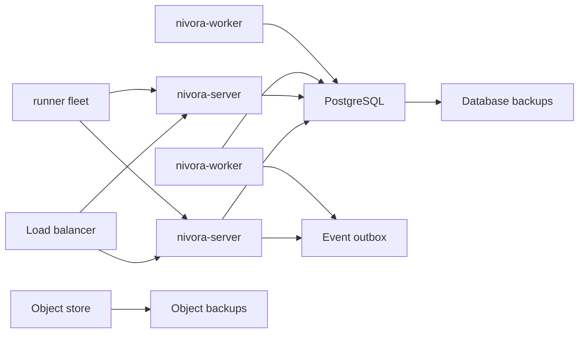

# HA and Disaster Recovery Model

Nivora is not production-ready. Phase 8.2 defines the operating model for high availability, backup, restore, and disaster recovery so later beta work has clear boundaries.

## Goals

- Keep server, worker, and runner processes restartable.
- Preserve database state before replaying runtime work.
- Preserve object store content referenced by manifests, logs, snapshots, and evidence bundles.
- Keep event outbox recovery explicit.
- Make runner reconnect behavior predictable.
- Expose dependency health through readiness and diagnostics APIs.

## High-Availability Shape

The alpha repository includes the API and runtime foundations for this shape, but default local deployments still use in-memory stores in many paths. Production-direction installs should configure PostgreSQL-backed runtime state before relying on restart recovery.

## Dependency Checks

`GET /readyz` and `GET /api/v1/system/diagnostics` expose dependency check objects for:

- HTTP router
- database runtime store configuration
- object store configuration
- event bus configuration
- event outbox recovery endpoint
- runner reconnect/offline detection endpoints

These checks are intentionally lightweight. They validate configuration posture and recovery surfaces without opening external network connections during normal tests.

## Failure Modes

| Scenario | Expected behavior | Operator action |
| --- | --- | --- |
| Server restart | API process can restart; in-memory state is lost unless persistent stores are configured. | Prefer PostgreSQL runtime store. Confirm `/readyz`, then inspect `/api/v1/system/runtime/recovery`. |
| Worker restart | Queued/running work should be reconciled by the worker recovery loop where supported. | Run `POST /api/v1/system/runtime/reconcile` or `nivora runtime reconcile`. |
| Runner disconnect | Runner heartbeat expires; offline detection can mark it offline. | Inspect runner dashboard/API and trigger offline detection if needed. |
| DB unavailable | Readiness reports degraded when PostgreSQL config is incomplete; real DB liveness checks are future work. | Restore database connectivity before starting workers. |
| Object store unavailable | Diagnostics reports config posture; live object store probing is future work. | Restore object snapshots before replaying deployments that reference stored artifacts. |
| Event publish failure | Event outbox records can remain pending/failed for retry. | Preserve outbox rows and run reconciliation after event transport recovers. |

## Recovery Order

1. Restore configuration and secret metadata.
2. Restore PostgreSQL.
3. Restore object store data.
4. Start server.
5. Check `/readyz` and `/api/v1/system/diagnostics`.
6. Start workers.
7. Reconcile runtime/outbox work.
8. Restart runners and confirm heartbeats.

## Current Limitations

- No multi-node leader election is implemented.
- No external event broker is required or configured by default.
- Live dependency probing is intentionally minimal.
- Default demos use in-memory state and are not recoverable after process restart.
- Backup and restore procedures are documented, not automated by Nivora.
