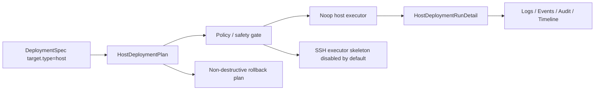

# Host Deployment Model

Phase 3.5 introduces the backend foundation for host-based deployments. It is designed for future VM or bare-metal delivery, but the current implementation is intentionally safe: planning, dry-run, and noop execution are supported by default, while remote SSH execution is represented only by a guarded adapter skeleton.

## Concepts

- `HostTarget`: a ReleaseTarget type for VM or bare-metal delivery.
- `HostGroup`: a named group of hosts within an Environment.
- `HostDeploymentPlan`: the per-host plan generated from a DeploymentSpec.
- `HostDeploymentRunDetail`: per-host execution status captured under a DeploymentRun.
- `HostExecutor`: a port for prepare, upload, execute, health check, and rollback operations.

## Flow

## Safety Model

Remote host execution requires all of the following:

- `options.apply: true`
- API or CLI confirmation
- `host.allowRemoteHostDeploy: true`
- `host.credentialRef`, host-level `credentialRef`, or target `credentialsRef`

The default examples use dry-run/noop behavior and do not mutate a host.

## Current Limitations

- No real SSH commands are executed by default.
- No cloud host discovery is implemented.
- Rollback is a symlink-restore plan only and is not executable in Phase 3.5.
- Health checks are modeled through the HostExecutor contract, but the default noop executor returns deterministic local results.
- Nivora is still early-stage and not production-ready.
