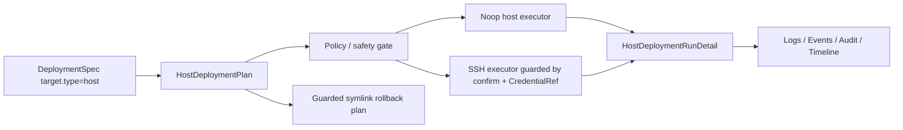

# Host Deployment Model

Phase 8.1 hardens the backend foundation for host-based deployments. It is designed for VM or bare-metal delivery, but the current implementation remains intentionally safe: planning, dry-run, noop execution, batch/canary modeling, typed health checks, and guarded rollback are supported without enabling remote SSH by default.

## Concepts

- `HostTarget`: a ReleaseTarget type for VM or bare-metal delivery.
- `HostGroup`: a named group of hosts within an Environment.
- `HostDeploymentPlan`: the per-host plan generated from a DeploymentSpec.
- `HostDeploymentRunDetail`: per-host execution status captured under a DeploymentRun.
- `HostExecutor`: a port for prepare, upload, execute, health check, and rollback operations.
- `HostHealthCheck`: a typed health check for HTTP, TCP, or command checks.

## Flow

## Safety Model

Remote host execution requires all of the following:

- `options.apply: true`
- API or CLI confirmation
- `host.allowRemoteHostDeploy: true`
- `host.credentialRef`, host-level `credentialRef`, or target `credentialsRef`
- configured host executor transport

## Deployment Strategy

The host strategy is still deliberately small:

- artifacts are uploaded into a versioned release directory under `deployPath/releases/<deployment-run-id>`
- `current`, `previous`, and `next` symlinks are planned for release switching
- service restart is optional through `serviceName` or `restartCommand`
- host groups can use `batchSize` for one-host canary style batches
- failures pause the rollout by default
- rollback restores the `current` symlink from `previous` and can restart the service when configured

The default examples use dry-run/noop behavior and do not mutate a host.

## Current Limitations

- No real SSH commands are executed by default; the SSH adapter requires an injected transport.
- No cloud host discovery is implemented.
- Rollback is guarded and does not delete release directories.
- Health checks are modeled through the HostExecutor contract, but the default noop executor returns deterministic local results.
- Nivora is a hardened beta-candidate foundation and is not production-ready.
