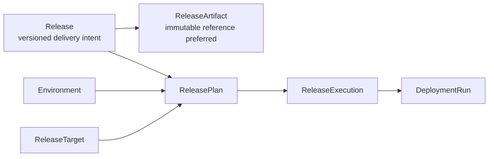

# Release Orchestration

Phase 2.7 adds the first release-level orchestration foundation. It connects a versioned Release, explicit ReleaseArtifacts, an Environment, and one or more ReleaseTargets into a ReleasePlan and ReleaseExecution.

This is still an early backend foundation. It does not add a workflow engine, production GitOps automation, cloud deployment, host SSH deployment, Helm, Kustomize, or frontend behavior.

## Model

## Responsibilities

Release orchestration owns aggregate planning and aggregate status. DeploymentRun remains the target-level execution object.

- ReleasePlan records selected targets, artifact summary, policy results, deployment plans, ordering, strategy, and warnings.
- ReleaseExecution records aggregate status, target execution status, DeploymentRun IDs, events, audit, and timeline.
- DeploymentRun continues to own Kubernetes YAML, GitOps, logs, resource inventory, health, diff, and rollback-plan details for one target.

## Strategies

Phase 2.7 supports:

- `plan-only`: create a ReleasePlan without target execution.
- `sequential`: execute targets in order.

`parallel` is accepted as a planning concept but currently falls back to sequential execution with a warning. A real workflow runtime is future work.

## Gates

Policy is evaluated during planning through the existing PolicyEngine port. The default local runtime uses an allow-all policy placeholder. Tests can simulate denial.

Approval is modeled as a backend gate: a release orchestration definition may request approval, causing the ReleaseExecution to stop in `WaitingApproval`. Phase 6.3 can resume an approved ReleaseExecution or stop it when the approval is rejected, expired, or canceled. Production-grade approval queues, delegation, escalation, and ITSM integration remain future work.

## Non-Goals

- No cloud provider adapters.
- No host SSH deployment.
- No production Argo CD sync automation.
- No Helm or Kustomize execution.
- No destructive rollback orchestration.
- No production readiness claims.
