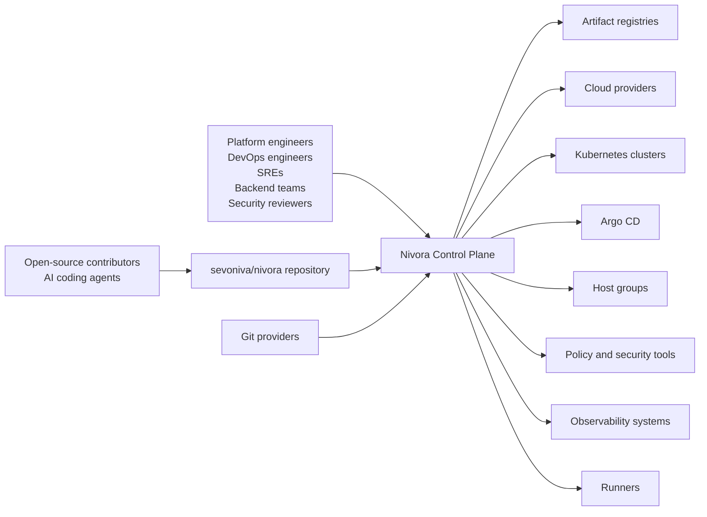

# System Context

Nivora sits between users, delivery systems, execution targets, and observability or security tools.

## Users

Users interact with the Control Plane through APIs and the CLI. Future visualization APIs may support a frontend, but frontend work is not part of current phases.

## External Systems

Nivora should integrate with Git providers, Artifact Registries, cloud providers, Kubernetes clusters, Argo CD, host groups, policy tools, scanners, notification systems, object stores, and observability systems through Ports and Adapters.

## Current State

Phase 0 / Phase 0.6 does not implement real external integrations. It reserves interfaces, package boundaries, API specs, and documentation for future phases.

