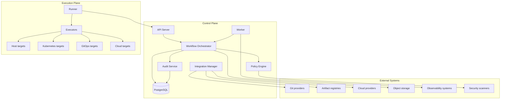

# Target Architecture

This document describes the target architecture. The current Phase 0 / Phase 0.6 implementation only contains the skeleton, package boundaries, minimal HTTP routes, placeholder Adapters, and documentation.

## Target Shape

Nivora starts as a modular monolith with separate binaries:

- `nivora-server`: API and Control Plane entry point.
- `nivora-worker`: background workflow and event processing.
- `nivora-runner`: Execution Plane process.
- `nivora`: CLI.

Service extraction is a future option only after stable module boundaries exist.

## Control Plane and Execution Plane

## Ports and Adapters

Ports define capabilities such as SCMProvider, ArtifactProvider, CloudProvider, Executor, WorkflowRuntime, SecretProvider, NotificationProvider, PolicyEngine, EventBus, and ObjectStore. Adapters implement those capabilities.

The domain layer must remain independent from transport, persistence, queue, cloud, Kubernetes, Argo CD, and vendor SDKs.

## Event-Driven Direction

Nivora should move toward durable events for PipelineRun, DeploymentRun, Runner, Artifact, Policy, and Audit activity. Phase 0 only includes an in-memory EventBus Adapter and AsyncAPI skeleton.

## Audit and Policy

Audit and Policy are not add-ons. They are part of the delivery lifecycle and must be considered in workflow, API, storage, and runner design.

