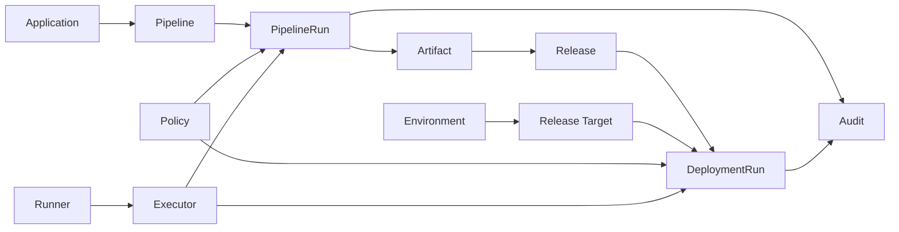

# Concepts Overview

Nivora models delivery as a set of explicit lifecycle records. The Control Plane owns intent, state, policy, audit, and integration configuration. The Execution Plane executes assigned work through Runners and Executors.

Core relationships:

Important distinctions:

- Pipeline is a definition.
- PipelineRun is one execution of a Pipeline.
- Release is a versioned delivery intent, usually tied to immutable Artifacts.
- DeploymentRun is one execution of a Release or deployment plan against an Environment or Release Target.
- Runner receives and executes jobs.
- Executor implements a specific execution mechanism.
- Environment is a delivery context, not only a Kubernetes namespace.
- GitOps is one deployment mode, not the whole product.

